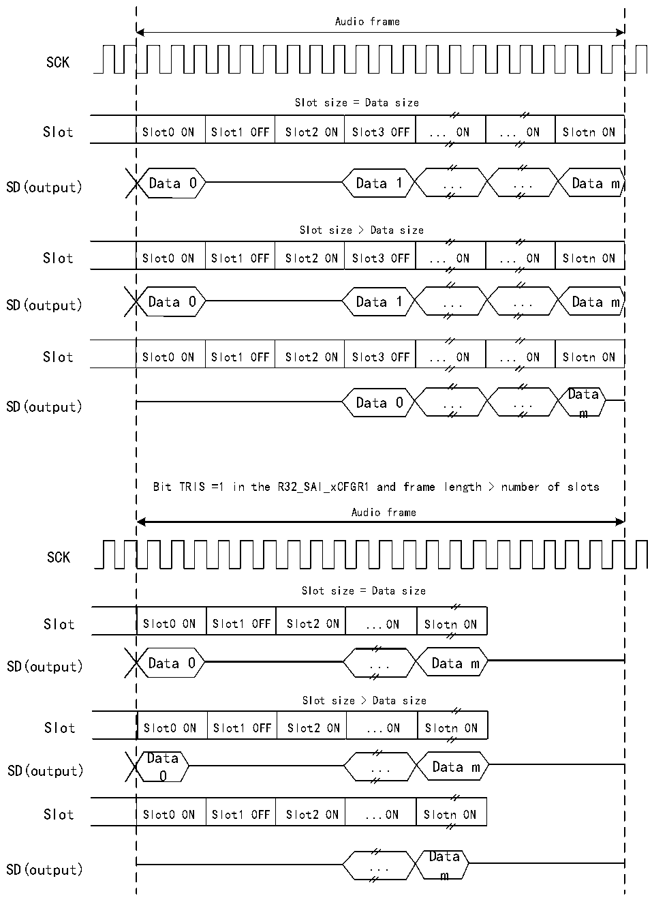

<!-- source-page: 790 -->

[← p.789](0789.md) · [index](../README.md) · [PDF p.790](https://ch32-riscv-ug.github.io/CH32H417/datasheet_en/CH32H417RM.PDF#page=790) · [p.791 →](0791.md)

<!-- header: CH32H417 Reference Manual https://wch-ic.com -->

Figure 36-13 Three-state strategy on SD output line when sending invalid Slot  
 <!-- rendered from the PDF; verify at https://ch32-riscv-ug.github.io/CH32H417/datasheet_en/CH32H417RM.PDF#page=790 -->

Bit TRIS =1 in the R32_SAI_xCFGR1 and frame length = number of slots  

🖼 Text parsed from the figure above

Audio frame  
SCK  
Slot size = Data size  
Slot0 ON  Slot1 OFF  Slot2 ON  Slot3 OFF  ... ON  ... ON  Slotn ON  
SD(output) Data 0 Data 1 ... ... Data m  
Slot size &gt; Data size  
Slot0 ON  Slot1 OFF  Slot2 ON  Slot3 OFF  ... ON  ... ON  Slotn ON  
SD(output) Data 0 Data 1 ... ... Data m  
Slot0 ON  Slot1 OFF  Slot2 ON  Slot3 OFF  ... ON  ... ON  Slotn ON  
Data  
SD(output) Data 0 ... ...  
m  
Bit TRIS =1 in the R32_SAI_xCFGR1 and frame length &gt; number of slots  
Audio frame  
SCK  
Slot size = Data size  
Slot0 ON  Slot1 OFF  Slot2 ON  ...ON  Slotn ON  
SD(output) Data 0 ... Data m  
Slot size &gt; Data size  
Slot0 ON  Slot1 OFF  Slot2 ON  ...ON  Slotn ON  
Data  
SD(output) ... Data m  
0  
Slot0 ON  Slot1 OFF  Slot2 ON  ...ON  Slotn ON  
Data  
SD(output) ...  
m  

When the selected audio protocol uses the FS signal as the SOF signal or channel identification signal  
(R32_SAI_xFRCR register FSDEF bit 1), the tri-state mode is managed according to Figure 36-14 (where  
<!-- image: p790-draw-image-00001 bbox=[511.44, 786.36, 530.88, 796.68] -->
<!-- footer: V1.7 788 -->
