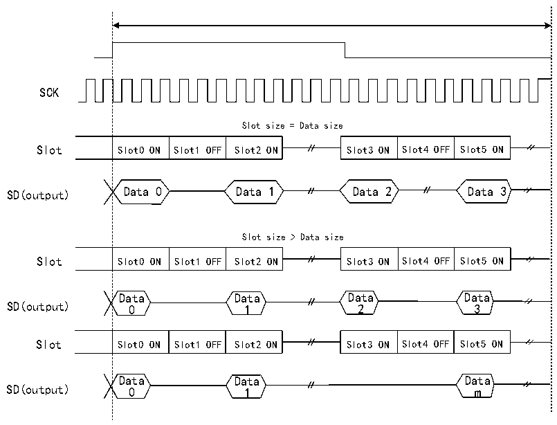

<!-- source-page: 791 -->

[← p.790](0790.md) · [index](../README.md) · [PDF p.791](https://ch32-riscv-ug.github.io/CH32H417/datasheet_en/CH32H417RM.PDF#page=791) · [p.792 →](0792.md)

<!-- header: CH32H417 Reference Manual https://wch-ic.com -->
R32_SAI_xCFGR1 register TRIS bit 1, FSDEF bit 1, half-frame length greater than Slot count/2, and  
NBSLOT=6).  

Figure 36-14 Three-State strategy on output data line with I2S and other protocols  
 <!-- rendered from the PDF; verify at https://ch32-riscv-ug.github.io/CH32H417/datasheet_en/CH32H417RM.PDF#page=791 -->

🖼 Text parsed from the figure above

SCK  
Slot size = Data size  
Slot0 ON  Slot1 OFF  Slot2 ON  
Slot3 ON  Slot4 OFF  Slot5 ON  
SD(output) Data 0 Data 1 Data 2 Data 3  
Slot size &gt; Data size  
Slot0 ON  Slot1 OFF  Slot2 ON  
Slot3 ON  Slot4 OFF  Slot5 ON  
Data Data Data Data  
SD(output) 0 1 2 3  
Slot0 ON  Slot1 OFF  Slot2 ON  
Slot3 ON  Slot4 OFF  Slot5 ON  
Data Data Data  
SD(output) 0 1 m  

If the TRIS bit in the R32_SAI_xCFGR2 register is cleared, all high impedance state on the SD output line in  
Figure 36-13 and Figure 36-14 will be replaced by driving with a value of 0.  

### 36.3.12 Error Flag

SAI uses the following error flags:  
- FIFO overflow/underflow;
- Frame sync advance detection;
- Frame sync delay detection;
- Codec not ready (AC&#x27;97 only);
- Master mode clock configuration error.

#### 36.3.12.1 FIFO Overflow/Underflow (OVRUDR)

The FIFO overflow/underflow bit is the OVRUDR bit in R32_SAI_xSR register.  
Since audio modules can be used as both receivers and transmitters, and each audio module in the specified SAI  
has its own R32_SAI_xSR register, overflow or underflow errors share the same bit.  
<strong>Overflow</strong>  
If the audio module is configured as a receiver, an overflow occurs when audio frame data is received while the  
FIFO is full and cannot store any more received data. In this case, the received data is lost, and the OVRUDR flag  
in the R32_SAI_xSR register is set to 1. If the OVRUDRIE bit in the R32_SAI_xINTENR register is set to 1, an  
interrupt is also generated. The internal system records the slot number at the time of overflow. The FIFO cannot  
<!-- image: p791-draw-image-00001 bbox=[511.44, 786.36, 530.88, 796.68] -->
<!-- footer: V1.7 789 -->
