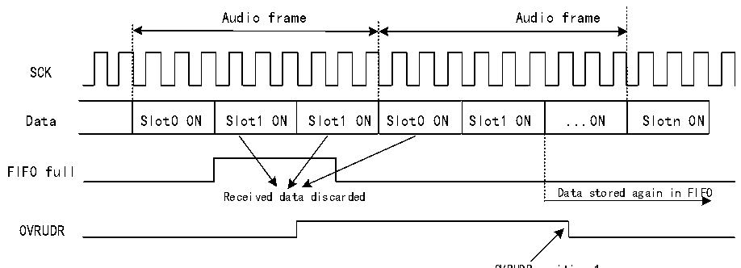
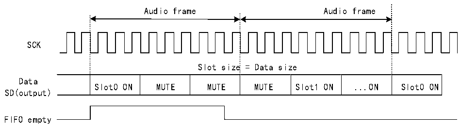

<!-- source-page: 792 -->

[← p.791](0791.md) · [index](../README.md) · [PDF p.792](https://ch32-riscv-ug.github.io/CH32H417/datasheet_en/CH32H417RM.PDF#page=792) · [p.793 →](0793.md)

<!-- header: CH32H417 Reference Manual https://wch-ic.com -->
store additional data until space is freed to accommodate new data. Once the FIFO has freed space for at least one  
data item, the SAI audio module receiver begins receiving new data from the new audio frame starting from the  
slot number internally recorded after the overflow detection. This prevents data slot misalignment in the target  
memory. Refer to Figure 36-15 for details.  
To clear the OVRUDR flag, set the OVRUDR bit in the R32_SAI_xSR register to 1.  

Figure 36-15 Overflow error detection  
 <!-- rendered from the PDF; verify at https://ch32-riscv-ug.github.io/CH32H417/datasheet_en/CH32H417RM.PDF#page=792 -->

🖼 Text parsed from the figure above

Audio frame Audio frame  
SCK  
Slot0 ON  Slot1 ON  Slot1 ON  Slot0 ON  Slot1 ON  ...ON  Slotn ON  
FIFO full  
Received data discarded Data stored again in FIFO  
OVRUDR  

OVRUDR position 1  
reset  
<strong>Underflow</strong>  
When the audio module in SAI is used as a transmitter, if the FIFO is empty when data needs to be sent,  
underflow may occur. If underflow is detected, the Slot number of the event will be stored and the MUTE value  
(00b) will be sent until the FIFO is ready to send the data corresponding to the Slot where underflow is detected.  
See Figure 36-16 for details. This can avoid synchronization failure between memory pointer and Slot in audio  
frame.  
The underflow event will set the OVRUDR flag in the R32_SAI_xSR register to 1, and if the OVRUDRIE bit in  
the R32_SAI_ xINTENR register is set to 1, an interrupt will be generated. To clear this flag, just write 1 to bit  
OVRUDR in R32_SAI_xSR register.  
When the audio submodule is configured as master mode or slave mode, an underflow event will occur.  

Figure 36-16 FIFO underflow event  
 <!-- rendered from the PDF; verify at https://ch32-riscv-ug.github.io/CH32H417/datasheet_en/CH32H417RM.PDF#page=792 -->

🖼 Text parsed from the figure above

Audio frame Audio frame  
SCK  
Slot size = Data size  
Slot0 ON  MUTE  MUTE  MUTE  Slot1 ON  ...ON  Slot0 ON  
Data  
SD(output)  
FIFO empty  

OVRUDR  
OVRUDR=1  
<!-- image: p792-draw-image-00001 bbox=[511.44, 786.36, 530.88, 796.68] -->
<!-- footer: V1.7 790 -->
