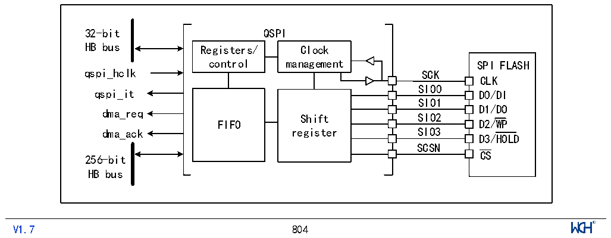

<!-- source-page: 806 -->

[← p.805](0805.md) · [index](../README.md) · [PDF p.806](https://ch32-riscv-ug.github.io/CH32H417/datasheet_en/CH32H417RM.PDF#page=806) · [p.807 →](0807.md)

<!-- header: CH32H417 Reference Manual https://wch-ic.com -->

# Chapter 37 QSPI Interface (QuadSPI)

<em>This chapter&#x27;s module description applies only to the CH32H417, CH32H416 microcontroller product.</em>  
The chip incorporates 2 dedicated QSPI communication interfaces (QuadSPI) for connecting to single-, dual-, or  
quad-wire (data-line) SPI flash storage media. The interface primarily supports the following operating modes:  
● Indirect Mode: In this mode, the QSPI interface performs all operations through the QSPI register. This mode  
is suitable for applications requiring frequent read/write operations.  
● Status Polling Mode: In this mode, the system periodically reads the external FLASH status register. When  
the flag is set to 1 (e.g., erase or program complete), the system generates an interrupt. This mode is suitable  
for applications requiring real-time monitoring of the external Flash status.  
Memory-mapped mode: In this mode, the external Flash is mapped into the microcontroller&#x27;s address space,  
allowing the system to access it as internal memory. For chips where the fifth-to-last digit of the lot number is less  
than 3, the memory-mapped address may only be used for data access.  
Dual-Flash Mode: When operating in dual-Flash mode, the system can simultaneously access 2 Quad-SPI FLASH  
devices, doubling both throughput and capacity. This mode is suitable for applications requiring extensive data  
processing.  

## 37.1 Main Features

● 3 functional modes: Indirect mode, Status polling mode, and Memory-mapped mode  
● Dual flash mode via parallel access to two FLASH devices  
● Integrated FIFOs for transmission and reception  
● Supports SDR mode  
● Fully programmable frame format for indirect and memory-mapped modes  
● Fully programmable opcode for indirect and memory-mapped modes  
● Generates DMA trigger signals upon reaching FIFO threshold and transmission completion  
● Generates interrupts upon reaching FIFO threshold, timeout, operation completion, and access errors  

## 37.2 Overview

Figure 37-1 Structure block diagram of QSPI (Dual flash mode disabled)  
 <!-- rendered from the PDF; verify at https://ch32-riscv-ug.github.io/CH32H417/datasheet_en/CH32H417RM.PDF#page=806 -->

🖼 Text parsed from the figure above

32-bit QSPI  
HB bus Registers/ Clock  
SPI FLASHCLKD0/DI  Shift register  SIO0SIO1SIO2  SIO2SIO3SCSN  
qspi_hclk SCK  
dma_req D1/DO  
dma_ack register SIO3  
D3/HOLD  
256-bit  
HB bus  
<!-- image: p806-draw-image-00001 inside the figure -->
<!-- footer: V1.7 804 -->

