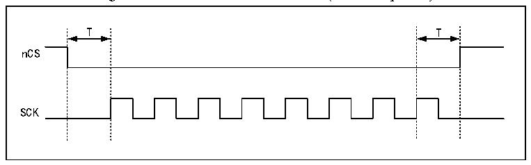
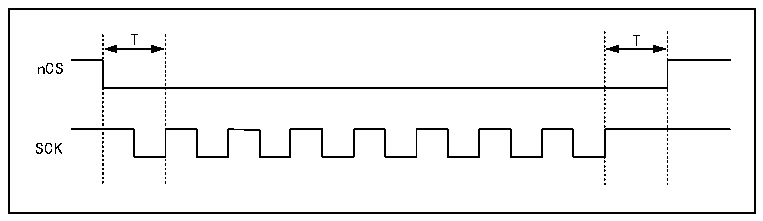
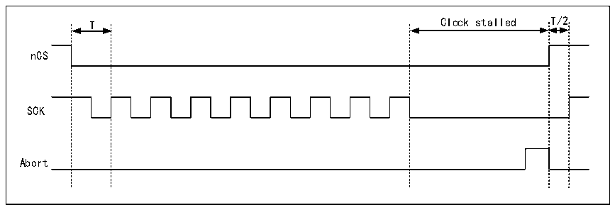

<!-- source-page: 816 -->

[← p.815](0815.md) · [index](../README.md) · [PDF p.816](https://ch32-riscv-ug.github.io/CH32H417/datasheet_en/CH32H417RM.PDF#page=816) · [p.817 →](0817.md)

<!-- header: CH32H417 Reference Manual https://wch-ic.com -->

Figure 37-4 nCS with CKMODE = 0 (T = SCK period)  
 <!-- rendered from the PDF; verify at https://ch32-riscv-ug.github.io/CH32H417/datasheet_en/CH32H417RM.PDF#page=816 -->

🖼 Text parsed from the figure above

T T  
nCS  
SCK  

When CKMODE=1 (&#x27;Mode 3&#x27;, where SCK rises to high level without any operation), nCS still falls to low level  
one SCK cycle before the first rising edge of SCK during operation, and rises to high level one SCK cycle after  
the last rising edge of SCK during operation, as shown in the figure below.  

Figure 37-5 nCS with CKMODE = 1 (T = SCK period)  
 <!-- rendered from the PDF; verify at https://ch32-riscv-ug.github.io/CH32H417/datasheet_en/CH32H417RM.PDF#page=816 -->

🖼 Text parsed from the figure above

T T  
nCS  
SCK  

If the FIFO remains full in a read operation or empty in a write operation, the operation stops and SCK remains  
low before the firmware intervenes in the FIFO. If the operation stops, the nCS will rise to the high level after  
requesting the suspension, and the SCK will rise to the high level after half a cycle, as shown in the following  
figure.  

Figure 37-6 nCS(T=SCK period) when CKMODE = 1 and termination occurs  
 <!-- rendered from the PDF; verify at https://ch32-riscv-ug.github.io/CH32H417/datasheet_en/CH32H417RM.PDF#page=816 -->

🖼 Text parsed from the figure above

T Clock stalled T/2  
nCS  
SCK  
Abort  

When not in Dual Flash Mode (DFM=0) and FSEL=0 (default), only FLASH1 is accessed. Therefore, if FSEL=1,  
only FLASH1 is accessed, and nCS remains high. In Dual Flash Mode, the nCS behavior for both FLASH1 and  
FLASH2 is identical. Consequently, if FLASH2 is present and the application always operates in Dual Flash  
Mode, the nCS signal for FLASH1 can also be used for FLASH2, while the nCS pin output for FLASH2 can be  
repurposed for other functions.  
<!-- image: p816-draw-image-00001 bbox=[511.44, 786.36, 530.88, 796.68] -->
<!-- footer: V1.7 814 -->
