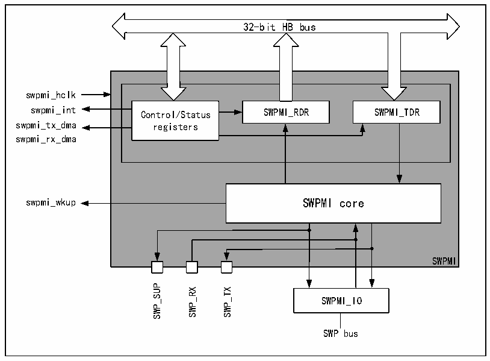

<!-- source-page: 831 -->

[← p.830](0830.md) · [index](../README.md) · [PDF p.831](https://ch32-riscv-ug.github.io/CH32H417/datasheet_en/CH32H417RM.PDF#page=831) · [p.832 →](0832.md)

<!-- header: CH32H417 Reference Manual https://wch-ic.com -->

# Chapter 38 Single-wire Protocol Main Interface (SWPMI)

The Single Wire Protocol Master Interface (SWPMI) is a full-duplex single-wire communication technology that  
implements Single Wire Protocol (SWP) communication based on the ETSI TS 102 613 standard specification.  
In SWPMI, data transmission occurs via two physical methods: First, data flows from the master device to the  
slave device through the voltage domain (S1 signal). Second, data flows from the slave device to the master  
device through the current domain (S2 signal). The S1 signal employs pulse width modulation (PWM) for digital  
transmission, while the S2 signal conveys data through current variations.  

## 38.1 Main Features

● Support full-duplex communication mode  
● Support automatic processing of fill bits  
● Support automatic SWP bus state management  
● Provide loopback mode for testing  
● Support automatic processing of Start of Frame (SOF) and End of Frame (EOF)  
● Support configurable bit rate up to 2Mbit/s with configurable interrupts  
● Provide CRC error, underflow, overflow, and slave device recovery monitoring flags  
● Support CRC-16 calculation, generation, and verification  

## 38.2 Overview

Figure 38-1 Structure block diagram of single-wire protocol main interface  
 <!-- rendered from the PDF; verify at https://ch32-riscv-ug.github.io/CH32H417/datasheet_en/CH32H417RM.PDF#page=831 -->

🖼 Text parsed from the figure above

32-bit HB bus  
swpmi_hclk  
swpmi_int Control/Status SWPMI_RDR SWPMI_TDR  
swpmi_tx_dma registers  
swpmi_rx_dma  
swpmi_wkup SWPMI core  
SWPMI  
SWP_SUP SWP_RX SWP_TX  
SWPMI_IO  
SWP bus  

<!-- image: p831-draw-image-00001 bbox=[511.44, 786.36, 530.88, 796.68] -->
<!-- footer: V1.7 829 -->
