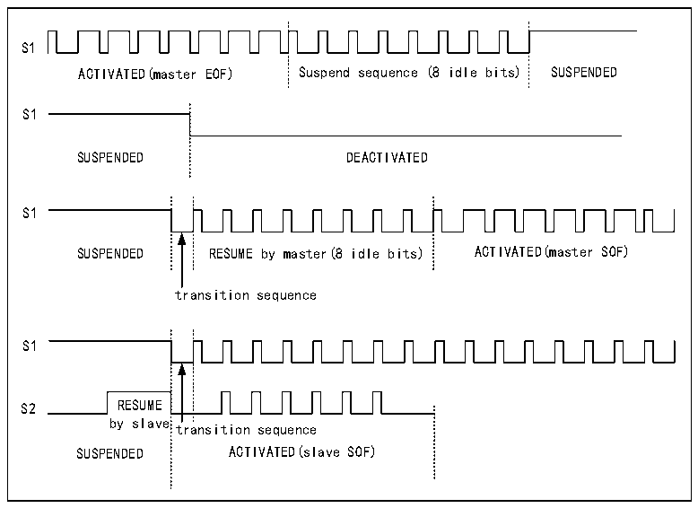

<!-- source-page: 833 -->

[← p.832](0832.md) · [index](../README.md) · [PDF p.833](https://ch32-riscv-ug.github.io/CH32H417/datasheet_en/CH32H417RM.PDF#page=833) · [p.834 →](0834.md)

<!-- header: CH32H417 Reference Manual https://wch-ic.com -->
<em>output mode, set it to low, and finally clear the SWPTEN bit in the R32_SWPMI_CR register.</em>  
<strong>Master device recovery</strong>  
After SWPMI is enabled, the user may request SWPMI frame transmission. First, SWPMI transmits a transition  
sequence and eight idle bits, indicating master device recovery, then commences frame transmission. Following  
“Master Device Recovery,” the SWP transitions from the ‘Suspended’ state to the “Activated” state. Refer to  
Figure 38-2: SWP Bus States.  

Figure 38-2 SWP bus state diagram  
 <!-- rendered from the PDF; verify at https://ch32-riscv-ug.github.io/CH32H417/datasheet_en/CH32H417RM.PDF#page=833 -->

🖼 Text parsed from the figure above

S1  
ACTIVATED(master EOF) Suspend sequence (8 idle bits) SUSPENDED  
S1  
SUSPENDED DEACTIVATED  
S1  
SUSPENDED RESUME by master(8 idle bits) ACTIVATED(master SOF)  
transition sequence  
S1  
S2 RESUME  
by slave  
transition sequence  
SUSPENDED ACTIVATED(slave SOF)  

<strong>Slave device recovery</strong>  
When SWPMI is enabled, if SWPMI receives a slave device recovery status signal, the SWP transitions from the  
“suspended” state to the ‘activated’ state. “Slave device recovery” triggers the SRF flag bit in the  
R32_SWPMI_ISR register to be set to 1.  

### 38.3.3 SWPMI_IO (Internal Transceiver) Bypass

The microcontroller integrates an SWPMI_IO (internal transceiver) compliant with the ETSI TS 102 613  
technical specification. To bypass this transceiver, set the SWP_TBYP bit in the R32_SWPMI_OR register to 1.  
In bypass mode, the SWPMI_IO is disabled, and the SWP_RX, SWP_TX, and SWPMI_SUP signals become  
available as multiplexed functions on these three GPIO pins. This configuration can be used to connect an external  
transceiver.  
Note: In SWPMI_IO bypass mode, the SWPTEN bit in the R32_SWPMI_CR register must be cleared.  

### 38.3.4 SWPMI Baud Rate

In the R32_SWPMI_BRR register, set the bit rate according to the following formula:  
FSWP= FHCLK/((BR[7:0]+1)x4)  
<em>Note: Maximum bit rate is 2 Mbit/s.</em>  
<!-- image: p833-draw-image-00001 bbox=[511.44, 786.36, 530.88, 796.68] -->
<!-- footer: V1.7 831 -->
