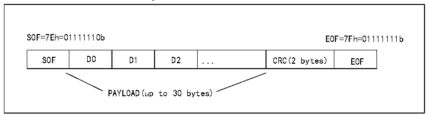

<!-- source-page: 834 -->

[← p.833](0833.md) · [index](../README.md) · [PDF p.834](https://ch32-riscv-ug.github.io/CH32H417/datasheet_en/CH32H417RM.PDF#page=834) · [p.835 →](0835.md)

<!-- header: CH32H417 Reference Manual https://wch-ic.com -->

### 38.3.5 SWPMI Frame Processing

The SWP frame consists of the following components: Start of Frame (SOF), a payload of 1 to 30 bytes, a 16-bit  
CRC (Cyclic Redundancy Check), and End of Frame (EOF). See Figure 38-3.  
The SWPMI integrates a 32-bit data transmit register (R32_SWPMI_TDR) and a 32-bit data receive register  
(R32_SWPMI_RDR).  
In data transmission mode, SOF insertion, EOF insertion, CRC calculation, and insertion are all automatically  
managed by SWPMI. The user only needs to provide the payload size and content. After writing data to the  
R32_SWPMI_TDR register, frame transmission occurs immediately. Specific flag bits indicate when the  
transmission data register is empty and when the data frame transmission is complete.  
In data reception mode, SOF deletion, EOF deletion, CRC calculation, and verification are all automatically  
managed by SWPMI. Users need only read the payload size and content. Specific flag bits will indicate frame  
reception completion, register full status, and potential CRC error events.  

Figure 38-3 SWP frame structure  
 <!-- rendered from the PDF; verify at https://ch32-riscv-ug.github.io/CH32H417/datasheet_en/CH32H417RM.PDF#page=834 -->

🖼 Text parsed from the figure above

SOF=7Eh=01111110b EOF=7Fh=01111111b  
SOF  D0  D1  D2  ...  CRC(2 bytes)  EOF  
PAYLOAD(up to 30 bytes)  

Insertion (in transmit mode) and deletion (in receive mode) of padding bits are automatically managed by SWPMI  
core. These operations are transparent to users.  

### 38.3.6 Transmit Processing

Before transmitting a frame, the user must first activate the SWP; refer to Section 38.3.1. Software  
implementations for frame transmission include multiple modes: no software buffer mode, single software buffer  
mode, and multiple software buffer mode. When using software buffers, data is transferred via a DMA channel  
from the software buffer in RAM memory to the SWPMI peripheral&#x27;s transmit data register.  
<strong>No software buffer mode</strong>  
In No Software Buffer Mode, DMA does not need to be enabled. Polling the status flag within the main loop or  
SWPMI interrupt routine handles SWP frame transmission. The SWPMI includes a 32-bit transmit data register  
(R32_SWPMI_TDR); writing to this register triggers transmission of up to 4 bytes.  
Software-Bufferless Mode can be selected by clearing the TXDMA bit in the R32_SWPMI_CR register.  
The first write to the R32_SWPMI_TDR register triggers frame transmission. Within the first word written to the  
R32_SWPMI_TDR register, bits [7:0] indicate the number of data bytes in the payload. Bits [15:8], bits [23:16],  
and bits [31:24] contain the first three bytes of the payload, where bits [15:8] contain the first byte, bits [23:16]  
contain the second byte, and bits [31:24] contain the third byte. Subsequent writes to the R32_SWPMI_TDR  
register will only contain additional payload data bytes (up to four bytes per write operation).  
<em>Note: The least significant byte of the first 32-bit word written to the R32_SWPMI_TDR register encodes the</em>  
<em>number of data bytes in the payload. This value must fall within the range of 1 to 30. If the least significant byte</em>  
<!-- image: p834-draw-image-00001 bbox=[511.44, 786.36, 530.88, 796.68] -->
<!-- footer: V1.7 832 -->
