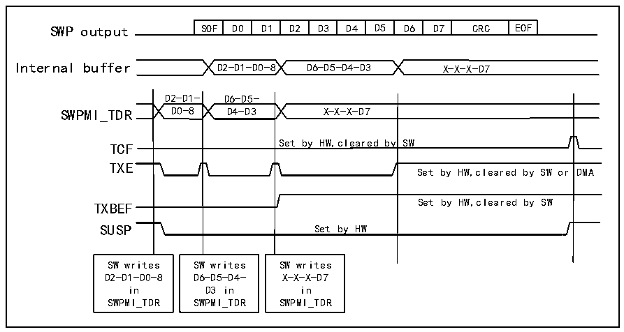

<!-- source-page: 835 -->

[← p.834](0834.md) · [index](../README.md) · [PDF p.835](https://ch32-riscv-ug.github.io/CH32H417/datasheet_en/CH32H417RM.PDF#page=835) · [p.836 →](0836.md)

<!-- header: CH32H417 Reference Manual https://wch-ic.com -->
<em>exceeds this range, it will be ignored and will not trigger data transmission.</em>  
Writing to the R32_SWPMI_TDR register triggers the following sequence of operations:  
1) When the SWP bus is in the “Suspended” state, the system sends a transition sequence followed by 8 idle bits  
(for host recovery). Conversely, if the SWP bus is in the “Active” state, this operation is not triggered;  
2) Frame start transmission;  
3) Transmit the payload based on the contents of the R32_SWPMI_TRD register. If the payload contains more  
than 3 bytes, the R32_SWPMI_TDR must be refilled by software whenever the TXE flag in the  
R32_SWPMI_ISR register is set to 1, provided the TXBEF flag in the R32_SWPMI_ISR register is not set to 1;  
4) Transmit the 16-bit CRC (automatically computed by the SWPMI core);  
5) Transmit the end-of-frame (EOF) signal.  
When the software performs a write operation to the R32_SWPMI_TDR register, it will automatically clear the  
TXE flag.  
After a complete frame transmission succeeds, if no other frame transmission is requested (i.e., no subsequent  
write operation to the R32_SWPMI_TDR register occurs after the TXBEF flag is set to 1), the TCF and SUSP  
flags in the R32_SWFMI_ISR register will be set to 1 after 7 idle bits following the completion of the EOF  
transmission. Additionally, setting the TCIE bit in the R32_SWPMI_IER register triggers an interrupt. See Figure  
38-4.  

Figure 38-4 SWPMI no software buffer mode transmission  
 <!-- rendered from the PDF; verify at https://ch32-riscv-ug.github.io/CH32H417/datasheet_en/CH32H417RM.PDF#page=835 -->

🖼 Text parsed from the figure above

SOF  D0  D1  D2  D3  D4  D5  D6  D7  CRC  EOF  
Internal buffer D2-D1-D0-8 D6-D5-D4-D3 X-X-X-D7  
D2-D1- D6-D5-  
y SW  Set by HW,cleared by SW or  
SWPMI_TDR D0-8 D4-D3 X-X-X-D7  
Set by HW,cleared by SW  
TCF  
TXE  
TXBEF Set by HW,cleared by SW  
SUSP Set by HW  
SW writes SW writes SW writes  
D2-D1-D0-8 D6-D5-D4- X-X-X-D7  
in D3 in in  
SWPMI_TDR SWPMI_TDR SWPMI_TDR  

If the frame transmission request is initiated again before the EOF transmission ends, the TCF flag bit will not be  
set, and the frame will be connected with the previous frame (there is only an idle bit between them, please refer  
to Figure 38-5).  
<!-- image: p835-draw-image-00001 bbox=[511.44, 786.36, 530.88, 796.68] -->
<!-- footer: V1.7 833 -->
