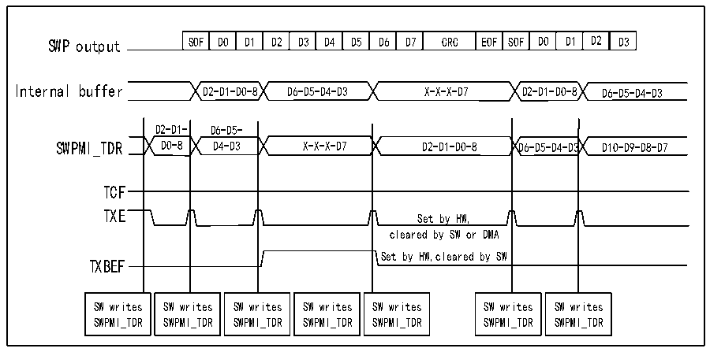

<!-- source-page: 836 -->

[← p.835](0835.md) · [index](../README.md) · [PDF p.836](https://ch32-riscv-ug.github.io/CH32H417/datasheet_en/CH32H417RM.PDF#page=836) · [p.837 →](0837.md)

<!-- header: CH32H417 Reference Manual https://wch-ic.com -->

Figure 38-5 SWPMI no software buffer mode transmission, continuous frames  
 <!-- rendered from the PDF; verify at https://ch32-riscv-ug.github.io/CH32H417/datasheet_en/CH32H417RM.PDF#page=836 -->

🖼 Text parsed from the figure above

SOF  D0  D1  D2  D3  D4  D5  D6  D7  CRC  EOF  SOF  D0  D1  D2  D3  
Internal buffer D2-D1-D0-8 D6-D5-D4-D3 X-X-X-D7 D2-D1-D0-8 D6-D5-D4-D3  
D2-D1- D6-D5-  
SWPMI_TDR D0-8 D4-D3 X-X-X-D7 D2-D1-D0-8 D6-D5-D4-D3 D10-D9-D8-D7  
TCF  
TXE  
Set by HW,  
cleared by SW or DMA  
Set by HW,cleared by SW  
TXBEF  
SW writes SWPMI_TDR  SW writes SWPMI_TDR  SW writes SWPMI_TDR  SW writes SWPMI_TDR  SW writes SWPMI_TDR  
SW writes SWPMI_TDR  SW writes SWPMI_TDR  

<strong>Single software buffer mode</strong>  
In Single Software Buffer Mode, complete SWP frames can be transmitted via DMA without CPU intervention.  
DMA will refill the 32-bit R32_SWPMI_TDR register. Software can poll the SWPMI_TXBEF flag to determine  
if frame transmission has completed. To select Single Software Buffer Mode: Clear the TXDMA bit 1 and  
TXMODE bit in the R32_SWPMI_CR register.  
The DMA channel or data stream must be configured in one of the following modes (refer to the DMA section):  
● Memory size set to 32 bits;  
● Peripheral size set to 32 bits;  
● Enable memory increment mode;  
● Disable cycle mode;  
● Disable peripheral increment mode;  
● Disable memory-to-memory mode;  
● Number of words to transfer must be set according to SWP frame length;  
● Target address is the R32_SWPMI_TDR register;  
● Data transfer direction is set to read from memory.  
● Source address is the SWP frame buffer in RAM.  
Subsequently, the user performs the following operations:  
1) Set the TXDMA bit in the R32_SWPMI_CR register to 1;  
2) Set the TXBEIE bit in the R32_SWPMI_IER register to 1;  
3) Populate the buffer in RAM memory (the number of data bytes in the payload is indicated by the least  
significant byte of the first word);  
4) Trigger the DMA transfer and frame transmission by enabling the data stream or channel within the DMA  
module.  
When the TXE flag in the R32_SWPMI_ISR is set to 1, the SWPMI will initiate a DMA request. During the  
DMA write operation to the R32_SWPMI_TDR register, the TXE flag bit will be automatically cleared.  
Within the SWPMI interrupt service routine, the user must check the TXBEF bit in the R32_SWPMI_ISR register.  
If this bit is set and additional frames remain to be transmitted, the user must perform the following actions:  
<!-- image: p836-draw-image-00001 bbox=[511.44, 786.36, 530.88, 796.68] -->
<!-- footer: V1.7 834 -->
