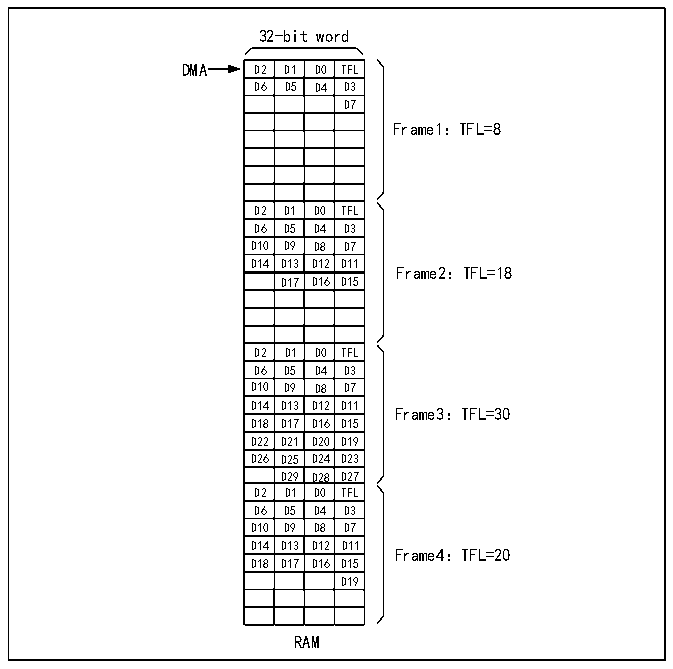

<!-- source-page: 837 -->

[← p.836](0836.md) · [index](../README.md) · [PDF p.837](https://ch32-riscv-ug.github.io/CH32H417/datasheet_en/CH32H417RM.PDF#page=837) · [p.838 →](0838.md)

<!-- header: CH32H417 Reference Manual https://wch-ic.com -->
1) Disable the data stream or channel within the DMA module;  
2) Update the buffer in RAM with the contents of the next frame to be transmitted;  
3) Set the total number of words to transfer in the DMA module;  
4) Enable the data stream or channel in the DMA module to trigger the next frame transmission;  
5) Clear the TXBEF flag by setting the CTXBEF bit in the R32_SWPMI_ICR register to 1.  
<strong>Multi-Software buffer mode</strong>  
Multi-Software buffer mode supports configuring multiple frame buffers in RAM memory to ensure continuous  
data transmission, maintain extremely low CPU load, and provide software with additional latency to execute  
buffer updates (using DMA). Software can monitor the DMA counter at any time and update the SWP frame in  
RAM memory accordingly.  
For optimal performance, Multi-Software Buffer Mode should be used in conjunction with DMA in cyclic mode.  
Within the SWP frame payload, each transmit buffer in RMA memory must have a fixed length of eight 32-bit  
words, regardless of the actual byte count. These transmit buffers require software filling, with an 8-byte offset  
maintained between consecutive buffers. The first data byte of the buffer indicates the total number of bytes in the  
frame payload, as illustrated below.  

Figure 38-6 SWPMI multi-software buffer mode transmission  
 <!-- rendered from the PDF; verify at https://ch32-riscv-ug.github.io/CH32H417/datasheet_en/CH32H417RM.PDF#page=837 -->

🖼 Text parsed from the figure above

32-bit word  

<!-- p837-table-001 (table-37-3@1) -->
<table><tr><th>D2</th><th>D1</th><th>D0</th><th>TFL</th></tr><tr><td>D6</td><td>D5</td><td>D4</td><td>D3</td></tr><tr><td></td><td></td><td></td><td>D7</td></tr><tr><td></td><td></td><td></td><td></td></tr><tr><td></td><td></td><td></td><td></td></tr><tr><td></td><td></td><td></td><td></td></tr><tr><td></td><td></td><td></td><td></td></tr><tr><td></td><td></td><td></td><td></td></tr><tr><td>D2</td><td>D1</td><td>D0</td><td>TFL</td></tr><tr><td>D6</td><td>D5</td><td>D4</td><td>D3</td></tr><tr><td>D10</td><td>D9</td><td>D8</td><td>D7</td></tr><tr><td>D14</td><td>D13</td><td>D12</td><td>D11</td></tr><tr><td></td><td>D17</td><td>D16</td><td>D15</td></tr><tr><td></td><td></td><td></td><td></td></tr><tr><td></td><td></td><td></td><td></td></tr><tr><td></td><td></td><td></td><td></td></tr><tr><td>D2</td><td>D1</td><td>D0</td><td>TFL</td></tr><tr><td>D6</td><td>D5</td><td>D4</td><td>D3</td></tr><tr><td>D10</td><td>D9</td><td>D8</td><td>D7</td></tr><tr><td>D14</td><td>D13</td><td>D12</td><td>D11</td></tr><tr><td>D18</td><td>D17</td><td>D16</td><td>D15</td></tr><tr><td>D22</td><td>D21</td><td>D20</td><td>D19</td></tr><tr><td>D26</td><td>D25</td><td>D24</td><td>D23</td></tr><tr><td></td><td>D29</td><td>D28</td><td>D27</td></tr><tr><td>D2</td><td>D1</td><td>D0</td><td>TFL</td></tr><tr><td>D6</td><td>D5</td><td>D4</td><td>D3</td></tr><tr><td>D10</td><td>D9</td><td>D8</td><td>D7</td></tr><tr><td>D14</td><td>D13</td><td>D12</td><td>D11</td></tr><tr><td>D18</td><td>D17</td><td>D16</td><td>D15</td></tr><tr><td></td><td></td><td></td><td>D19</td></tr><tr><td></td><td></td><td></td><td></td></tr><tr><td></td><td></td><td></td><td></td></tr></table>

Frame1：TFL=8  
D14 D13 D12 D11 Frame2：TFL=18  
D14 D13 D12 D11 Frame3：TFL=30  
Frame4：TFL=20  
RAM  

Select the multi-software buffer mode by setting the TXDMA and TXMODE bits in the R32_SWPMI_CR register  
to 1. To use 4 transmit buffers, the user must configure the DMA as follows:  
The DMA channel or data stream must be configured in the following modes (refer to the DMA section):  
● Memory size set to 32 bits;  
<!-- image: p837-draw-image-00001 bbox=[511.44, 786.36, 530.88, 796.68] -->
<!-- footer: V1.7 835 -->
