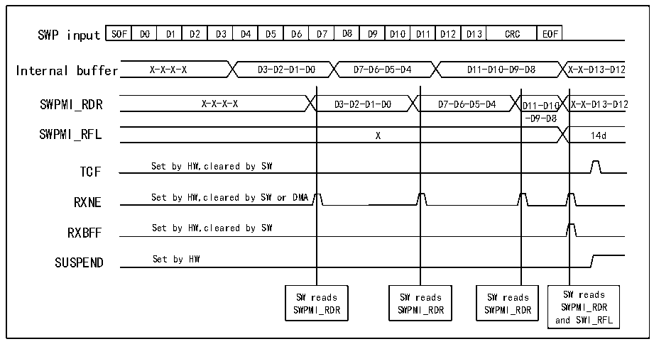

<!-- source-page: 839 -->

[← p.838](0838.md) · [index](../README.md) · [PDF p.839](https://ch32-riscv-ug.github.io/CH32H417/datasheet_en/CH32H417RM.PDF#page=839) · [p.840 →](0840.md)

<!-- header: CH32H417 Reference Manual https://wch-ic.com -->
data from the receive data register within the SWPMI peripheral to the software buffer in RAM memory.  
<strong>No software buffer mode</strong>  
In No Software Buffer Mode, DMA does not need to be enabled. Polling the status flag within the main loop or  
SWPMI interrupt routine handles SWP frame transmission. SWPMI includes a 32-bit receive data register  
(R32_SWPMI_RDR), allowing reception of up to 4 bytes before reading this register.  
No Software-buffer mode is selected by clearing the RXDMA bit in the R32_SWPMI_CR register.  
After receiving the Start of Frame (SOF), subsequent payload bytes are stored in the R32_SWPMI_RDR register.  
When R32_SWPMI_RDR is full, the RXNE flag in R32_SWPMI_ISR is set to 1. Additionally, an interrupt is  
generated if the RIE bit in the R32_SWPMI_IER register is set to 1. Users can read the R32_SWPMI_RDR  
register to retrieve data. When software reads the R32_SWPMI_RDR register, the RXNE flag is automatically  
cleared.  
Upon receiving a complete frame (CRC, EOF), the RXNE and RXBFF flags in the R32_SWPMI_ISR register are  
set to 1. The user must read the last byte(s) of the payload from the R32_SWPMI_RDR register and set the  
CRXBFF flag in the R32_SWPMI_ICR register to clear the RXBFF flag. The number of data bytes in the payload  
can be obtained from the R32_SWPMI_RFL register. When software reads the R32_SWPMI_RDR register, the  
RXNE flag is automatically reset again. As shown in the figure below.  
When RXNE is cleared, reading the R32_SWPMI_RDR register returns 0.  

Figure 38-7 SWPMI no software buffer mode reception  
 <!-- rendered from the PDF; verify at https://ch32-riscv-ug.github.io/CH32H417/datasheet_en/CH32H417RM.PDF#page=839 -->

🖼 Text parsed from the figure above

SOF  D0  D1  D2  D3  D4  D5  D6  D7  D8  D9  D10  D11  D12  D13  CRC  EOF  
Internal buffer X-X-X-X D3-D2-D1-D0 D7-D6-D5-D4 D11-D10-D9-D8 X-X-D13-D12  
SWPMI_RDR X-X-X-X D3-D2-D1-D0 D7-D6-D5-D4 D11-D10 X-X-D13-D12  
-D9-D8  
X  
TCF Set by HW,cleared by SW  
RXNE Set by HW,cleared by SW or DMA  
RXBFF Set by HW,cleared by SW  
SUSPEND Set by HW  
SW reads SW reads SW reads SW reads  
SWPMI_RDR SWPMI_RDR SWPMI_RDR SWPMI_RDR  
and SWI_RFL  

Single software buffer mode  
In Single Software Buffer Mode, complete SWP frames can be transmitted via DMA without CPU intervention.  
DMA transfers received data from the 32-bit R32_SWPMI_RDR register to RAM storage. Software can poll the  
SWPMI_RBFF flag to determine if frame reception has completed. Single Software Buffer Mode: Clear the  
RXDMA bit position 1 and RXMODE bit in the R32_SWPMI_CR register.  
The DMA channel or data stream must be configured in one of the following modes (refer to the DMA section):  
● Memory size set to 32 bits;  
<!-- image: p839-draw-image-00001 bbox=[511.44, 786.36, 530.88, 796.68] -->
<!-- footer: V1.7 837 -->
