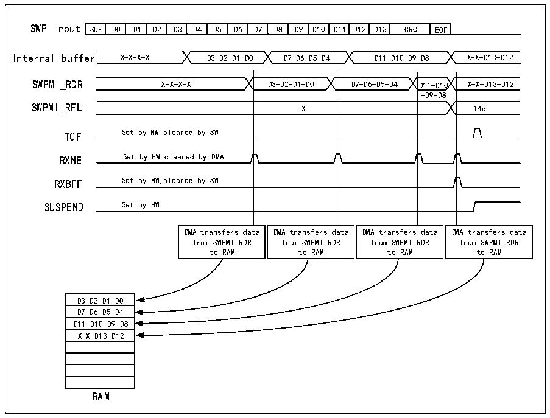

<!-- source-page: 841 -->

[← p.840](0840.md) · [index](../README.md) · [PDF p.841](https://ch32-riscv-ug.github.io/CH32H417/datasheet_en/CH32H417RM.PDF#page=841) · [p.842 →](0842.md)

<!-- header: CH32H417 Reference Manual https://wch-ic.com -->

Figure 38-8 SWPMI single software buffer mode reception  
 <!-- rendered from the PDF; verify at https://ch32-riscv-ug.github.io/CH32H417/datasheet_en/CH32H417RM.PDF#page=841 -->

🖼 Text parsed from the figure above

SOF  D0  D1  D2  D3  D4  D5  D6  D7  D8  D9  D10  D11  D12  D13  CRC  EOF  
Internal buffer X-X-X-X D3-D2-D1-D0 D7-D6-D5-D4 D11-D10-D9-D8 X-X-D13-D12  
SWPMI_RDR X-X-X-X D3-D2-D1-D0 D7-D6-D5-D4 D11-D10 X-X-D13-D12  
-D9-D8  
SWPMI_RFL X 14d  
X  
TCF Set by HW,cleared by SW  
RXNE Set by HW,cleared by DMA  
RXBFF Set by HW,cleared by SW  
SUSPEND Set by HW  
DMA transfers data from SWPMI_RDR to RAM  DMA transfers data from SWPMI_RDR to RAM  DMA transfers data from SWPMI_RDR to RAM  DMA transfers data from SWPMI_RDR to RAM  
D3-D2-D1-D0  D7-D6-D5-D4  D11-D10-D9-D8  X-X-D13-D12  
RAM  

<strong>Multi-Software Buffer Mode</strong>  
Multi-Software Buffer Mode supports configuring multiple frame buffers in RAM memory to ensure continuous  
data transmission while maintaining extremely low CPU load. Frame payloads and frame status flags are stored  
together in RAM memory. Software can check the DMA counter and status flags at any time to process SWP  
frames received in RAM memory.  
For optimal performance, Multi-Software Buffer Mode should be used in conjunction with DMA in cyclic mode.  
Select Multi-Software Buffer Mode: Set the RXDMA and RXMODE bits in the R32_SWPMI_CR register to 1.  
To implement n receive buffers in RAM, the DMA channel or data stream must be configured in one of the  
following modes (refer to the DMA section):  
● Memory size set to 32 bits;  
● Peripheral size set to 32 bits;  
● Number of words to transfer must be set to 8*n (8 words per buffer);  
● Data transfer direction set to read from peripheral;  
● Disable memory-to-memory mode;  
● Disable peripheral increment mode;  
● Enable memory increment mode;  
● Enable cyclic mode;  
● Source address is the R32_SWPMI_TDR register;  
● Destination address is buffer 1 in RAM.  
Subsequently, the user performs the following operations:  
1) Set bit 1 in the RXDMA field of the R32_SWPMI_CR register;  
<!-- image: p841-draw-image-00001 bbox=[511.44, 786.36, 530.88, 796.68] -->
<!-- footer: V1.7 839 -->
