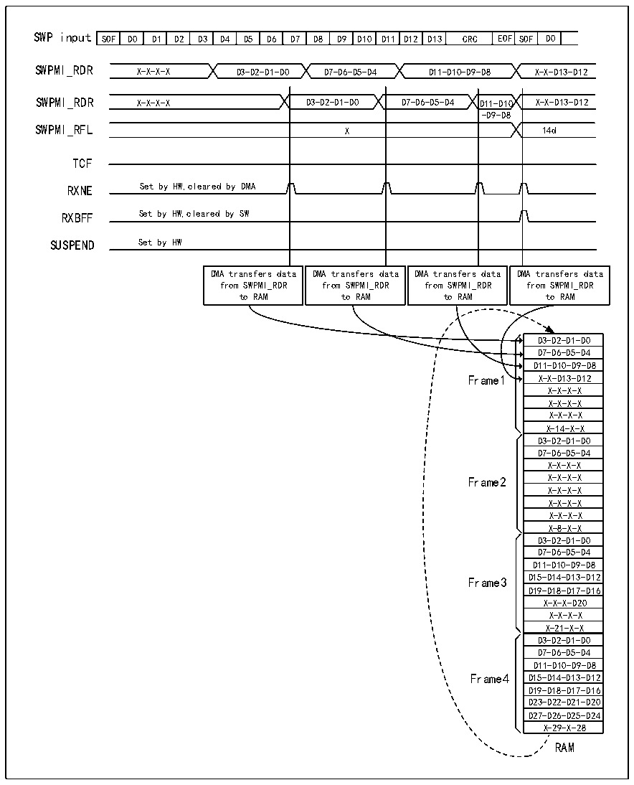

<!-- source-page: 842 -->

[← p.841](0841.md) · [index](../README.md) · [PDF p.842](https://ch32-riscv-ug.github.io/CH32H417/datasheet_en/CH32H417RM.PDF#page=842) · [p.843 →](0843.md)

<!-- header: CH32H417 Reference Manual https://wch-ic.com -->
2) Set bit 1 in the RXBEIE field of the R32_SWPMI_IER register;  
3) Enable the data stream or channel within the DMA module.  
In the SWPMI interrupt routine, the user must check the RXBEF bit in the R32_SWPMI_ISR register. If this bit is  
set to 1, the user should set the CTXBEF bit in the R32_SWPMI_ICR register to 1 to clear the RXBEF flag. The  
first frame payload received in the first buffer (the RAM address set in DMA2_CMAR1) can then be read. The  
number of data bytes in the payload can be obtained from bits [23:16] of the 8th word from the end.  
Upon the next SWPMI interrupt routine, the user reads the second frame received in the second buffer (address set  
in DMA2_CMAR1 + 8), repeating this process cyclically. See Figure 38-9.  

Figure 38-9 SWPMI multi-software buffer mode reception  
 <!-- rendered from the PDF; verify at https://ch32-riscv-ug.github.io/CH32H417/datasheet_en/CH32H417RM.PDF#page=842 -->

🖼 Text parsed from the figure above

SOF  D0  D1  D2  D3  D4  D5  D6  D7  D8  D9  D10  D11  D12  D13  CRC  EOF  SOF  D0  
SWPMI_RDR X-X-X-X D3-D2-D1-D0 D7-D6-D5-D4 D11-D10-D9-D8 X-X-D13-D12  
D11-D10 -D9-D8  X  DMA transfers data from SWPMI_RDR to RAM  DMA transfers data from SWPMI_RDR to RAM  DMA transfers data from SWPMI_RDR to RAM  DMA transfers data from SWPMI_RDR to RAM  
SWPMI_RFL X 14d  
TCF  
RXNE Set by HW,cleared by DMA  
RXBFF Set by HW,cleared by SW  
SUSPEND Set by HW  
D3-D2-D1-D0  
D7-D6-D5-D4  
D11-D10-D9-D8  
Frame1 X-X-D13-D12  
X-X-X-X  
X-X-X-X  
X-X-X-X  
X-14-X-X  
D3-D2-D1-D0  
D7-D6-D5-D4  
X-X-X-X  
Frame2 X-X-X-X  
X-X-X-X  
X-X-X-X  
X-X-X-X  
X-8-X-X  
D3-D2-D1-D0  
D7-D6-D5-D4  
D11-D10-D9-D8  
Frame3 D15-D14-D13-D12  
D19-D18-D17-D16  
X-X-X-D20  
X-X-X-X  
X-21-X-X  
D3-D2-D1-D0  
D7-D6-D5-D4  
D11-D10-D9-D8  
Frame4 D15-D14-D13-D12  
D19-D18-D17-D16  
D23-D22-D21-D20  
D27-D26-D25-D24  
X-29-X-28  
RAM  

<!-- image: p842-draw-image-00001 bbox=[511.44, 786.36, 530.88, 796.68] -->
<!-- footer: V1.7 840 -->
