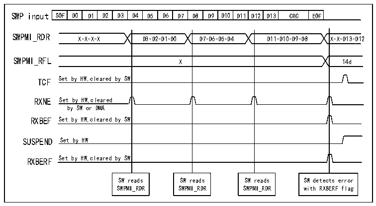

<!-- source-page: 844 -->

[← p.843](0843.md) · [index](../README.md) · [PDF p.844](https://ch32-riscv-ug.github.io/CH32H417/datasheet_en/CH32H417RM.PDF#page=844) · [p.845 →](0845.md)

<!-- header: CH32H417 Reference Manual https://wch-ic.com -->
and the next frame will set the overflow bit (bit 25 of the 8th byte) to 1.  
<strong>A CRC error occurred during payload reception</strong>  
Upon receiving two CRC bytes, if a CRC error occurs, the RXBERF flag in the R32_SWPMI_ISR register will be  
set to 1 after completing EOF reception. At this point, if the RXBEIE bit in the R32_SWPMI_IER register is set to  
1, an interrupt will be triggered. Refer to Figure 38-10. To clear the RXBERF flag, the user must set the  
CRXBERF bit in the R32_SWPMI_ICR register to 1.  

Figure 38-10 SWPMI single buffer mode reception (with CRC error)  
 <!-- rendered from the PDF; verify at https://ch32-riscv-ug.github.io/CH32H417/datasheet_en/CH32H417RM.PDF#page=844 -->

🖼 Text parsed from the figure above

SOF  D0  D1  D2  D3  D4  D5  D6  D7  D8  D9  D10  D11  D12  D13  CRC  EOF  
SWPMI_RDR  
X-X-X-X D3-D2-D1-D0 D7-D6-D5-D4 D11-D10-D9-D8 X-X-D13-D12  
X  
TCF Set by HW,cleared by SW  
RXNE Set by HW,cleared  
by SW or DMA  
RXBEF Set by HW,cleared by SW  
SUSPEND Set by HW  
RXBERF Set by HW,cleared by SW  
SW reads SW reads SW reads SW detects error  
SWPMI_RDR SWPMI_RDR SWPMI_RDR with RXBERF flag  

<strong>Loss or corruption of padding bits during payload reception</strong>  
When the padding bits in the payload are lost or damaged, the RXBERF and RXBFF flags in R32_SWPMI_ISR  
will be set to 1 after receiving EOF.  
<strong>Receiving damaged EOF</strong>  
After receiving SOF, SWPMI will start to accumulate the received bytes until EOF is received (ignoring any  
possible SOF). After receiving EOF, SWPMI will be ready to start a new round of frame reception and wait for  
the next SOF. If the EOF is damaged, the RXBERF and RXBFF flags in the SWPMI_ISR register will be set after  
the next EOF is received.  
<em>Note: When the damaged EOF is received, the payload will continue to be received. Therefore, if the number of</em>  
<em>bytes received exceeds 30, the number of bytes in the payload can take the value of 31. The number of bytes in the</em>  
<em>payload is read in the R32_SWPMI_RFL register, or in bits [23:16] of the 8th word in the RAM memory buffer</em>  
<em>according to different working modes.</em>  

### 38.3.9 Loopback Mode

You can use loopback mode for testing. The user must set the LPBK bit in the R32_SWPMI_CR register to enable  
loopback mode. When loopback mode is enabled, SWP_TX and SWP_RX signals will be connected. Therefore,  
all frames sent through SWPMI will be retracted.  

### 38.3.10 SWPMI Interrupt

All SWPMI interrupts are connected to PFIC. To enable SWPMI interrupts, the following process is required:  
1) Configure the SWPMI interrupt channel in PFIC and enable it;  
<!-- image: p844-draw-image-00001 bbox=[511.44, 786.36, 530.88, 796.68] -->
<!-- footer: V1.7 842 -->
