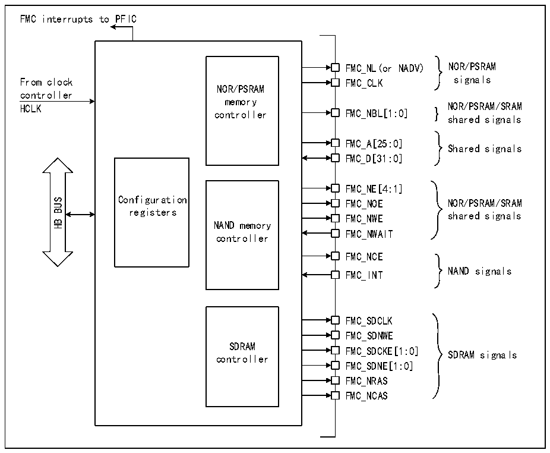

<!-- source-page: 857 -->

[← p.856](0856.md) · [index](../README.md) · [PDF p.857](https://ch32-riscv-ug.github.io/CH32H417/datasheet_en/CH32H417RM.PDF#page=857) · [p.858 →](0858.md)

<!-- header: CH32H417 Reference Manual https://wch-ic.com -->

Figure 40-1 Structural block diagram of FMC  
 <!-- rendered from the PDF; verify at https://ch32-riscv-ug.github.io/CH32H417/datasheet_en/CH32H417RM.PDF#page=857 -->

🖼 Text parsed from the figure above

FMC interrupts to PFIC  
FMC_NL(or NADV) NOR/PSRAM  
From clock FMC_CLK signals  
NOR/PSRAM  
controller  
memory  
HCLK controller FMC_NBL[1:0] } NOR/PSRAM/SRAM  
shared signals  
FMC_A[25:0]  
Shared signals  
FMC_D[31:0]  
FMC_NE[4:1]  
Configuration FMC_NOE NOR/PSRAM/SRAM  
BUS  
registers FMC_NWE shared signals  
HB  
NAND memory  
FMC_NWAIT  
controller  
FMC_NCE  
NAND signals  
FMC_INT  
FMC_SDCLK  
FMC_SDNWE  
SDRAM  
FMC_SDCKE[1:0]  
SDRAM signals  
controller  
FMC_SDNE[1:0]  
FMC_NRAS  
FMC_NCAS  

## 40.3 HB Interface

The HB device interface permits the CPU and other HB bus masters to access external memory. HB transactions  
are translated into external device protocols. Specifically, when the selected external memory width is 16 bits or 8  
bits, the 32-bit-wide transaction in the HB is split into multiple consecutive 16-bit or 8-bit accesses. Between  
consecutive accesses, the FMC chip select (FMC_NEx) does not toggle, except when operating in access mode D  
with extended mode enabled.  
The FMC generates an HB error under the following conditions:  
● Reading or writing to an FMC memory region that is not enabled.  
● Violating the SDRAM address range (accessing reserved address ranges).  
● Writing to a write-protected SDRAM memory region (WP bit 1 in the R32_FMC_SDCRx register).  
● Reading or writing to NOR Flash memory regions when the FACCEN bit in the R32_FMC_BCRx register is  
reset.  
The impact of this HB error depends on the HB master device attempting the read/write access.  
● If it is the DMA controller, a DMA transfer error is generated and the corresponding DMA channel is  
automatically disabled.  
The HB clock (HCLK) serves as the reference clock for the FMC.  
<!-- image: p857-draw-image-00001 bbox=[511.44, 786.36, 530.88, 796.68] -->
<!-- footer: V1.7 855 -->
