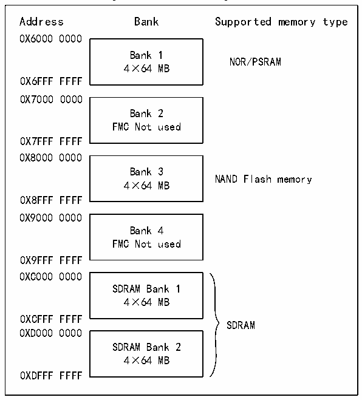

<!-- source-page: 859 -->

[← p.858](0858.md) · [index](../README.md) · [PDF p.859](https://ch32-riscv-ug.github.io/CH32H417/datasheet_en/CH32H417RM.PDF#page=859) · [p.860 →](0860.md)

<!-- header: CH32H417 Reference Manual https://wch-ic.com -->

Figure 40-2 FMC storage area  
 <!-- rendered from the PDF; verify at https://ch32-riscv-ug.github.io/CH32H417/datasheet_en/CH32H417RM.PDF#page=859 -->

🖼 Text parsed from the figure above

Address Bank Supported memory type  
0X6000 0000  
Bank 1  
NOR/PSRAM  
4×64 MB  
0X6FFF FFFF  
0X7000 0000  
Bank 2  
FMC Not used  
0X7FFF FFFF  
0X8000 0000  
Bank 3  
NAND Flash memory  
4×64 MB  
0X8FFF FFFF  
0X9000 0000  
Bank 4  
FMC Not used  
0X9FFF FFFF  
0XC000 0000  
SDRAM Bank 1  
4×64 MB  
0XCFFF FFFF  
SDRAM  
0XD000 0000  
SDRAM Bank 2  
4×64 MB  
0XDFFF FFFF  

Memory Area 1 can connect up to 4 NOR Flash or PSRAM devices. This memory area is divided into four  
NOR/PSRAM/SR sub-areas with four dedicated chip select signals: Memory Area 1 NOR/PSRAM1, Memory  
Area 1 NOR/PSRAM2, Memory Area 1 NOR/PSRAM3, and Memory Area 1 NOR/PSRAM4. Memory Area 3 is  
used to connect NAND Flash devices. The MPU memory characteristics of this space must be reconfigured into  
the device via software. Memory regions 4 and 5 are used to connect SDRAM devices (one device per memory  
region).  
For each memory region, the memory type to be used can be configured by the user application through  
configuration registers.  
The FMC memory area mapping can be modified via the BMP[1:0] bits in the R32_FMC_BCR1 register. The  
table below shows configurations for swapping NOR/PSRAM memory areas with SDRAM memory areas or  
remapping SDRAM Memory Area 2, thereby enabling access to the SDRAM memory area across two distinct  
address maps.  

<!-- p859-table-001 (table-40-1@1) -->
<table><caption>Table 40-1 FMC storage area mapping option</caption><tr><th>Start address-End address</th><th style="text-align:left">BMP[1:0]=00 (Default mapping)</th><th style="text-align:left">BMP[1:0]=01 exchange NOR/PSRAM to SDRAM storage area</th></tr><tr><td>0x60000000-0x6FFFFFFF</td><td style="text-align:left">NOR/PSRAM storage area</td><td>SDRAM storage area 1</td></tr><tr><td>0x70000000-0x7FFFFFFF</td><td colspan="2">FMC unused</td></tr><tr><td>0x80000000-0x8FFFFFFF</td><td>NAND storage area</td><td>NAND storage area</td></tr><tr><td>0x90000000-0x9FFFFFFF</td><td colspan="2">FMC unused</td></tr></table>

<!-- image: p859-draw-image-00001 bbox=[511.44, 786.36, 530.88, 796.68] -->
<!-- footer: V1.7 857 -->
