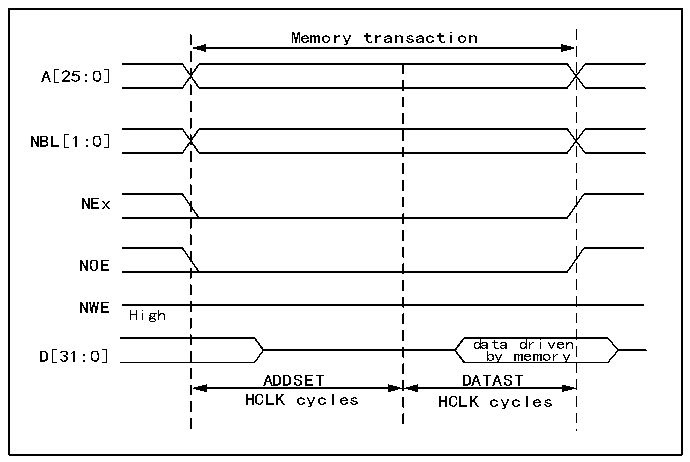

<!-- source-page: 868 -->

[← p.867](0867.md) · [index](../README.md) · [PDF p.868](https://ch32-riscv-ug.github.io/CH32H417/datasheet_en/CH32H417RM.PDF#page=868) · [p.869 →](0869.md)

<!-- header: CH32H417 Reference Manual https://wch-ic.com -->
FMC_CLK clock.  
- NOEH/NWEH/NEH/NOEH/NBLH address valid outputs change on the rising edge of the FMC_CLK
clock.  

### 40.5.4 NOR Flash/PSRAM Controller Asynchronous Transaction

Asynchronous static memory (NOR Flash, PSRAM, SRAM)  
● Signals are synchronized via the internal clock HCLK. This clock is not sent to the memory;  
● FMC always samples data before disabling the chip select signal NE. This ensures compliance with memory  
data hold timing requirements (typically 0ns from chip select enable high to minimum data conversion time).  
● If extended mode is enabled (EXTMOD bit set to 1 in the R32_FMC_BCRx register), up to four extended  
modes (A, B, C, D) are available. Modes A, B, C, and D can be mixed for read and write operations. For  
example, a read operation can be performed in mode A while a write operation occurs in mode B.  
● If extended mode is disabled (EXTMOD bit cleared in the R32_FMC_BCRx register), the FMC can operate  
in either Mode 1 or Mode 2 as described below:  
- When selecting SRAM/PSRAM memory type, Mode 1 is the default mode (MTYP = 0x0 or 0x01 in the
R32_FMC_BCRx register);  
- When selecting NOR memory type, Mode 2 is the default mode (MTYP = 0x10 in the
R32_FMC_BCRx register).  
<strong>Mode 1-SRAM/PSRAM (CRAM)</strong>  
As shown in the figure below, the supported modes for read and write transactions, along with the required  
R32_FMC_BCRx and R32_FMC_BTRx/R32_FMC_BWTRx register configurations.  

Figure 40-3 Mode 1 read access waveform  
 <!-- rendered from the PDF; verify at https://ch32-riscv-ug.github.io/CH32H417/datasheet_en/CH32H417RM.PDF#page=868 -->

🖼 Text parsed from the figure above

Memory transaction  
A[25:0]  
NBL[1:0]  
NEx  
NOE  
NWE  
High  
data driven  
D[31:0] by memory  
ADDSET DATAST  
HCLK cycles HCLK cycles  

<!-- image: p868-draw-image-00001 bbox=[511.44, 786.36, 530.88, 796.68] -->
<!-- footer: V1.7 866 -->
