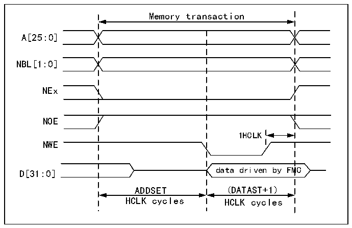

<!-- source-page: 869 -->

[← p.868](0868.md) · [index](../README.md) · [PDF p.869](https://ch32-riscv-ug.github.io/CH32H417/datasheet_en/CH32H417RM.PDF#page=869) · [p.870 →](0870.md)

<!-- header: CH32H417 Reference Manual https://wch-ic.com -->

Figure 40-4 Mode 1 write access waveform  
 <!-- rendered from the PDF; verify at https://ch32-riscv-ug.github.io/CH32H417/datasheet_en/CH32H417RM.PDF#page=869 -->

🖼 Text parsed from the figure above

Memory transaction  
A[25:0]  
NBL[1:0]  
NEx  
NOE  
1HCLK  
NWE  
D[31:0] data driven by FMC  
ADDSET (DATAST+1)  
HCLK cycles HCLK cycles  

Writing one HCLK cycle at the end of a transaction helps ensure address and data hold time after the NEW rising  
edge. Due to this HCLK cycle, the DATAST value must be greater than zero (DATAST &gt; 0).  

<!-- p869-table-001 (table-40-17@1) -->
<table><caption>Table 40-17 R32_FMC_BCRx bit field</caption><tr><th>Bit number</th><th>Bit name</th><th>The value to set</th></tr><tr><td>31</td><td>FMC_EN</td><td>0x1</td></tr><tr><td>[30:26]</td><td>Reserved</td><td>0x00</td></tr><tr><td>[25:24]</td><td>BMP</td><td>0x0 or 0x1</td></tr><tr><td>[23:20]</td><td>Reserved</td><td>0x0</td></tr><tr><td>19</td><td>CBURSTRW</td><td>0x0 (has no effect on asynchronous mode)</td></tr><tr><td>[18:16]</td><td>CPSIZE</td><td>0x0 (has no effect on asynchronous mode)</td></tr><tr><td>15</td><td>ASYNCWAIT</td><td style="text-align:left">Set to 1 if the memory supports this feature. Otherwise, it remains at 0.</td></tr><tr><td>14</td><td>EXTMOD</td><td>0x0</td></tr><tr><td>13</td><td>WAITEN</td><td>0x0 (has no effect on asynchronous mode)</td></tr><tr><td>12</td><td>WREN</td><td>Make the settings as needed.</td></tr><tr><td>11</td><td>Reserved</td><td>0x0</td></tr><tr><td>10</td><td>WRAPMOD</td><td>0x0</td></tr><tr><td>9</td><td>WAITPOL</td><td>It only makes sense when bit 15 is 1.</td></tr><tr><td>8</td><td>BURSTEN</td><td>0x0</td></tr><tr><td>7</td><td>Reserved</td><td>0x1</td></tr><tr><td>6</td><td>FACCEN</td><td>Irrelevant</td></tr><tr><td>[5:4]</td><td>MWID</td><td>Make the settings as needed.</td></tr><tr><td>[3:2]</td><td>MTYP</td><td style="text-align:left">Make the settings as needed, excluded 0x2 (NOR Flash)</td></tr><tr><td>1</td><td>MUXE</td><td>0x0</td></tr><tr><td>0</td><td>MBKEN</td><td>0x1</td></tr></table>

<!-- p869-table-002 (table-40-18@1) pages 869-870 -->
<table><caption>Table 40-18 FMC_BTRx bit field</caption><tr><th>Bit number</th><th>Bit name</th><th>The value to set</th></tr><tr><td>[31:30]</td><td>Reserved</td><td>0x00</td></tr><tr><td>[29:28]</td><td>ACCMOD</td><td>Irrelevant</td></tr><tr><td>[27:24]</td><td>DATLAT</td><td>Irrelevant</td></tr><tr><td>[23:20]</td><td>CLKDIV</td><td>Irrelevant</td></tr><tr><td>[19:16]</td><td>BUSTURN</td><td style="text-align:left">The time interval between NEx going high and NEx going low (BUSTURN HCLK)</td></tr><tr><td>[15:8]</td><td>DATAST</td><td style="text-align:left">The duration of the second access phase (DATAST+1 HCLK cycles write accesses, DATAST HCLK cycles for read accesses).</td></tr><tr><td>[7:4]</td><td>ADDHLD</td><td>Irrelevant</td></tr><tr><td>[3:0]</td><td>ADDSET</td><td style="text-align:left">Duration of the first access phase (ADDSET HCLK cycles). The minimum value for ADDSET is 0.</td></tr></table>

<!-- image: p869-draw-image-00001 bbox=[511.44, 786.36, 530.88, 796.68] -->
<!-- footer: V1.7 867 -->
