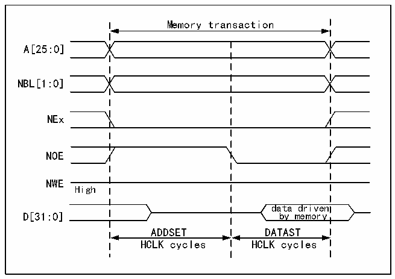

<!-- source-page: 870 -->

[← p.869](0869.md) · [index](../README.md) · [PDF p.870](https://ch32-riscv-ug.github.io/CH32H417/datasheet_en/CH32H417RM.PDF#page=870) · [p.871 →](0871.md)

<!-- header: CH32H417 Reference Manual https://wch-ic.com -->

> ⬆ **Table continued** — rendered in full at [page 869](0869.md). <!-- p870-table-001 -->

<strong>Mode A-SRAM/PSRAM (CRAM) OE switching</strong>  

Figure 40-5 Mode A read access waveform  
 <!-- rendered from the PDF; verify at https://ch32-riscv-ug.github.io/CH32H417/datasheet_en/CH32H417RM.PDF#page=870 -->

🖼 Text parsed from the figure above

Memory transaction  
A[25:0]  
NBL[1:0]  
NEx  
NOE  
NWE  
High  
data driven  
D[31:0] by memory  
ADDSET DATAST  
HCLK cycles HCLK cycles  

<em>Note: NBL[1:0] is low during read access.</em>  
<!-- image: p870-draw-image-00001 bbox=[511.44, 786.36, 530.88, 796.68] -->
<!-- footer: V1.7 868 -->
