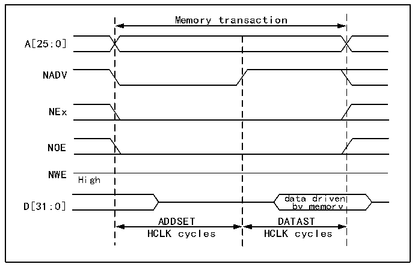

<!-- source-page: 872 -->

[← p.871](0871.md) · [index](../README.md) · [PDF p.872](https://ch32-riscv-ug.github.io/CH32H417/datasheet_en/CH32H417RM.PDF#page=872) · [p.873 →](0873.md)

<!-- header: CH32H417 Reference Manual https://wch-ic.com -->

> ⬆ **Table continued** — rendered in full at [page 871](0871.md). <!-- p872-table-001 -->

<!-- p872-table-002 (table-40-21@1) -->
<table><caption>Table 40-21 R32_FMC_BWTRx bit field</caption><tr><th>Bit number</th><th>Bit name</th><th>The value to set</th></tr><tr><td>[31:30]</td><td>Reserved</td><td>0x00</td></tr><tr><td>[29:28]</td><td>ACCMOD</td><td>0x00</td></tr><tr><td>[27:24]</td><td>DATLAT</td><td>Irrelevant</td></tr><tr><td>[23:20]</td><td>CLKDIV</td><td>Irrelevant</td></tr><tr><td>[19:16]</td><td>BUSTURN</td><td style="text-align:left">The time interval between NEx going high and NEx going low (BUSTURN HCLK)</td></tr><tr><td>[15:8]</td><td>DATAST</td><td style="text-align:left">The duration of the second access phase (DATAST HCLK cycles).</td></tr><tr><td>[7:4]</td><td>ADDHLD</td><td>Irrelevant</td></tr><tr><td>[3:0]</td><td>ADDSET</td><td style="text-align:left">Duration of the first access phase (ADDSET HCLK cycles). The minimum value for ADDSET is 0.</td></tr></table>

<strong>Mode 2/B-NOR Flash</strong>  

Figure 40-7 Mode 2 and Mode B read access waveform  
 <!-- rendered from the PDF; verify at https://ch32-riscv-ug.github.io/CH32H417/datasheet_en/CH32H417RM.PDF#page=872 -->

🖼 Text parsed from the figure above

Memory transaction  
A[25:0]  
NADV  
NEx  
NOE  
NWE  
High  
data driven  
D[31:0] by memory  
ADDSET DATAST  
HCLK cycles HCLK cycles  

<!-- image: p872-draw-image-00001 bbox=[511.44, 786.36, 530.88, 796.68] -->
<!-- footer: V1.7 870 -->
