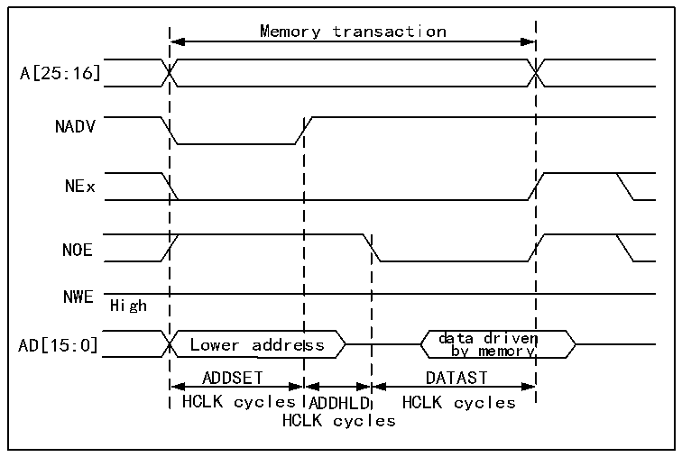
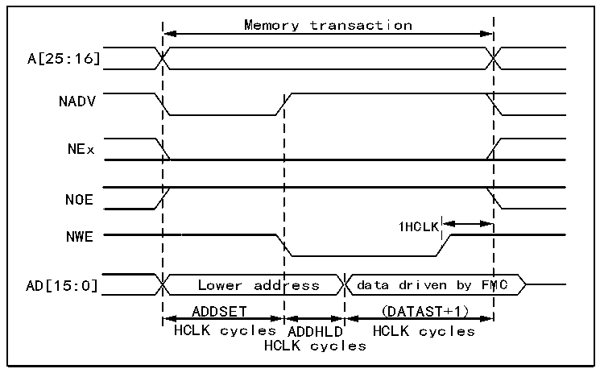

<!-- source-page: 879 -->

[← p.878](0878.md) · [index](../README.md) · [PDF p.879](https://ch32-riscv-ug.github.io/CH32H417/datasheet_en/CH32H417RM.PDF#page=879) · [p.880 →](0880.md)

<!-- header: CH32H417 Reference Manual https://wch-ic.com -->

> ⬆ **Table continued** — rendered in full at [page 878](0878.md). <!-- p879-table-001 -->

<strong>Multiplex mode-multiplex asynchronous access NOR Flash</strong>  

Figure 40-14 Multiplex read access waveforms  
 <!-- rendered from the PDF; verify at https://ch32-riscv-ug.github.io/CH32H417/datasheet_en/CH32H417RM.PDF#page=879 -->

🖼 Text parsed from the figure above

Memory transaction  
A[25:16]  
NADV  
NEx  
NOE  
NWE  
High  
data driven  
AD[15:0] Lower address  
by memory  
ADDSET DATAST  
HCLK cycles ADDHLD HCLK cycles  
HCLK cycles  

Figure 40-15 Multiplex write access waveforms  
 <!-- rendered from the PDF; verify at https://ch32-riscv-ug.github.io/CH32H417/datasheet_en/CH32H417RM.PDF#page=879 -->

🖼 Text parsed from the figure above

Memory transaction  
A[25:16]  
NADV  
NEx  
NOE  
1HCLK  
NWE  
AD[15:0] Lower address data driven by FMC  
ADDSET (DATAST+1)  
HCLK cycles ADDHLD HCLK cycles  
HCLK cycles  

The difference from mode D is that low address bytes are driven on the data bus.  

<!-- p879-table-002 (table-40-31@1) pages 879-880 -->
<table><caption>Table 40-31 R32_FMC_BCRx bit field</caption><tr><th>Bit number</th><th>Bit name</th><th>The value to set</th></tr><tr><td>31</td><td>FMC_EN</td><td>0x1</td></tr><tr><td>[30:26]</td><td>Reserved</td><td>0x00</td></tr><tr><td>[25:24]</td><td>BMP</td><td>0x0 or 0x1</td></tr><tr><td>[23:20]</td><td>Reserved</td><td>0x0</td></tr><tr><td>19</td><td>CBURSTRW</td><td>0x0 (has no effect on asynchronous mode)</td></tr><tr><td>[18:16]</td><td>CPSIZE</td><td>0x0 (has no effect on asynchronous mode)</td></tr><tr><td>15</td><td>ASYNCWAIT</td><td style="text-align:left">Set to 1 if the memory supports this feature. Otherwise, it remains at 0.</td></tr><tr><td>14</td><td>EXTMOD</td><td>0x0</td></tr><tr><td>13</td><td>WAITEN</td><td>0x0 (has no effect on asynchronous mode)</td></tr><tr><td>12</td><td>WREN</td><td>Make the settings as needed.</td></tr><tr><td>11</td><td>WAITCFG</td><td>Irrelevant</td></tr><tr><td>10</td><td>Reserved</td><td>0x0</td></tr><tr><td>9</td><td>WAITPOL</td><td>It only makes sense when bit 15 is 1.</td></tr><tr><td>8</td><td>BURSTEN</td><td>0x0</td></tr><tr><td>7</td><td>Reserved</td><td>0x1</td></tr><tr><td>6</td><td>FACCEN</td><td>0x1</td></tr><tr><td>[5:4]</td><td>MWID</td><td>Make the settings as needed.</td></tr><tr><td>[3:2]</td><td>MTYP</td><td>0x2 (NOR Flash)</td></tr><tr><td>1</td><td>MUXEN</td><td>0x0</td></tr><tr><td>0</td><td>MBKEN</td><td>0x1</td></tr></table>

<!-- image: p879-draw-image-00001 bbox=[511.44, 786.36, 530.88, 796.68] -->
<!-- footer: V1.7 877 -->
