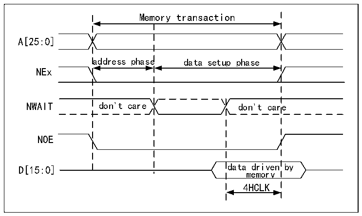

<!-- source-page: 881 -->

[← p.880](0880.md) · [index](../README.md) · [PDF p.881](https://ch32-riscv-ug.github.io/CH32H417/datasheet_en/CH32H417RM.PDF#page=881) · [p.882 →](0882.md)

<!-- header: CH32H417 Reference Manual https://wch-ic.com -->
DATAST≥(4*HCLK)+ max_wait_assertion_time  
2) The WAIT signal sent by the memory is aligned with NEx (or the NOE/NWE signal does not flip):  
If  
max_wait_assertion_time&gt;address_phase+hold_phase  
Then:  
DATAST≥(4*HCLK)+(max_wait_assertion_time–address_phase–hold_phase)  
Otherwise  
DATAST≥4*HCLK  
Where max_wait_assertion_time is the longest time it takes for the memory to enable the wait signal after  
NEx/NOE/NWE goes low.  
Figures 40-15 and 40-16 show the number of increased HCLK clock cycles in the memory access phase after the  
asynchronous memory releases WAIT (independent of the above situation).  

Figure 40-16 Asynchronous waiting during reading access waveform  
 <!-- rendered from the PDF; verify at https://ch32-riscv-ug.github.io/CH32H417/datasheet_en/CH32H417RM.PDF#page=881 -->

🖼 Text parsed from the figure above

Memory transaction  
A[25:0]  
address phase data setup phase  
NEx  
NWAIT don&#x27;t care don&#x27;t care  
NOE  
data driven by  
D[15:0]  
memory  
4HCLK  

<em>Note: The polarity of NWAIT depends on the setting of WAITPOL bit in R32_FMC_BCRx register.</em>  
<!-- image: p881-draw-image-00001 bbox=[511.44, 786.36, 530.88, 796.68] -->
<!-- footer: V1.7 879 -->
