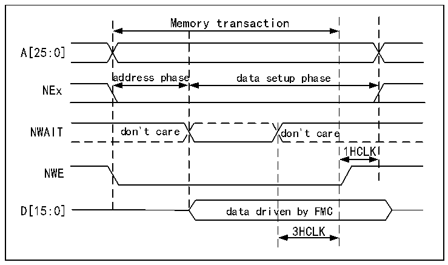

<!-- source-page: 882 -->

[← p.881](0881.md) · [index](../README.md) · [PDF p.882](https://ch32-riscv-ug.github.io/CH32H417/datasheet_en/CH32H417RM.PDF#page=882) · [p.883 →](0883.md)

<!-- header: CH32H417 Reference Manual https://wch-ic.com -->

Figure 40-17 Asynchronous waiting during writing access waveform  
 <!-- rendered from the PDF; verify at https://ch32-riscv-ug.github.io/CH32H417/datasheet_en/CH32H417RM.PDF#page=882 -->

🖼 Text parsed from the figure above

Memory transaction  
A[25:0]  
address phase data setup phase  
NEx  
NWAIT don&#x27;t care don&#x27;t care  
1HCLK  
NWE  
D[15:0] data driven by FMC  
3HCLK  

<em>Note: The polarity of NWAIT depends on the setting of WAITPOL bit in R32_FMC_BCRx register.</em>  

### 40.5.5 Synchronous Transaction

The memory clock FMC_CLK is a divisor of HCLK. It depends on the value of CLKDIV and the MWID/HB data  
size, as shown in the following formula:  
FMC_CLK Frequency division ratio = max (CLKDIV+1, MWID (HB data size))  
When MWID is 16-bit or 8-bit, the frequency division ratio of FMC_CLK is always defined by the setting value  
of CLKDIV.  
When MWID is 32-bit, the frequency division ratio of FMC_CLK also depends on the size of HB data.  
Example:  
● LKDIV=1, MWID=32 bits, when HB data size=8 bits, FMC_CLK=HCLK/4.  
● CLKDIV=1, MWID=16 bits, when HB data size =8 bits, FMC_CLK=HCLK/2.  
NOR Flash specifies the minimum time from NADV enable to CLK high. In order to meet this limitation, FMC  
will not send the clock to the memory within the first internal clock cycle of synchronous access (before NADV is  
enabled). This ensures that the rising edge of the memory clock appears in the middle of the NADV low pulse.  
<strong>Data delay and NOR delay</strong>  
Data delay is the number of cycles to wait before sampling data. The value of DATLAT must match the delay  
value specified in the NORFLASH configuration register. When NADV is low in the data delay count, FMC will  
not count the clock period.  
Some NOR Flash count the NADV low period in the data delay count, so the exact relationship between the NOR  
Flash delay and the FMC DATLAT parameter can be any of the following:  
● NOR Flash delay =(DATLAT+2) CLK clock cycles.  
● NOR Flash delay =(DATLAT+3) CLK clock cycles.  
Recently, some memories will enable NWAIT in the delay phase. In this case, you can set DATLAT to the  
minimum value. Then, FMC will sample the data and wait long enough to evaluate whether the data is valid. In  
this way, FMC can detect the delay time in the memory, so as to process the real data.  
Other memories will not enable NWAIT during the delay. In this case, the delay of FMC and memory must be set  
correctly, otherwise invalid data may be misused as valid data, or valid data may be lost in the initial stage of  
<!-- image: p882-draw-image-00001 bbox=[511.44, 786.36, 530.88, 796.68] -->
<!-- footer: V1.7 880 -->
