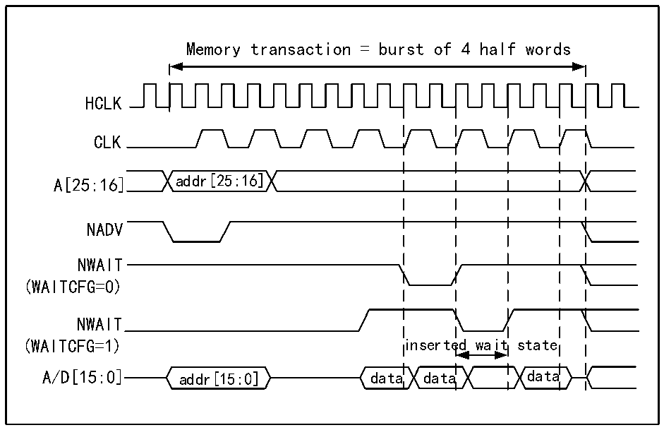

<!-- source-page: 884 -->

[← p.883](0883.md) · [index](../README.md) · [PDF p.884](https://ch32-riscv-ug.github.io/CH32H417/datasheet_en/CH32H417RM.PDF#page=884) · [p.885 →](0885.md)

<!-- header: CH32H417 Reference Manual https://wch-ic.com -->

Figure 40-18 Waiting configuration waveform  
 <!-- rendered from the PDF; verify at https://ch32-riscv-ug.github.io/CH32H417/datasheet_en/CH32H417RM.PDF#page=884 -->

🖼 Text parsed from the figure above

Memory transaction = burst of 4 half words  
HCLK  
CLK  
A[25:16] addr[25:16]  
NADV  
NWAIT  
(WAITCFG=0)  
NWAIT  
(WAITCFG=1) inserted wait state  
A/D[15:0] addr[15:0] data data data  

<!-- image: p884-draw-image-00001 bbox=[511.44, 786.36, 530.88, 796.68] -->
<!-- footer: V1.7 882 -->
