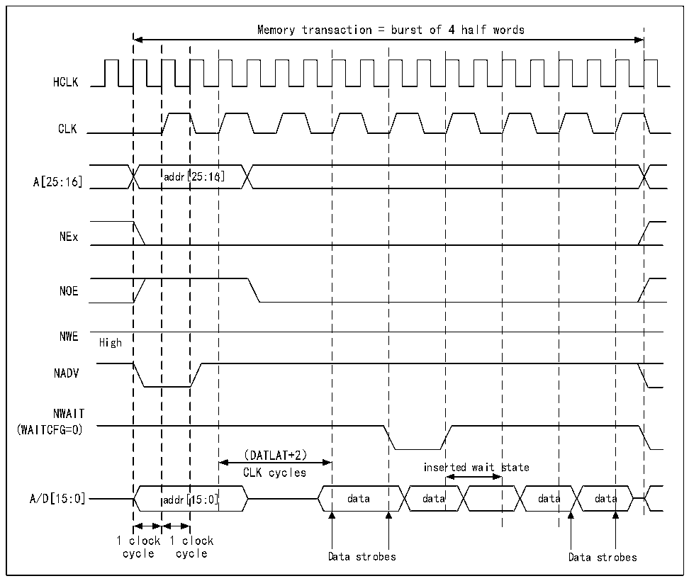

<!-- source-page: 885 -->

[← p.884](0884.md) · [index](../README.md) · [PDF p.885](https://ch32-riscv-ug.github.io/CH32H417/datasheet_en/CH32H417RM.PDF#page=885) · [p.886 →](0886.md)

<!-- header: CH32H417 Reference Manual https://wch-ic.com -->

Figure 40-19 Synchronous multiplexing read mode waveform-NOR, PSRAM (CRAM)  
 <!-- rendered from the PDF; verify at https://ch32-riscv-ug.github.io/CH32H417/datasheet_en/CH32H417RM.PDF#page=885 -->

🖼 Text parsed from the figure above

Memory transaction = burst of 4 half words  
HCLK  
CLK  
A[25:16] addr[25:16]  
NEx  
NOE  
NWE  
High  
NADV  
NWAIT  
(WAITCFG=0)  
（DATLAT+2）  
inserted wait state  
CLK cycles  
A/D[15:0] addr[15:0] data data data data  
1 clock 1 clock  
cycle cycle Data strobes Data strobes  

<em>Note: Byte channel outputs NBL are not shown. They remain high for NOR access and low for PSRAM(CRAM)</em>  
<em>access.</em>  

<!-- p885-table-001 (table-40-33@1) pages 885-886 -->
<table><caption>Table 40-33 R32_FMC_BCRx bit field</caption><tr><th>Bit number</th><th>Bit name</th><th>The value to set</th></tr><tr><td>31</td><td>FMC_EN</td><td>0x1</td></tr><tr><td>[30:26]</td><td>Reserved</td><td>0x00</td></tr><tr><td>[25:24]</td><td>BMP</td><td>0x0 or 0x1</td></tr><tr><td>[23:20]</td><td>Reserved</td><td>0x0</td></tr><tr><td>19</td><td>CBURSTRW</td><td style="text-align:left">There is no effect on synchronous reading.</td></tr><tr><td>[18:16]</td><td>CPSIZE</td><td>0x0 (has no effect on asynchronous mode)</td></tr><tr><td>15</td><td>ASYNCWAIT</td><td>0x0</td></tr><tr><td>14</td><td>EXTMOD</td><td>0x0</td></tr><tr><td>13</td><td>WAITEN</td><td style="text-align:left">Set to 1 if the memory supports this feature, otherwise keep to 0.</td></tr><tr><td>12</td><td>WREN</td><td style="text-align:left">There is no effect on synchronous reading.</td></tr><tr><td>11</td><td>WAITCFG</td><td style="text-align:left">Whether it is set or not depends on the memory situation.</td></tr><tr><td>10</td><td>Reserved</td><td>0x0</td></tr><tr><td>9</td><td>WAITPOL</td><td style="text-align:left">Whether it is set or not depends on the memory situation.</td></tr><tr><td>8</td><td>BURSTEN</td><td>0x0</td></tr><tr><td>7</td><td>Reserved</td><td>0x1</td></tr><tr><td>6</td><td>FACCEN</td><td>Set if memory supports it (NOR Flash).</td></tr><tr><td>[5:4]</td><td>MWID</td><td>Make the settings as needed.</td></tr><tr><td>[3:2]</td><td>MTYP</td><td>0x1 or 0x2</td></tr><tr><td>1</td><td>MUXEN</td><td>Make the settings as needed.</td></tr><tr><td>0</td><td>MBKEN</td><td>0x1</td></tr></table>

<!-- image: p885-draw-image-00001 bbox=[511.44, 786.36, 530.88, 796.68] -->
<!-- footer: V1.7 883 -->
