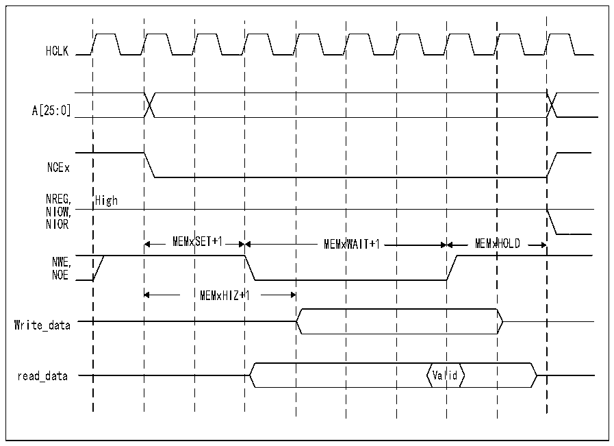

<!-- source-page: 901 -->

[← p.900](0900.md) · [index](../README.md) · [PDF p.901](https://ch32-riscv-ug.github.io/CH32H417/datasheet_en/CH32H417RM.PDF#page=901) · [p.902 →](0902.md)

<!-- header: CH32H417 Reference Manual https://wch-ic.com -->

Figure 40-21 General memory access waveform of NAND Flash controller  
 <!-- rendered from the PDF; verify at https://ch32-riscv-ug.github.io/CH32H417/datasheet_en/CH32H417RM.PDF#page=901 -->

🖼 Text parsed from the figure above

HCLK  
A[25:0]  
NCEx  
NREG, High  
NIOW,  
NIOR  
MEMxSET+1 MEMxWAIT+1 MEMxHOLD  
NWE,  
NOE  
MEMxHIZ+1  
Write_data  
Valid  
read_data Valid  

<em>Note: During write access, NOE remains high (disabled). During read access, NWE remains high (disabled).</em>  
Each timing configuration register contains 4 parameters: three define the number of HCLK cycles for the 3  
access phases of the NAND Flash, while the fourth defines the timing for initiating data bus drive during write  
access. The diagram above illustrates the timing parameter definitions for general memory access; access timing  
for feature memory spaces follows a similar pattern.  

### 40.6.4 NAND Flash Operation

The Command Latch Enable (CLE) signal and Address Latch Enable (ALE) signal for NAND Flash devices are  
driven by the address signals from the FMC controller. This means that to send a command or address to the  
NAND Flash, the CPU must perform a write operation to a specific address within its memory space.  
A typical page read operation from a NAND Flash device requires the following steps:  
1) Based on NAND Flash characteristics (PWID bit indicates NAND Flash data bus width, PTYP=1, set  
PWAITEN=0 or 1 as required; For timing configuration, refer to Section 40.4.2: NAND Flash Address  
Mapping), configure the FMC_PCR and FMC_PMEM registers (for certain devices, configure the  
R32_FMC_PATT register; refer to Section 40.6.5: NAND Flash Pre-Wait Function). This process configures  
and enables the corresponding storage regions.  
2) The CPU performs a byte write operation to the general memory space, where the data byte equals one Flash  
command byte (e.g., 0x00 for Samsung NAND Flash devices). During the write enable period (a low-level  
pulse on NWE), the LE input of the NAND Flash is active. Consequently, the written byte is interpreted as a  
command for the NAND Flash. Once this command is latched by the memory device, it need not be rewritten  
during subsequent page read operations.  
3) By writing the four bytes STARTAD[7:0], STARTAD[16:9], STARTAD[24:17], and STARTAD[25] (for  
64Mb*8-bit NAND Flash) into the general memory space or feature space (three bytes for smaller capacity  
devices), the CPU can send the start address (STARTAD) for the read operation. During the write enable  
<!-- image: p901-draw-image-00001 bbox=[511.44, 786.36, 530.88, 796.68] -->
<!-- footer: V1.7 899 -->
