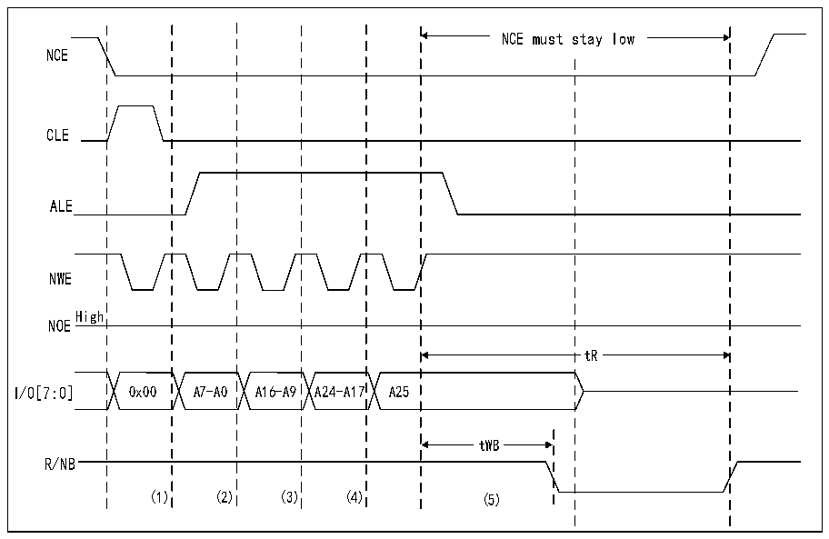

<!-- source-page: 902 -->

[← p.901](0901.md) · [index](../README.md) · [PDF p.902](https://ch32-riscv-ug.github.io/CH32H417/datasheet_en/CH32H417RM.PDF#page=902) · [p.903 →](0903.md)

<!-- header: CH32H417 Reference Manual https://wch-ic.com -->
period (a low-level pulse on NWE), the ALE input of the NAND Flash device is active, causing the written  
byte to be treated as the starting address for the read operation. Utilizing the feature memory space, an  
alternative timing configuration of the FMC can be employed to implement the pre-wait functionality  
required by certain NAND Flash devices (for details, refer to Section 40.6.5: NAND Flash Pre-Wait  
Functionality).  
4) The controller waits for the NAND Flash to become ready (R/NB signal high) before initiating a new access  
to the same or another storage area. During this wait period, the controller maintains the NCE signal active  
(low).  
5) The CPU can then execute byte-read operations from general memory space, thereby reading NAND Flash  
pages (data field + spare field) byte by byte.  
6) The next NAND Flash page can be read without any CPU command or address write operation. This can be  
achieved in three distinct ways:  
- Perform the operation described in Step 5
- Randomly access a new address by restarting the operation in Step 3
- Send a new command to the NAND Flash device by restarting Step 2

### 40.6.5 NAND Flash Pre-waiting Function

Some NAND Flash devices need the controller to wait for the R/NB signal to go low after writing the last part of  
the address, as shown in the following figure.  

Figure 40-22 Accessing non-CE-unrelated NAND flash  
 <!-- rendered from the PDF; verify at https://ch32-riscv-ug.github.io/CH32H417/datasheet_en/CH32H417RM.PDF#page=902 -->

🖼 Text parsed from the figure above

NCE must stay low  
NCE  
CLE  
ALE  
NWE  
High  
NOE  
tR  
I/0[7:0] 0x00 A7-A0 A16-A9 A24-A17 A25  
tWB  
R/NB  
(1) (2) (3) (4) (5)  

1) The CPU writes byte 0x00 to address 0x70010000.  
2) The CPU writes bytes A7 through A0 to address 0x70020000.  
3) The CPU writes bytes A16 through A9 to address 0x70020000.  
4) The CPU writes bytes A24 to A17 at address 0x70020000.  
5) The CPU writes byte A25 at address 0x78020000: The FMC performs a write access via the R32_FMC_PATT2  
<!-- image: p902-draw-image-00001 bbox=[511.44, 786.36, 530.88, 796.68] -->
<!-- footer: V1.7 900 -->
