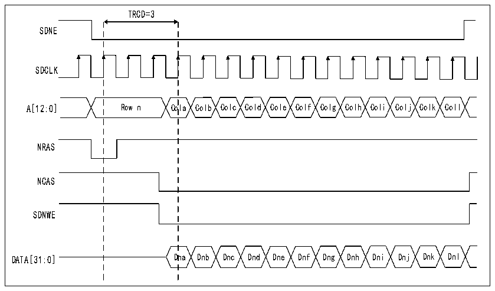

<!-- source-page: 910 -->

[← p.909](0909.md) · [index](../README.md) · [PDF p.910](https://ch32-riscv-ug.github.io/CH32H417/datasheet_en/CH32H417RM.PDF#page=910) · [p.911 →](0911.md)

<!-- header: CH32H417 Reference Manual https://wch-ic.com -->
At this stage, the SDRAM device is ready to receive commands. If a system reset occurs during an SDRAM  
access, the data bus may still be driven by the SDRAM device. Therefore, the SDRAM device must be  
reinitialized after reset before the NOR Flash/PSRAM/SRAM or NAND Flash controller can issue new access  
commands.  
<em>Note: If two SDRAM devices are connected to the FMC, simultaneous access to both devices via the command</em>  
<em>mode register (loading the mode register command) will issue access commands based on the timing parameters</em>  
<em>(TMRD and TRAS timing) configured for SDRAM memory region 1 in the R32_FMC_SDTR1 register.</em>  
<strong>SDRAM controller write cycle</strong>  
SDRAM controller can receive single and burst write requests and treat them as a single memory access. In both  
cases, the SDRAM controller will track the valid lines of each storage area, so as to be able to make continuous  
write access to different storage areas (multi-storage area ping-pong access). Before performing any write access,  
the WP bit in R32_FMC_SDCRx register must be cleared to prohibit write protection of SDRAM storage area.  
The SDRAM controller always checks for the next access:  
1) If the next access occurs on the same row or another valid row, the write operation proceeds directly.  
2) If the next access points to an invalid row, the SDRAM controller generates a precharge command, activates  
the new row, and initializes the write command.  

Figure 40-23 Burst write SDRAM access waveform  
 <!-- rendered from the PDF; verify at https://ch32-riscv-ug.github.io/CH32H417/datasheet_en/CH32H417RM.PDF#page=910 -->

🖼 Text parsed from the figure above

TRCD=3  
SDNE  
SDCLK  
A[12:0] Row n Cola Colb Colc Cold Cole Colf Colg Colh Coli Colj Colk Coll  
NRAS  
NCAS  
SDNWE  
DATA[31:0] Dna Dnb Dnc Dnd Dne Dnf Dng Dnh Dni Dnj Dnk Dnl  

<strong>SDRAM controller read cycle</strong>  
SDRAM controller can receive single and burst read requests and treat them as a single memory access. In both  
cases, the SDRAM controller will track the valid lines of each storage area, so as to be able to perform continuous  
read access to different storage areas (multi-storage area ping-pong access).  
<!-- image: p910-draw-image-00001 bbox=[511.44, 786.36, 530.88, 796.68] -->
<!-- footer: V1.7 908 -->
