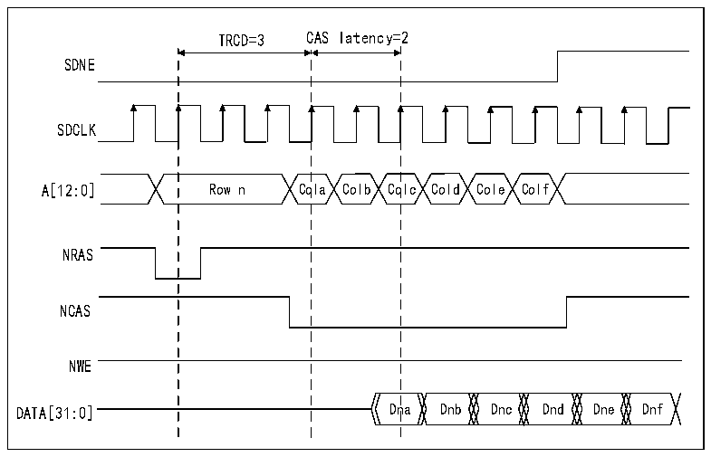

<!-- source-page: 911 -->

[← p.910](0910.md) · [index](../README.md) · [PDF p.911](https://ch32-riscv-ug.github.io/CH32H417/datasheet_en/CH32H417RM.PDF#page=911) · [p.912 →](0912.md)

<!-- header: CH32H417 Reference Manual https://wch-ic.com -->

Figure 40-24 Burst read SDRAM access waveform  
 <!-- rendered from the PDF; verify at https://ch32-riscv-ug.github.io/CH32H417/datasheet_en/CH32H417RM.PDF#page=911 -->

🖼 Text parsed from the figure above

TRCD=3 CAS latency=2  
SDNE  
SDCLK  
A[12:0] Row n Cola Colb Colc Cold Cole Colf  
NRAS  
NCAS  
NWE  
DATA[31:0] Dna Dnb Dnc Dnd Dne Dnf  

The FMC SDRAM controller features a cacheable read FIFO (6 lines × 32 bits) that pre-fetches read data during  
CAS latency cycles and RPIPE delays according to the following formula. The RBURST bit in the  
R32_FMC_SDCR1 register must be set to 1 to accept the next read access. Expected data count = CAS latency +  
1 + (RPIPE latency) / 2, example:  
● CAS latency = 3, RPIPE latency = 0: Four data items (uncommitted) stored in the FIFO.  
● CAS latency = 3, RPIPE latency = 2: Five data items (uncommitted) stored in the FIFO.  
Each row in the read FIFO has a 14-bit address tag to identify its contents: 11 bits for the column address, 2 bits  
for selecting the internal memory region and valid row, and 1 bit for selecting the SDRAM device. During HB  
burst reads, if the end of the row is reached prematurely, the data read ahead (not yet committed) is not stored in  
the read FIFO. For single read accesses, the data is correctly stored in the read FIFO.  
Whenever a read request occurs, the SDRAM controller checks:  
● Whether the address matches one of the address tags. If a match is found, data is read directly from the FIFO,  
the corresponding address tag/row content is cleared, and the remaining data in the FIFO is compressed to  
avoid empty rows.  
● Otherwise, a new read command is sent to memory and the FIFO is updated with the new data. If the FIFO is  
full, earlier data will be lost.  
<!-- image: p911-draw-image-00001 bbox=[511.44, 786.36, 530.88, 796.68] -->
<!-- footer: V1.7 909 -->
