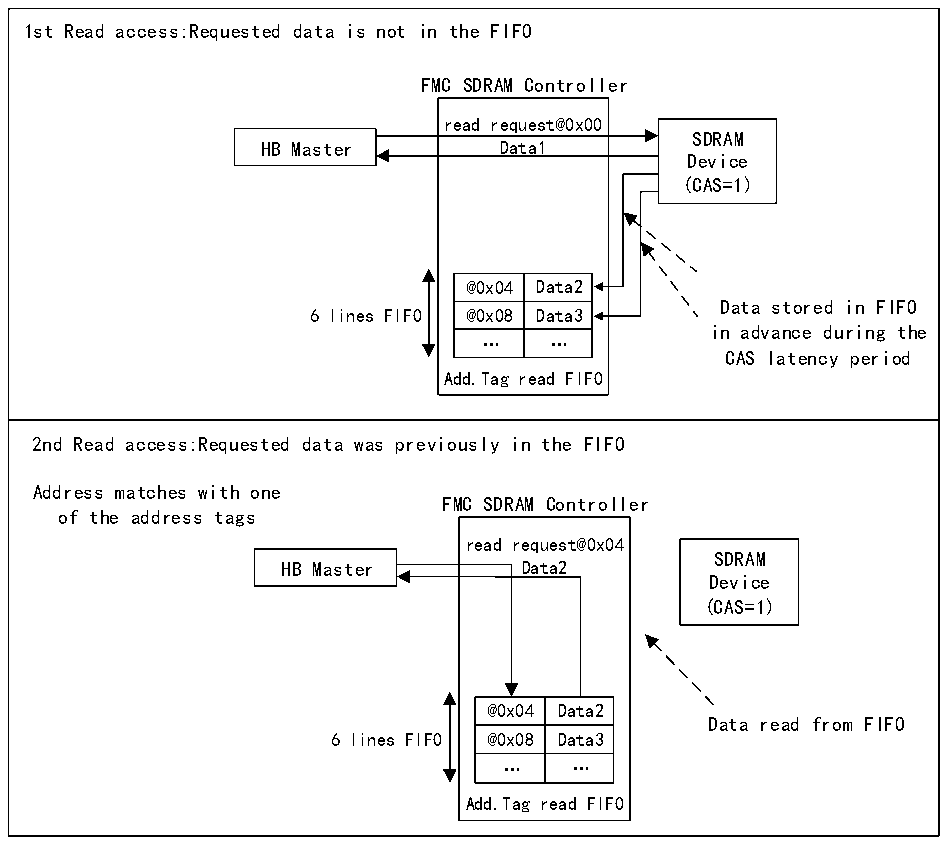

<!-- source-page: 912 -->

[← p.911](0911.md) · [index](../README.md) · [PDF p.912](https://ch32-riscv-ug.github.io/CH32H417/datasheet_en/CH32H417RM.PDF#page=912) · [p.913 →](0913.md)

<!-- header: CH32H417 Reference Manual https://wch-ic.com -->

Figure 40-25 Read access logic diagram with RBURST set to 1 (CAS=1, RPIPE=0)  
 <!-- rendered from the PDF; verify at https://ch32-riscv-ug.github.io/CH32H417/datasheet_en/CH32H417RM.PDF#page=912 -->

🖼 Text parsed from the figure above

1st Read access:Requested data is not in the FIFO FMC SDRAM Controller read request@0x00SDRAM HB Master Data1Device (CAS=1) @0x04 Data2 Data stored in FIFO 6 lines FIFO @0x08 Data3 in advance during the … … CAS latency period Add.Tag read FIFO  2nd Read access:Requested data was previously in the FIFO Address matches with one FMC SDRAM Controller of the address tags read request@0x04SDRAM HB Master Data2Device (CAS=1) @0x04 Data2 Data read from FIFO 6 lines FIFO @0x08 Data3 … … Add.Tag read FIFO  
read request@0x00  Data1  Data1 @0x04 Data2 @0x08 Data3 … … Add.Tag read FIFO  

<!-- p912-table-003 (table-40-43@1) -->
<table><tr><th>@0x04</th><th>Data2</th></tr><tr><td>@0x08</td><td>Data3</td></tr><tr><td>…</td><td>…</td></tr></table>

<!-- p912-table-004 (table-40-43@1) -->
<table><tr><th>@0x04</th><th>Data2</th></tr><tr><td>@0x08</td><td>Data3</td></tr><tr><td>…</td><td>…</td></tr></table>

During a read access or precharge command, the read FIFO will refresh and prepare to fill with new data.  
Upon receiving the first read request, if the current access has not yet reached a row boundary, the SDRAM  
controller will accept the next read access during the CAS latency cycle and RPIPE latency (if configured). This is  
achieved by incrementing the memory address. The following conditions must be met:  
● The RBURST control bit in the R32_FMC_SDCR1 register must be set to 1  
Address management depends on the next HB request:  
● The next HB request is consecutive (HB burst)  
In this case, the SDRAM controller will increment the address.  
● The next HB request is not consecutive  
- If the new read request targets the same row as the previous request or another valid row, the new
address is transmitted to the memory while the master device halts operations during the CAS latency  
period, awaiting new data from the memory.  
- If the new read request targets an invalid row, the SDRAM controller generates a precharge command,
activates the new row, and initializes the read command.  
If RURST is set to 0, the read FIFO is not used.  
<strong>Row and storage area boundary management</strong>  
<!-- image: p912-draw-image-00001 bbox=[511.44, 786.36, 530.88, 796.68] -->
<!-- footer: V1.7 910 -->
