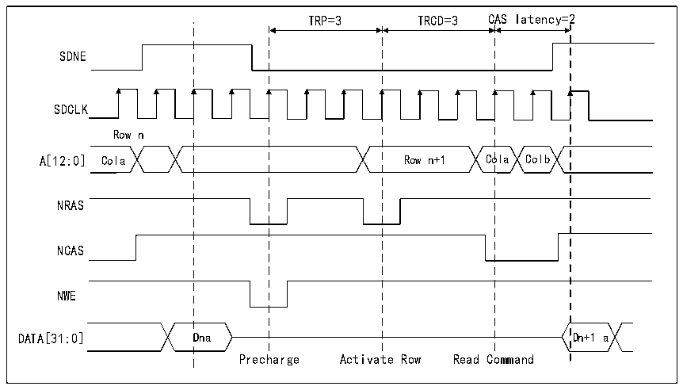

<!-- source-page: 913 -->

[← p.912](0912.md) · [index](../README.md) · [PDF p.913](https://ch32-riscv-ug.github.io/CH32H417/datasheet_en/CH32H417RM.PDF#page=913) · [p.914 →](0914.md)

<!-- header: CH32H417 Reference Manual https://wch-ic.com -->
When a read/write access crosses a row boundary, if the next read/write access is continuous and the current  
access has been executed to the row boundary, the SDRAM controller will perform the following operations:  
1) Precharge the active row;  
2) Activate the new row;  
3) Initiate the read/write command.  
For all column and data bus width configurations, automatic row activation at row boundaries is supported.  
The SDRAM controller may insert additional clock cycles between the following commands as required:  
● Inserted between the precharge and activate commands to match the TRP parameter (only when the next  
access targets another row within the same memory area).  
● Inserted between the activate and read commands to match the TRCD parameter.  
These parameters are defined in the FMC_SDTRx register.  
For information on row boundary crossing reads and burst write accesses, refer to the diagram below.  

Figure 40-26 Read access of interbank boundary  
 <!-- rendered from the PDF; verify at https://ch32-riscv-ug.github.io/CH32H417/datasheet_en/CH32H417RM.PDF#page=913 -->

🖼 Text parsed from the figure above

TRP=3 TRCD=3 CAS latency=2  
SDNE  
SDCLK  
Row n  
A[12:0] Cola Row n+1 Cola Colb  
NRAS  
NCAS  
NWE  
DATA[31:0] Dna Dn+1 a  
Precharge Activate Row Read Command  

<!-- image: p913-draw-image-00001 bbox=[511.44, 786.36, 530.88, 796.68] -->
<!-- footer: V1.7 911 -->
