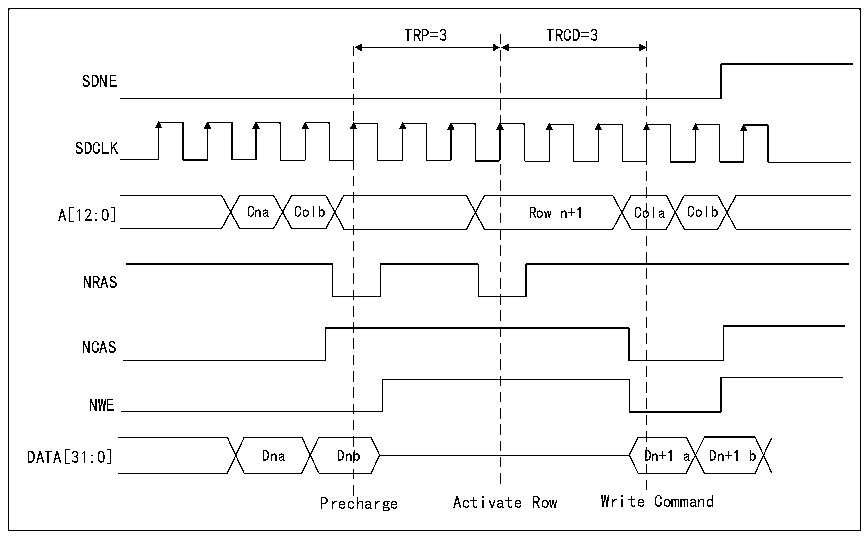

<!-- source-page: 914 -->

[← p.913](0913.md) · [index](../README.md) · [PDF p.914](https://ch32-riscv-ug.github.io/CH32H417/datasheet_en/CH32H417RM.PDF#page=914) · [p.915 →](0915.md)

<!-- header: CH32H417 Reference Manual https://wch-ic.com -->

Figure 40-27 Write access of interbank boundary  
 <!-- rendered from the PDF; verify at https://ch32-riscv-ug.github.io/CH32H417/datasheet_en/CH32H417RM.PDF#page=914 -->

🖼 Text parsed from the figure above

TRP=3 TRCD=3  
SDNE  
SDCLK  
A[12:0] Cna Colb Row n+1 Cola Colb  
NRAS  
NCAS  
NWE  
DATA[31:0] Dna Dnb Dn+1 a Dn+1 b  
Precharge Activate Row Write Command  

If the next access is continuous and the current access crosses the storage area boundary, the SDRAM controller  
will activate the first row of the next storage area and issue a new read/write command. There are two possible  
situations:  
● If the current memory area is not the last memory area, the active row in the new memory area must be  
precharged. For various row/column and data bus width configurations, the automatic activation of the next  
row at the boundary of the storage area is supported.  
● If the current storage area is the last storage area, the automatic activation of the next row is only supported  
when addressing SDRAM devices with 13-bit rows, 11-bit columns, 4 internal storage areas and 32-bit data  
bus. Otherwise, SDRAM address range will be violated and HB error will be generated.  
● For the SDRAM memory with 13-bit row address, 11-column address, 4 internal storage areas and 32-bit bus  
width, the SDRAM controller will continue the read/write operation through the second SDRAM device  
(assuming that the second SDRAM device is initialized):  
- The SDRAM controller will activate the first row (assuming that there is a valid row in the first internal
storage area after precharging the valid row) and issue a new read/write command;  
- If the first row is activated, the SDRAM controller will only issue read/write commands.
<strong>SDRAM controller refresh cycle</strong>  
The automatic refresh command is used to refresh the contents of SDRAM devices. SDRAM controller will send  
automatic refresh command periodically. It uses an internal COUNTer to load the count value in the  
R32_FMC_SDRTR register. This value defines the number of memory clock cycles (refresh rate) between refresh  
cycles. When the value of the counter reaches zero, an internal pulse will be generated.  
If there is an ongoing memory access, the automatic refresh request will be delayed. However, when memory  
access and automatic refresh request occur at the same time, the automatic refresh request is given priority.  
If the memory is accessed during the automatic refresh, the access request is cached and processed after the  
automatic refresh is completed.  
If a new automatic refresh request appears when the last automatic refresh request has not been completed, the RE  
(refresh error) bit in the status register will be set to 1. If this bit is enabled (REIE=1), an interrupt will be  
<!-- image: p914-draw-image-00001 bbox=[511.44, 786.36, 530.88, 796.68] -->
<!-- footer: V1.7 912 -->
