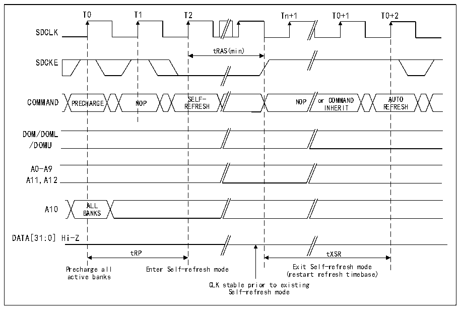
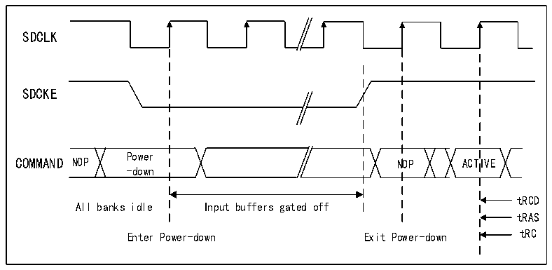

<!-- source-page: 916 -->

[← p.915](0915.md) · [index](../README.md) · [PDF p.916](https://ch32-riscv-ug.github.io/CH32H417/datasheet_en/CH32H417RM.PDF#page=916) · [p.917 →](0917.md)

<!-- header: CH32H417 Reference Manual https://wch-ic.com -->

Figure 40-28 Self-refresh mode  
 <!-- rendered from the PDF; verify at https://ch32-riscv-ug.github.io/CH32H417/datasheet_en/CH32H417RM.PDF#page=916 -->

🖼 Text parsed from the figure above

T0 T1 T2 Tn+1 T0+1 T0+2  
SDCLK  
tRAS(min)  
SDCKE  
COMMAND PRECHARGE NOP SELF- NOP or COMMAND AUTO  
REFRESH INHERIT REFRESH  
DOM/DOML  
/DOMU  
A0-A9  
A11,A12  
A10 ALL  
BANKS  
DATA[31:0] Hi-Z  
tRP tXSR  
Precharge all Enter Self-refresh mode Exit Self-refresh mode  
active banks (restart refresh timebase)  
CLK stable prior to existing  
Self-refresh mode  

<strong>Power-down mode</strong>  
Select the MODE by setting the mode position to &quot;110&quot; and configuring the target memory area bits (CTB1 and/or  
CTB2) in the R32_FMC_SDCMR register.  

Figure 40-29 Power-down mode  
 <!-- rendered from the PDF; verify at https://ch32-riscv-ug.github.io/CH32H417/datasheet_en/CH32H417RM.PDF#page=916 -->

🖼 Text parsed from the figure above

SDCLK  
SDCKE  
Power  
COMMAND NOP NOP ACTIVE  
-down  
tRCD  
All banks idle Input buffers gated off  
tRAS  
Enter Power-down Exit Power-down tRC  

If the write data FIFO is not empty, all data will be sent to memory before power-down mode is activated.  
The SDRAM controller will exit power-down mode immediately after an SDRAM device is selected. After  
memory access completes, the selected SDRAM device will remain in normal mode.  
During power-down mode, all input/output buffers of the SDRAM device will be disabled, except for SDCKE,  
which remains low.  
SDRAM devices can&#x27;t stay in power-down mode for longer than refresh cycle, and they can&#x27;t perform self-refresh  
cycle. Therefore, the SDRAM controller performs refresh by:  
<!-- image: p916-draw-image-00001 bbox=[511.44, 786.36, 530.88, 796.68] -->
<!-- footer: V1.7 914 -->
