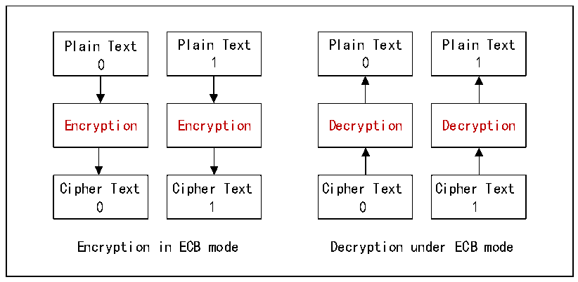
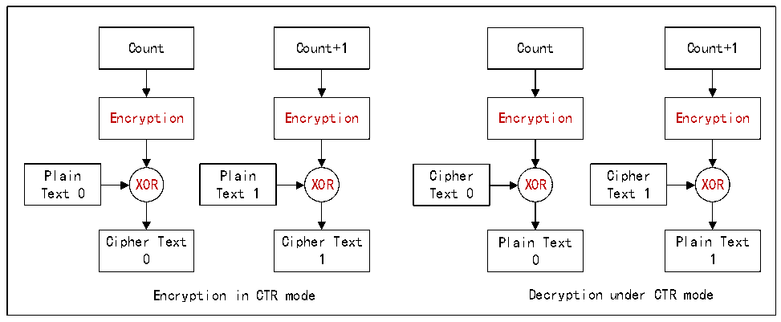

<!-- source-page: 927 -->

[← p.926](0926.md) · [index](../README.md) · [PDF p.927](https://ch32-riscv-ug.github.io/CH32H417/datasheet_en/CH32H417RM.PDF#page=927) · [p.928 →](0928.md)

<!-- header: CH32H417 Reference Manual https://wch-ic.com -->

Figure 41-1 ECB mode encryption and decryption process  
 <!-- rendered from the PDF; verify at https://ch32-riscv-ug.github.io/CH32H417/datasheet_en/CH32H417RM.PDF#page=927 -->

🖼 Text parsed from the figure above

Plain Text Plain Text Plain Text Plain Text  
0 1 0 1  
Encryption Encryption Decryption Decryption  
Cipher Text Cipher Text Cipher Text Cipher Text  
0 1 0 1  
Encryption in ECB mode Decryption under ECB mode  

Figure 41-2 CTR mode encryption and decryption process  
 <!-- rendered from the PDF; verify at https://ch32-riscv-ug.github.io/CH32H417/datasheet_en/CH32H417RM.PDF#page=927 -->

🖼 Text parsed from the figure above

Count Count+1 Count Count+1  
Encryption Encryption Encryption Encryption  
Plain Plain Cipher Cipher  
XOR XOR XOR XOR  
Text 0 Text 1 Text 0 Text 1  
Cipher Text Cipher Text Plain Text Plain Text  
0 1 0 1  
Encryption in CTR mode Decryption under CTR mode  

In ECB mode, plaintext and ciphertext are directly mapped one-to-one; the plaintext is encrypted verbatim to  
produce the ciphertext. In CTR mode, however, a 128-bit counter must be preloaded. This counter is encrypted,  
and the encrypted counter is then XORed with the plaintext to generate the ciphertext. It is important to note that  
in CTR decryption mode, only the counter is encrypted—it is not decrypted.  

## 41.4 Module Application

### 41.4.1 Initialization of Encryption and Decryption Module

● Clock configuration: set RB_ECDC_CLKDIV_MASK bit in R32_ECEC_CTRL register to configure the  
clock for module operation. If you don&#x27;t use this module, you can set it to 0 and turn it off to reduce power  
consumption.  
● Data size end: set RB_ECDC_DAT_MOD bit of R32_ECEC_CTRL register, and you can choose the storage  
mode of the size end of the encrypted and decrypted data. According to the size of a packet of 128bits(16  
bytes).  
● Key Expansion: During encryption and decryption, an expansion key is used instead of the user key. After  
<!-- image: p927-draw-image-00001 bbox=[511.44, 786.36, 530.88, 796.68] -->
<!-- footer: V1.7 925 -->
