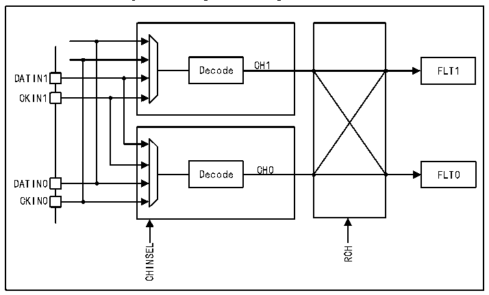

<!-- source-page: 937 -->

[← p.936](0936.md) · [index](../README.md) · [PDF p.937](https://ch32-riscv-ug.github.io/CH32H417/datasheet_en/CH32H417RM.PDF#page=937) · [p.938 →](0938.md)

<!-- header: CH32H417 Reference Manual https://wch-ic.com -->
● Channel y: SITP=0 (data gated on rising edge) – left audio channel for channel y  
● Channel (y-1): SITP=1 (data gated on falling edge) – right audio channel for channel (y-1)  
● 2 DFSDM filters will be assigned to channels y and (y-1) (for filtering left and right channels of PDM  
microphones)  

Figure 42-2 Input channel pin redirection  
 <!-- rendered from the PDF; verify at https://ch32-riscv-ug.github.io/CH32H417/datasheet_en/CH32H417RM.PDF#page=937 -->

🖼 Text parsed from the figure above

CH1  
Decode FLT1  
DATIN1  
CKIN1  
CH0  
Decode FLT0  
DATIN0  
CKIN0  
CHINSEL RCH  

<strong>Clock Signal Output</strong>  
A clock signal can be provided at the CKOUT pin to drive the clock input of an external ΣΔ modulator. The  
CKOUT signal frequency is derived from either the DFSDM clock or the audio clock (refer to the CKOUTSRC  
bit in the R32_DFSDM_CH0CFGR1 register) via a prescaler (refer to the CKOUTDIV bit in the  
R32_DFSDM_CH0CFGR1 register). If the output clock is stopped, the CKOUT signal is placed in a low state  
(the output clock can be stopped by setting CKOUTDIV=0 in the R32_DFSDM_CHyCFGR1 register or by  
setting DFSDMEN=0 in the R32_DFSDM_CH0CFGR1 register). The output clock stop is executed at the  
following times:  
● When CKOUTSRC=0, 4 system clock cycles after DFSDMEN cleared  
● When CKOUTSRC=1, one system clock cycle and three audio clock cycles after DFSDMEN is cleared.  
● Before changing CKOUTSRC, the software must wait for CKOUT to stop to avoid glitch signals on the  
CKOUT pin. The output clock signal frequency must be within the range of 0 to 20MHz.  
Before changing CKOUTSRC, the software must wait for CKOUT to stop, so as to avoid generating glitch signal  
on CKOUT pin. The frequency of the output clock signal must be in the range of 0 ~ 20MHz.  
<strong>SPI Data Input Format Operation</strong>  
In SPI format, data streams are transmitted in serial format through data and clock signals. The data signal is  
always provided by the datum pin. The clock signal can be provided from the outside through CKINy pin or from  
the inside through the signal from CKOUT signal source.  
If an external clock source is selected (SPICKSEL[1:0]=0), the data signal is sampled (DATINy pin) on the rising  
or falling edge of the clock according to the SITP bit setting in the R32_DFSDM_CHyCFGR1 register.  
Internal clock source—refer to SPICKSEL[1:0] in the R32_DFSDM_CHyCFGR1 register:  
● CKOUT signal:  
- For connecting an external ΣΔ modulator, which directly uses its clock input (from CKOUT) to generate the
<!-- image: p937-draw-image-00001 bbox=[511.44, 786.36, 530.88, 796.68] -->
<!-- footer: V1.7 935 -->
