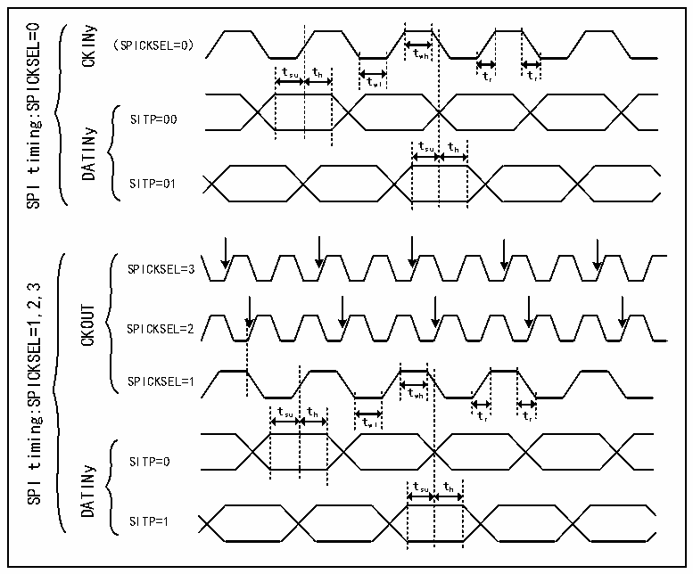

<!-- source-page: 938 -->

[← p.937](0937.md) · [index](../README.md) · [PDF p.938](https://ch32-riscv-ug.github.io/CH32H417/datasheet_en/CH32H417RM.PDF#page=938) · [p.939 →](0939.md)

<!-- header: CH32H417 Reference Manual https://wch-ic.com -->
output serial communication clock.  
- Sampling point: Rising edge/falling edge, depending on SITP settings.
● CKOUT/2 signal (generated on the rising edge of CKOUT):  
- Used to connect an external ΣΔ modulator, which divides the clock input (from CKOUT) by 2 to generate the
output serial communication clock. This output clock is active on each rising edge of the clock input.  
- Sampling point: Every second falling edge of CKOUT.
● CKOUT/2 signal (generated on the falling edge of CKOUT):  
- Used to connect an external ΣΔ modulator, which divides the clock input (from CKOUT) by 2 to generate the
output serial communication clock. This output clock change is valid on each falling edge of the clock input.  
- Sampling point: Every second rising edge of CKOUT.
<em>Note: The internal clock source can only be used when an external ΣΔ modulator employs the CKOUT signal as</em>  
<em>its clock input (to achieve synchronous clock and data operation). Using the internal clock source eliminates the</em>  
<em>need for a CKINy pin connection (the CKINy pin can be repurposed for other functions). When using SPI</em>  
<em>encoding, the clock source signal frequency must fall within the range of 0 to 20 MHz and be less than</em>  
<em>fDFSDMCLK/4.</em>  

Figure 42-3 Channel transceiver timing diagram  
 <!-- rendered from the PDF; verify at https://ch32-riscv-ug.github.io/CH32H417/datasheet_en/CH32H417RM.PDF#page=938 -->

🖼 Text parsed from the figure above

timing:SPICKSEL=0  
CKINy  
（SPICKSEL=0）  
twh  
t su t h t t r t r  
wl  
SITP=00  
DATINy  
tsu th  
SITP=01  
SPI  
SPICKSEL=3  
timing:SPICKSEL=1,2,3  
CKOUT  
SPICKSEL=2  
SPICKSEL=1  
twh  
t su t h t wl t r t r  
SITP=0  
DATINy  
SPI  
tsu th  
SITP=1  

<strong>Clock Loss Detection</strong>  
This feature detects the presence or absence of clock signals on channel serial clock inputs, ensuring proper  
operation of conversion processes and error reporting. Clock absence detection is enabled or disabled for each  
input channel y via the CKABEN bit in the R32_DFSDM_CHyCFGR1 register. If clock absence detection is  
enabled for a given channel, it is continuously monitored. If an input clock error occurs, the clock loss flag is set  
to 1 (CKABF[y]=1) and an interrupt is triggered (when CKABIE=1). After the clock miss flag is cleared (via  
<!-- image: p938-draw-image-00001 bbox=[511.44, 786.36, 530.88, 796.68] -->
<!-- footer: V1.7 936 -->
