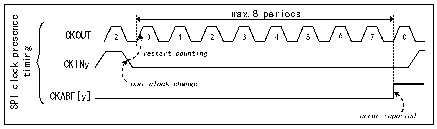

<!-- source-page: 939 -->

[← p.938](0938.md) · [index](../README.md) · [PDF p.939](https://ch32-riscv-ug.github.io/CH32H417/datasheet_en/CH32H417RM.PDF#page=939) · [p.940 →](0940.md)

<!-- header: CH32H417 Reference Manual https://wch-ic.com -->
CLRCKABF in the R32_DFSDM_FLT0ICR register), the clock miss status bit CKABF[y] is reset. When the  
corresponding channel y is disabled, CKABF[y] is additionally set to 1 by hardware (if CHEN[y]=0, CKABF[y]  
remains set).  
Upon occurrence of a clock-out event, the data conversion (and/or analog watchdog and short-circuit detector)  
will provide erroneous data. When clock-out is reported, the user should handle this event and discard the  
associated data.  
The clock-out function is only available when the system clock is used for the CKOUT signal (CKOUTSRC=0 in  
the R32_DFSDM_CH0CFGR1 register).  
When the transceiver is out of synchronization, the clock loss flag will be set and cannot be cleared via the  
CLRCKABF[y] bit in the R32_DFSDM_FLT0ICR register. The software operation sequence associated with the  
clock loss detection function should be as follows:  
● Enable the specified channel by setting CHEN=1  
● Attempt to clear the clock absent flag (by setting CLRCKABF=1) until the clock absent flag is actually  
cleared (CKABF=0). At this point, the transceiver is synchronized (signal clock is valid) and capable of  
receiving data  
● Enable the clock absent function CKABEN=1 and the associated interrupt CKABIE=1 to detect whether the  
SPI clock is lost  
When using the SPI data format, clock loss detection is based on comparing the CKOUT signal generated from  
the external input clock with the output clock. The external input clock signal in the input channel must change  
once every 8 signal cycles of the CKOUT signal (controlled by the CKOUTDIV field in the  
R32_DFSDM_CH0CFGR1 register).  

Figure 42-4 SPI clock missing timing diagram  
 <!-- rendered from the PDF; verify at https://ch32-riscv-ug.github.io/CH32H417/datasheet_en/CH32H417RM.PDF#page=939 -->

🖼 Text parsed from the figure above

max.8 periods  
presence  
CKOUT 2 0 1 2 3 4 5 6 7 0  
gnimit restart counting  
CKINy  
clock  
last clock change  
CKABF[y]  
SPI  
error reported  

If a clock recovery error occurs during input, the clock absent flag is set to 1 (CKABF[y]=1) and an interrupt is  
triggered (when CKABIE=1). After the clock absent flag is cleared (via CLRCKABF in the  
R32_DFSDM_FLT0ICR register), the clock absent flag is reset.  
<strong>External Serial Clock Frequency Measurement</strong>  
By measuring the serial clock input frequency of the channel, the data rate from the external ΣΔ modulator can be  
obtained in real time, which is critical for application purposes.  
The external serial clock input frequency can be measured using a timer that counts the DFSDM clock (fDFSDMCLK)  
over one conversion duration. Counting begins at the first input data clock following conversion triggering (either  
normal or injected) and ends at the last input data clock before conversion completion (when the conversion end  
flag is set to 1). Upon conversion completion (JEOCF=1 or REOCF=1), the time per conversion (the interval  
between the first and last serial samples) is updated in the CNVCNT[27:0] counter of register  
R32_DFSDM_FLTxCNVTIMR. The user can then calculate the data rate based on the digital filter settings  
<!-- image: p939-draw-image-00001 bbox=[511.44, 786.36, 530.88, 796.68] -->
<!-- footer: V1.7 937 -->
