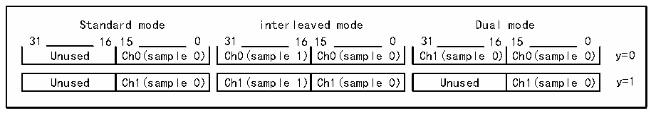

<!-- source-page: 943 -->

[← p.942](0942.md) · [index](../README.md) · [PDF p.943](https://ch32-riscv-ug.github.io/CH32H417/datasheet_en/CH32H417RM.PDF#page=943) · [p.944 →](0944.md)

<!-- header: CH32H417 Reference Manual https://wch-ic.com -->

Figure 42-5 R32_DFSDM_CHyDATINR register operation mode and allocation  
 <!-- rendered from the PDF; verify at https://ch32-riscv-ug.github.io/CH32H417/datasheet_en/CH32H417RM.PDF#page=943 -->

🖼 Text parsed from the figure above

Standard mode interleaved mode Dual mode  
31 16 15 0 31 16 15 0 31 16 15 0  
Unused Ch0(sample 0) Ch0(sample 1) Ch0(sample 0) Ch1(sample 0) Ch0(sample 0) y=0  
Unused  Ch1(sample 0)  
Ch1(sample 1)  Ch1(sample 0)  
Unused  Ch1(sample 0)  

First enable the selected input channel (channel y) to initiate data acquisition (starting conversion for channel y).  
Then, a write operation to the R32_DFSDM_CHyDATINR register is required to load one or two samples. Failure  
to do so will result in the loss of written data during subsequent processing.  
For example: In single conversion and interleaved mode, do not begin writing paired data samples to  
R32_DFSDM_CHyDATINR before initiating the single conversion (any data present in  
R32_DFSDM_CHyDATINR prior to conversion start will be discarded).  

### 42.3.5 Channel Selection

There are 2 multiplex channels, which can be selected for injection channel group conversion and/or conventional  
channel conversion.  
The injection channel group can select any or all of the 2 channels. JCHG[1:0] in the R32_DFSDM_FLTxJCHGR  
register selects the injection group channel, where JCHG[y]=1 indicates that channel y has been selected.  
Injection conversion can work in scan mode (JSCAN=1) or single mode (JSCAN=0). In scan mode, each selected  
channel will be converted in turn. The lowest channel (channel 0, if selected) is converted first, and then the next  
higher channel is converted until all channels selected by JCHG[1:0] are converted. In single mode (JSCAN=0),  
only one selected channel will be converted, and the channel selection will be moved to the next channel. When  
JSCAN=0, writing to JCHG[1:0] will reset the channel selection to the lowest channel selected.  
Injection conversion can be initiated by software or triggers. Such transformations are never interrupted by regular  
transformations.  
Conventional channels only select one of the two channels. The RCH bit in the R32_DFSDM_FLTxCR1 register  
indicates the selected channel.  
General transformations can only be initiated by software (not by triggers). When an injection transformation is  
requested, the continuous regular transformation sequence is temporarily interrupted.  
Attempting a conversion on a disabled channel (CHEN=0 in the R32_DFSDM_CHyCFGR1 register) will cause  
the conversion to never complete, as no input data is provided (no clock signal). In this case, either enable the  
given channel (CHEN=1 in the R32_DFSDM_CHyCFGR1 register) or stop the conversion (by setting DFEN=0  
in the R32_DFSDM_FLTxCR1 register).  

### 42.3.6 Digital Filter Configuration

DFSDM includes a Sincx-type digital filter implementation. This Sincx filter performs filtering on the input digital  
data stream, resulting in a reduced output data rate (decimation) and increased output data resolution. The Sincx  
digital filter can be configured to achieve the desired output data rate and desired output data resolution.  
Configurable parameters include:  
● Filter order/type: (Refer to FORD[2:0] bits in the R32_DFSDM_FLTxFCR register):  
- FastSinc
- Sinc1
- Sinc2
- Sinc3
- Sinc4
<!-- image: p943-draw-image-00001 bbox=[511.44, 786.36, 530.88, 796.68] -->
<!-- footer: V1.7 941 -->
