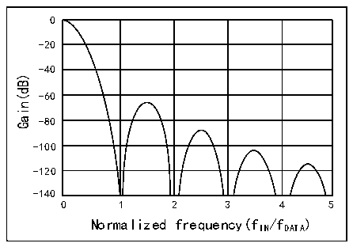

<!-- source-page: 944 -->

[← p.943](0943.md) · [index](../README.md) · [PDF p.944](https://ch32-riscv-ug.github.io/CH32H417/datasheet_en/CH32H417RM.PDF#page=944) · [p.945 →](0945.md)

<!-- header: CH32H417 Reference Manual https://wch-ic.com -->
- Sinc5
● Filter oversampling/decimation rate: (Refer to FOSR[9:0] bits in the R32_DFSDM_FLTxFCR register):  
- FOSR=1-1024——Applicable to FastSinc filters and Sincx filters where x=FORD=1..3
- FOSR=1-215——Applicable to Sincx filters where x=FORD=4
- FOSR=1-73——Applicable to Sincx filters where x=FORD=5
The filter supports the following transfer functions (impulse response in the H domain):  
● Sincx filter type:  
<!-- image: p944-draw-image-00002 bbox=[348.48, 190.08, 352.08, 190.8] -->
<!-- image: p944-draw-image-00003 bbox=[347.76, 190.8, 352.08, 191.52] -->
<!-- image: p944-draw-image-00004 bbox=[324.72, 191.52, 329.04, 192.24] -->
<!-- image: p944-draw-image-00005 bbox=[330.48, 191.52, 332.64, 192.24] -->
<!-- image: p944-draw-image-00006 bbox=[334.08, 191.52, 339.84, 192.24] -->
<!-- image: p944-draw-image-00007 bbox=[349.2, 191.52, 350.64, 192.24] -->
<!-- image: p944-draw-image-00008 bbox=[324.72, 192.24, 329.04, 192.96] -->
<!-- image: p944-draw-image-00009 bbox=[330.48, 192.24, 332.64, 192.96] -->
<!-- image: p944-draw-image-00010 bbox=[334.08, 192.24, 339.84, 192.96] -->
<!-- image: p944-draw-image-00011 bbox=[349.2, 192.24, 350.64, 192.96] -->
<!-- image: p944-draw-image-00012 bbox=[305.28, 192.96, 306.72, 193.68] -->
<!-- image: p944-draw-image-00013 bbox=[324.72, 192.96, 341.28, 193.68] -->
<!-- image: p944-draw-image-00014 bbox=[342.0, 192.96, 343.44, 193.68] -->
<!-- image: p944-draw-image-00015 bbox=[347.76, 192.96, 352.08, 193.68] -->
<!-- image: p944-draw-image-00016 bbox=[304.56, 193.68, 306.72, 194.4] -->
<!-- image: p944-draw-image-00017 bbox=[324.72, 193.68, 330.48, 194.4] -->
<!-- image: p944-draw-image-00018 bbox=[331.92, 193.68, 335.52, 194.4] -->
<!-- image: p944-draw-image-00019 bbox=[336.96, 193.68, 341.28, 194.4] -->
<!-- image: p944-draw-image-00020 bbox=[342.0, 193.68, 344.16, 194.4] -->
<!-- image: p944-draw-image-00021 bbox=[347.04, 193.68, 351.36, 194.4] -->
<!-- image: p944-draw-image-00022 bbox=[303.84, 194.4, 306.0, 195.12] -->
<!-- image: p944-draw-image-00023 bbox=[320.4, 194.4, 330.48, 195.12] -->
<!-- image: p944-draw-image-00024 bbox=[331.92, 194.4, 333.36, 195.12] -->
<!-- image: p944-draw-image-00025 bbox=[334.08, 194.4, 340.56, 195.12] -->
<!-- image: p944-draw-image-00026 bbox=[342.72, 194.4, 344.88, 195.12] -->
<!-- image: p944-draw-image-00027 bbox=[303.12, 195.12, 305.28, 195.84] -->
<!-- image: p944-draw-image-00028 bbox=[307.44, 195.12, 310.32, 195.84] -->
<!-- image: p944-draw-image-00029 bbox=[324.72, 195.12, 326.88, 195.84] -->
<!-- image: p944-draw-image-00030 bbox=[329.04, 195.12, 331.2, 195.84] -->
<!-- image: p944-draw-image-00031 bbox=[331.92, 195.12, 333.36, 195.84] -->
<!-- image: p944-draw-image-00032 bbox=[335.52, 195.12, 340.56, 195.84] -->
<!-- image: p944-draw-image-00033 bbox=[343.44, 195.12, 344.88, 195.84] -->
<!-- image: p944-draw-image-00034 bbox=[303.12, 195.84, 305.28, 196.56] -->
<!-- image: p944-draw-image-00035 bbox=[306.72, 195.84, 310.32, 196.56] -->
<!-- image: p944-draw-image-00036 bbox=[316.8, 195.84, 320.4, 196.56] -->
<!-- image: p944-draw-image-00037 bbox=[324.72, 195.84, 326.88, 196.56] -->
<!-- image: p944-draw-image-00038 bbox=[329.76, 195.84, 341.28, 196.56] -->
<!-- image: p944-draw-image-00039 bbox=[343.44, 195.84, 346.32, 196.56] -->
<!-- image: p944-draw-image-00040 bbox=[302.4, 196.56, 304.56, 197.28] -->
<!-- image: p944-draw-image-00041 bbox=[308.16, 196.56, 310.32, 197.28] -->
<!-- image: p944-draw-image-00042 bbox=[316.8, 196.56, 320.4, 197.28] -->
<!-- image: p944-draw-image-00043 bbox=[344.16, 196.56, 346.32, 197.28] -->
H（z）=  
<!-- image: p944-draw-image-00044 bbox=[302.4, 197.28, 304.56, 198.0] -->
<!-- image: p944-draw-image-00045 bbox=[308.16, 197.28, 310.32, 198.0] -->
<!-- image: p944-draw-image-00046 bbox=[311.76, 197.28, 316.8, 198.0] -->
<!-- image: p944-draw-image-00047 bbox=[317.52, 197.28, 319.68, 198.0] -->
<!-- image: p944-draw-image-00048 bbox=[344.16, 197.28, 347.04, 198.0] -->
<!-- image: p944-draw-image-00049 bbox=[302.4, 198.0, 304.56, 198.72] -->
<!-- image: p944-draw-image-00050 bbox=[308.16, 198.0, 310.32, 198.72] -->
<!-- image: p944-draw-image-00051 bbox=[316.8, 198.0, 320.4, 198.72] -->
<!-- image: p944-draw-image-00052 bbox=[344.16, 198.0, 347.04, 198.72] -->
<!-- image: p944-draw-image-00053 bbox=[302.4, 198.72, 303.84, 199.44] -->
<!-- image: p944-draw-image-00054 bbox=[306.72, 198.72, 311.76, 199.44] -->
<!-- image: p944-draw-image-00055 bbox=[316.8, 198.72, 320.4, 199.44] -->
<!-- image: p944-draw-image-00056 bbox=[344.16, 198.72, 347.04, 199.44] -->
<!-- image: p944-draw-image-00057 bbox=[302.4, 199.44, 303.84, 200.16] -->
<!-- image: p944-draw-image-00058 bbox=[344.88, 199.44, 347.04, 200.16] -->
<!-- image: p944-draw-image-00059 bbox=[301.68, 200.16, 303.84, 200.88] -->
<!-- image: p944-draw-image-00060 bbox=[344.88, 200.16, 347.04, 200.88] -->
<!-- image: p944-draw-image-00061 bbox=[301.68, 200.88, 303.84, 201.6] -->
<!-- image: p944-draw-image-00062 bbox=[344.88, 200.88, 347.04, 201.6] -->
<!-- image: p944-draw-image-00063 bbox=[301.68, 201.6, 303.84, 202.32] -->
<!-- image: p944-draw-image-00064 bbox=[306.72, 201.6, 342.0, 202.32] -->
<!-- image: p944-draw-image-00065 bbox=[344.88, 201.6, 347.04, 202.32] -->
<!-- image: p944-draw-image-00066 bbox=[301.68, 202.32, 303.84, 203.04] -->
<!-- image: p944-draw-image-00067 bbox=[344.88, 202.32, 347.04, 203.04] -->
<!-- image: p944-draw-image-00068 bbox=[302.4, 203.04, 303.84, 203.76] -->
<!-- image: p944-draw-image-00069 bbox=[344.16, 203.04, 347.04, 203.76] -->
<!-- image: p944-draw-image-00070 bbox=[302.4, 203.76, 303.84, 204.48] -->
<!-- image: p944-draw-image-00071 bbox=[344.16, 203.76, 347.04, 204.48] -->
<!-- image: p944-draw-image-00072 bbox=[302.4, 204.48, 304.56, 205.2] -->
<!-- image: p944-draw-image-00073 bbox=[332.64, 204.48, 334.8, 205.2] -->
<!-- image: p944-draw-image-00074 bbox=[344.16, 204.48, 347.04, 205.2] -->
<!-- image: p944-draw-image-00075 bbox=[302.4, 205.2, 304.56, 205.92] -->
<!-- image: p944-draw-image-00076 bbox=[331.92, 205.2, 334.8, 205.92] -->
<!-- image: p944-draw-image-00077 bbox=[344.16, 205.2, 347.04, 205.92] -->
<!-- image: p944-draw-image-00078 bbox=[302.4, 205.92, 304.56, 206.64] -->
<!-- image: p944-draw-image-00079 bbox=[313.92, 205.92, 316.08, 206.64] -->
<!-- image: p944-draw-image-00080 bbox=[326.88, 205.92, 331.92, 206.64] -->
<!-- image: p944-draw-image-00081 bbox=[332.64, 205.92, 334.8, 206.64] -->
<!-- image: p944-draw-image-00082 bbox=[344.16, 205.92, 346.32, 206.64] -->
<!-- image: p944-draw-image-00083 bbox=[303.12, 206.64, 305.28, 207.36] -->
<!-- image: p944-draw-image-00084 bbox=[313.2, 206.64, 316.08, 207.36] -->
<!-- image: p944-draw-image-00085 bbox=[322.56, 206.64, 326.88, 207.36] -->
<!-- image: p944-draw-image-00086 bbox=[332.64, 206.64, 334.8, 207.36] -->
<!-- image: p944-draw-image-00087 bbox=[343.44, 206.64, 346.32, 207.36] -->
<!-- image: p944-draw-image-00088 bbox=[303.12, 207.36, 305.28, 208.08] -->
<!-- image: p944-draw-image-00089 bbox=[314.64, 207.36, 316.08, 208.08] -->
<!-- image: p944-draw-image-00090 bbox=[322.56, 207.36, 326.16, 208.08] -->
<!-- image: p944-draw-image-00091 bbox=[331.92, 207.36, 335.52, 208.08] -->
<!-- image: p944-draw-image-00092 bbox=[343.44, 207.36, 344.88, 208.08] -->
<!-- image: p944-draw-image-00093 bbox=[303.84, 208.08, 306.0, 208.8] -->
<!-- image: p944-draw-image-00094 bbox=[314.64, 208.08, 316.08, 208.8] -->
<!-- image: p944-draw-image-00095 bbox=[317.52, 208.08, 322.56, 208.8] -->
<!-- image: p944-draw-image-00096 bbox=[323.28, 208.08, 325.44, 208.8] -->
<!-- image: p944-draw-image-00097 bbox=[342.72, 208.08, 344.88, 208.8] -->
<!-- image: p944-draw-image-00098 bbox=[304.56, 208.8, 306.72, 209.52] -->
<!-- image: p944-draw-image-00099 bbox=[314.64, 208.8, 316.08, 209.52] -->
<!-- image: p944-draw-image-00100 bbox=[322.56, 208.8, 326.16, 209.52] -->
<!-- image: p944-draw-image-00101 bbox=[342.0, 208.8, 344.16, 209.52] -->
<!-- image: p944-draw-image-00102 bbox=[304.56, 209.52, 306.72, 210.24] -->
<!-- image: p944-draw-image-00103 bbox=[314.64, 209.52, 316.08, 210.24] -->
<!-- image: p944-draw-image-00104 bbox=[322.56, 209.52, 326.16, 210.24] -->
<!-- image: p944-draw-image-00105 bbox=[342.0, 209.52, 344.16, 210.24] -->
<!-- image: p944-draw-image-00106 bbox=[305.28, 210.24, 306.72, 210.96] -->
<!-- image: p944-draw-image-00107 bbox=[313.2, 210.24, 317.52, 210.96] -->
<!-- image: p944-draw-image-00108 bbox=[321.84, 210.24, 326.16, 210.96] -->
<!-- image: p944-draw-image-00109 bbox=[342.0, 210.24, 343.44, 210.96] -->
● FastSinc filter type:  
<!-- image: p944-draw-image-00110 bbox=[305.28, 268.56, 308.88, 269.28] -->
<!-- image: p944-draw-image-00111 bbox=[304.56, 269.28, 309.6, 270.0] -->
<!-- image: p944-draw-image-00112 bbox=[307.44, 270.0, 308.88, 270.72] -->
<!-- image: p944-draw-image-00113 bbox=[282.24, 270.72, 285.84, 271.44] -->
<!-- image: p944-draw-image-00114 bbox=[287.28, 270.72, 290.16, 271.44] -->
<!-- image: p944-draw-image-00115 bbox=[291.6, 270.72, 297.36, 271.44] -->
<!-- image: p944-draw-image-00116 bbox=[306.72, 270.72, 308.16, 271.44] -->
<!-- image: p944-draw-image-00117 bbox=[262.8, 271.44, 264.24, 272.16] -->
<!-- image: p944-draw-image-00118 bbox=[282.24, 271.44, 298.8, 272.16] -->
<!-- image: p944-draw-image-00119 bbox=[299.52, 271.44, 300.96, 272.16] -->
<!-- image: p944-draw-image-00120 bbox=[305.28, 271.44, 307.44, 272.16] -->
<!-- image: p944-draw-image-00121 bbox=[308.16, 271.44, 309.6, 272.16] -->
<!-- image: p944-draw-image-00122 bbox=[262.08, 272.16, 264.24, 272.88] -->
<!-- image: p944-draw-image-00123 bbox=[282.24, 272.16, 287.28, 272.88] -->
<!-- image: p944-draw-image-00124 bbox=[289.44, 272.16, 293.04, 272.88] -->
<!-- image: p944-draw-image-00125 bbox=[294.48, 272.16, 298.8, 272.88] -->
<!-- image: p944-draw-image-00126 bbox=[299.52, 272.16, 301.68, 272.88] -->
<!-- image: p944-draw-image-00127 bbox=[304.56, 272.16, 309.6, 272.88] -->
<!-- image: p944-draw-image-00128 bbox=[261.36, 272.88, 263.52, 273.6] -->
<!-- image: p944-draw-image-00129 bbox=[277.92, 272.88, 287.28, 273.6] -->
<!-- image: p944-draw-image-00130 bbox=[289.44, 272.88, 290.88, 273.6] -->
<!-- image: p944-draw-image-00131 bbox=[291.6, 272.88, 298.08, 273.6] -->
<!-- image: p944-draw-image-00132 bbox=[300.24, 272.88, 302.4, 273.6] -->
<!-- image: p944-draw-image-00133 bbox=[260.64, 273.6, 262.8, 274.32] -->
<!-- image: p944-draw-image-00134 bbox=[264.96, 273.6, 267.12, 274.32] -->
<!-- image: p944-draw-image-00135 bbox=[282.24, 273.6, 284.4, 274.32] -->
<!-- image: p944-draw-image-00136 bbox=[285.84, 273.6, 288.72, 274.32] -->
<!-- image: p944-draw-image-00137 bbox=[289.44, 273.6, 290.88, 274.32] -->
<!-- image: p944-draw-image-00138 bbox=[293.04, 273.6, 298.08, 274.32] -->
<!-- image: p944-draw-image-00139 bbox=[300.96, 273.6, 302.4, 274.32] -->
<!-- image: p944-draw-image-00140 bbox=[260.64, 274.32, 262.8, 275.04] -->
<!-- image: p944-draw-image-00141 bbox=[264.24, 274.32, 267.12, 275.04] -->
<!-- image: p944-draw-image-00142 bbox=[274.32, 274.32, 277.92, 275.04] -->
<!-- image: p944-draw-image-00143 bbox=[282.24, 274.32, 284.4, 275.04] -->
<!-- image: p944-draw-image-00144 bbox=[286.56, 274.32, 298.8, 275.04] -->
<!-- image: p944-draw-image-00145 bbox=[300.96, 274.32, 303.12, 275.04] -->
<!-- image: p944-draw-image-00146 bbox=[366.48, 274.32, 367.92, 275.04] -->
<!-- image: p944-draw-image-00147 bbox=[398.88, 274.32, 400.32, 275.04] -->
<!-- image: p944-draw-image-00148 bbox=[259.92, 275.04, 262.08, 275.76] -->
<!-- image: p944-draw-image-00149 bbox=[265.68, 275.04, 267.12, 275.76] -->
<!-- image: p944-draw-image-00150 bbox=[274.32, 275.04, 277.92, 275.76] -->
<!-- image: p944-draw-image-00151 bbox=[301.68, 275.04, 303.12, 275.76] -->
<!-- image: p944-draw-image-00152 bbox=[365.76, 275.04, 367.92, 275.76] -->
<!-- image: p944-draw-image-00153 bbox=[378.72, 275.04, 383.04, 275.76] -->
<!-- image: p944-draw-image-00154 bbox=[383.76, 275.04, 387.36, 275.76] -->
<!-- image: p944-draw-image-00155 bbox=[388.8, 275.04, 397.44, 275.76] -->
<!-- image: p944-draw-image-00156 bbox=[398.88, 275.04, 401.04, 275.76] -->
<!-- image: p944-draw-image-00157 bbox=[259.92, 275.76, 262.08, 276.48] -->
<!-- image: p944-draw-image-00158 bbox=[265.68, 275.76, 267.12, 276.48] -->
<!-- image: p944-draw-image-00159 bbox=[268.56, 275.76, 274.32, 276.48] -->
<!-- image: p944-draw-image-00160 bbox=[275.04, 275.76, 277.2, 276.48] -->
<!-- image: p944-draw-image-00161 bbox=[301.68, 275.76, 303.84, 276.48] -->
<!-- image: p944-draw-image-00162 bbox=[331.92, 275.76, 334.08, 276.48] -->
<!-- image: p944-draw-image-00163 bbox=[365.76, 275.76, 367.2, 276.48] -->
<!-- image: p944-draw-image-00164 bbox=[369.36, 275.76, 372.24, 276.48] -->
<!-- image: p944-draw-image-00165 bbox=[372.96, 275.76, 375.12, 276.48] -->
<!-- image: p944-draw-image-00166 bbox=[376.56, 275.76, 378.72, 276.48] -->
<!-- image: p944-draw-image-00167 bbox=[379.44, 275.76, 380.88, 276.48] -->
<!-- image: p944-draw-image-00168 bbox=[381.6, 275.76, 385.2, 276.48] -->
<!-- image: p944-draw-image-00169 bbox=[385.92, 275.76, 392.4, 276.48] -->
<!-- image: p944-draw-image-00170 bbox=[393.12, 275.76, 394.56, 276.48] -->
<!-- image: p944-draw-image-00171 bbox=[395.28, 275.76, 398.16, 276.48] -->
<!-- image: p944-draw-image-00172 bbox=[399.6, 275.76, 401.04, 276.48] -->
<!-- image: p944-draw-image-00173 bbox=[406.8, 275.76, 408.96, 276.48] -->
H（z）=  
<!-- image: p944-draw-image-00174 bbox=[259.92, 276.48, 262.08, 277.2] -->
<!-- image: p944-draw-image-00175 bbox=[265.68, 276.48, 267.12, 277.2] -->
<!-- image: p944-draw-image-00176 bbox=[274.32, 276.48, 277.92, 277.2] -->
<!-- image: p944-draw-image-00177 bbox=[301.68, 276.48, 303.84, 277.2] -->
<!-- image: p944-draw-image-00178 bbox=[331.2, 276.48, 333.36, 277.2] -->
<!-- image: p944-draw-image-00179 bbox=[334.08, 276.48, 335.52, 277.2] -->
<!-- image: p944-draw-image-00180 bbox=[365.04, 276.48, 367.2, 277.2] -->
<!-- image: p944-draw-image-00181 bbox=[368.64, 276.48, 372.96, 277.2] -->
<!-- image: p944-draw-image-00182 bbox=[373.68, 276.48, 377.28, 277.2] -->
<!-- image: p944-draw-image-00183 bbox=[379.44, 276.48, 385.2, 277.2] -->
<!-- image: p944-draw-image-00184 bbox=[386.64, 276.48, 390.24, 277.2] -->
<!-- image: p944-draw-image-00185 bbox=[393.12, 276.48, 394.56, 277.2] -->
<!-- image: p944-draw-image-00186 bbox=[395.28, 276.48, 397.44, 277.2] -->
<!-- image: p944-draw-image-00187 bbox=[399.6, 276.48, 401.76, 277.2] -->
<!-- image: p944-draw-image-00188 bbox=[407.52, 276.48, 409.68, 277.2] -->
<!-- image: p944-draw-image-00189 bbox=[259.92, 277.2, 261.36, 277.92] -->
<!-- image: p944-draw-image-00190 bbox=[264.24, 277.2, 268.56, 277.92] -->
<!-- image: p944-draw-image-00191 bbox=[274.32, 277.2, 277.92, 277.92] -->
<!-- image: p944-draw-image-00192 bbox=[301.68, 277.2, 303.84, 277.92] -->
<!-- image: p944-draw-image-00193 bbox=[330.48, 277.2, 331.92, 277.92] -->
<!-- image: p944-draw-image-00194 bbox=[333.36, 277.2, 335.52, 277.92] -->
<!-- image: p944-draw-image-00195 bbox=[343.44, 277.2, 344.88, 277.92] -->
<!-- image: p944-draw-image-00196 bbox=[365.04, 277.2, 367.2, 277.92] -->
<!-- image: p944-draw-image-00197 bbox=[370.8, 277.2, 372.24, 277.92] -->
<!-- image: p944-draw-image-00198 bbox=[374.4, 277.2, 376.56, 277.92] -->
<!-- image: p944-draw-image-00199 bbox=[379.44, 277.2, 385.2, 277.92] -->
<!-- image: p944-draw-image-00200 bbox=[386.64, 277.2, 388.08, 277.92] -->
<!-- image: p944-draw-image-00201 bbox=[388.8, 277.2, 391.68, 277.92] -->
<!-- image: p944-draw-image-00202 bbox=[393.12, 277.2, 397.44, 277.92] -->
<!-- image: p944-draw-image-00203 bbox=[400.32, 277.2, 401.76, 277.92] -->
<!-- image: p944-draw-image-00204 bbox=[408.24, 277.2, 409.68, 277.92] -->
<!-- image: p944-draw-image-00205 bbox=[259.92, 277.92, 261.36, 278.64] -->
<!-- image: p944-draw-image-00206 bbox=[302.4, 277.92, 303.84, 278.64] -->
<!-- image: p944-draw-image-00207 bbox=[312.48, 277.92, 313.92, 278.64] -->
<!-- image: p944-draw-image-00208 bbox=[316.8, 277.92, 318.24, 278.64] -->
<!-- image: p944-draw-image-00209 bbox=[329.76, 277.92, 331.2, 278.64] -->
<!-- image: p944-draw-image-00210 bbox=[332.64, 277.92, 335.52, 278.64] -->
<!-- image: p944-draw-image-00211 bbox=[343.44, 277.92, 344.88, 278.64] -->
<!-- image: p944-draw-image-00212 bbox=[354.96, 277.92, 360.72, 278.64] -->
<!-- image: p944-draw-image-00213 bbox=[365.76, 277.92, 367.2, 278.64] -->
<!-- image: p944-draw-image-00214 bbox=[370.08, 277.92, 371.52, 278.64] -->
<!-- image: p944-draw-image-00215 bbox=[374.4, 277.92, 376.56, 278.64] -->
<!-- image: p944-draw-image-00216 bbox=[379.44, 277.92, 385.2, 278.64] -->
<!-- image: p944-draw-image-00217 bbox=[386.64, 277.92, 388.08, 278.64] -->
<!-- image: p944-draw-image-00218 bbox=[390.24, 277.92, 392.4, 278.64] -->
<!-- image: p944-draw-image-00219 bbox=[393.12, 277.92, 397.44, 278.64] -->
<!-- image: p944-draw-image-00220 bbox=[399.6, 277.92, 401.76, 278.64] -->
<!-- image: p944-draw-image-00221 bbox=[408.24, 277.92, 410.4, 278.64] -->
<!-- image: p944-draw-image-00222 bbox=[259.2, 278.64, 261.36, 279.36] -->
<!-- image: p944-draw-image-00223 bbox=[302.4, 278.64, 303.84, 279.36] -->
<!-- image: p944-draw-image-00224 bbox=[312.48, 278.64, 314.64, 279.36] -->
<!-- image: p944-draw-image-00225 bbox=[316.08, 278.64, 318.24, 279.36] -->
<!-- image: p944-draw-image-00226 bbox=[329.04, 278.64, 331.2, 279.36] -->
<!-- image: p944-draw-image-00227 bbox=[334.08, 278.64, 335.52, 279.36] -->
<!-- image: p944-draw-image-00228 bbox=[343.44, 278.64, 344.88, 279.36] -->
<!-- image: p944-draw-image-00229 bbox=[349.92, 278.64, 354.96, 279.36] -->
<!-- image: p944-draw-image-00230 bbox=[365.76, 278.64, 367.2, 279.36] -->
<!-- image: p944-draw-image-00231 bbox=[369.36, 278.64, 370.8, 279.36] -->
<!-- image: p944-draw-image-00232 bbox=[371.52, 278.64, 372.96, 279.36] -->
<!-- image: p944-draw-image-00233 bbox=[373.68, 278.64, 375.12, 279.36] -->
<!-- image: p944-draw-image-00234 bbox=[375.84, 278.64, 377.28, 279.36] -->
<!-- image: p944-draw-image-00235 bbox=[379.44, 278.64, 380.88, 279.36] -->
<!-- image: p944-draw-image-00236 bbox=[383.04, 278.64, 385.2, 279.36] -->
<!-- image: p944-draw-image-00237 bbox=[385.92, 278.64, 389.52, 279.36] -->
<!-- image: p944-draw-image-00238 bbox=[390.24, 278.64, 392.4, 279.36] -->
<!-- image: p944-draw-image-00239 bbox=[393.12, 278.64, 394.56, 279.36] -->
<!-- image: p944-draw-image-00240 bbox=[395.28, 278.64, 398.16, 279.36] -->
<!-- image: p944-draw-image-00241 bbox=[399.6, 278.64, 401.04, 279.36] -->
<!-- image: p944-draw-image-00242 bbox=[408.96, 278.64, 410.4, 279.36] -->
<!-- image: p944-draw-image-00243 bbox=[259.2, 279.36, 261.36, 280.08] -->
<!-- image: p944-draw-image-00244 bbox=[302.4, 279.36, 303.84, 280.08] -->
<!-- image: p944-draw-image-00245 bbox=[313.2, 279.36, 317.52, 280.08] -->
<!-- image: p944-draw-image-00246 bbox=[329.04, 279.36, 330.48, 280.08] -->
<!-- image: p944-draw-image-00247 bbox=[334.08, 279.36, 335.52, 280.08] -->
<!-- image: p944-draw-image-00248 bbox=[343.44, 279.36, 344.88, 280.08] -->
<!-- image: p944-draw-image-00249 bbox=[349.92, 279.36, 351.36, 280.08] -->
<!-- image: p944-draw-image-00250 bbox=[352.08, 279.36, 354.24, 280.08] -->
<!-- image: p944-draw-image-00251 bbox=[366.48, 279.36, 367.92, 280.08] -->
<!-- image: p944-draw-image-00252 bbox=[368.64, 279.36, 375.12, 280.08] -->
<!-- image: p944-draw-image-00253 bbox=[376.56, 279.36, 381.6, 280.08] -->
<!-- image: p944-draw-image-00254 bbox=[383.76, 279.36, 387.36, 280.08] -->
<!-- image: p944-draw-image-00255 bbox=[388.08, 279.36, 391.68, 280.08] -->
<!-- image: p944-draw-image-00256 bbox=[392.4, 279.36, 400.32, 280.08] -->
<!-- image: p944-draw-image-00257 bbox=[408.96, 279.36, 410.4, 280.08] -->
<!-- image: p944-draw-image-00258 bbox=[259.2, 280.08, 261.36, 280.8] -->
<!-- image: p944-draw-image-00259 bbox=[264.24, 280.08, 299.52, 280.8] -->
<!-- image: p944-draw-image-00260 bbox=[302.4, 280.08, 303.84, 280.8] -->
<!-- image: p944-draw-image-00261 bbox=[313.92, 280.08, 316.8, 280.8] -->
<!-- image: p944-draw-image-00262 bbox=[328.32, 280.08, 330.48, 280.8] -->
<!-- image: p944-draw-image-00263 bbox=[334.08, 280.08, 335.52, 280.8] -->
<!-- image: p944-draw-image-00264 bbox=[339.84, 280.08, 347.76, 280.8] -->
<!-- image: p944-draw-image-00265 bbox=[351.36, 280.08, 353.52, 280.8] -->
<!-- image: p944-draw-image-00266 bbox=[367.2, 280.08, 367.92, 280.8] -->
<!-- image: p944-draw-image-00267 bbox=[398.88, 280.08, 399.6, 280.8] -->
<!-- image: p944-draw-image-00268 bbox=[408.96, 280.08, 410.4, 280.8] -->
<!-- image: p944-draw-image-00269 bbox=[259.2, 280.8, 261.36, 281.52] -->
<!-- image: p944-draw-image-00270 bbox=[302.4, 280.8, 303.84, 281.52] -->
<!-- image: p944-draw-image-00271 bbox=[313.92, 280.8, 316.8, 281.52] -->
<!-- image: p944-draw-image-00272 bbox=[328.32, 280.8, 330.48, 281.52] -->
<!-- image: p944-draw-image-00273 bbox=[334.08, 280.8, 335.52, 281.52] -->
<!-- image: p944-draw-image-00274 bbox=[343.44, 280.8, 344.88, 281.52] -->
<!-- image: p944-draw-image-00275 bbox=[351.36, 280.8, 353.52, 281.52] -->
<!-- image: p944-draw-image-00276 bbox=[408.96, 280.8, 410.4, 281.52] -->
<!-- image: p944-draw-image-00277 bbox=[259.2, 281.52, 261.36, 282.24] -->
<!-- image: p944-draw-image-00278 bbox=[302.4, 281.52, 303.84, 282.24] -->
<!-- image: p944-draw-image-00279 bbox=[313.92, 281.52, 316.8, 282.24] -->
<!-- image: p944-draw-image-00280 bbox=[328.32, 281.52, 330.48, 282.24] -->
<!-- image: p944-draw-image-00281 bbox=[334.08, 281.52, 335.52, 282.24] -->
<!-- image: p944-draw-image-00282 bbox=[343.44, 281.52, 344.88, 282.24] -->
<!-- image: p944-draw-image-00283 bbox=[351.36, 281.52, 353.52, 282.24] -->
<!-- image: p944-draw-image-00284 bbox=[408.96, 281.52, 410.4, 282.24] -->
<!-- image: p944-draw-image-00285 bbox=[259.92, 282.24, 261.36, 282.96] -->
<!-- image: p944-draw-image-00286 bbox=[301.68, 282.24, 303.84, 282.96] -->
<!-- image: p944-draw-image-00287 bbox=[313.2, 282.24, 317.52, 282.96] -->
<!-- image: p944-draw-image-00288 bbox=[328.32, 282.24, 330.48, 282.96] -->
<!-- image: p944-draw-image-00289 bbox=[334.08, 282.24, 335.52, 282.96] -->
<!-- image: p944-draw-image-00290 bbox=[343.44, 282.24, 344.88, 282.96] -->
<!-- image: p944-draw-image-00291 bbox=[350.64, 282.24, 352.8, 282.96] -->
<!-- image: p944-draw-image-00292 bbox=[408.24, 282.24, 410.4, 282.96] -->
<!-- image: p944-draw-image-00293 bbox=[259.92, 282.96, 261.36, 283.68] -->
<!-- image: p944-draw-image-00294 bbox=[301.68, 282.96, 303.84, 283.68] -->
<!-- image: p944-draw-image-00295 bbox=[312.48, 282.96, 314.64, 283.68] -->
<!-- image: p944-draw-image-00296 bbox=[316.08, 282.96, 318.24, 283.68] -->
<!-- image: p944-draw-image-00297 bbox=[328.32, 282.96, 330.48, 283.68] -->
<!-- image: p944-draw-image-00298 bbox=[334.08, 282.96, 335.52, 283.68] -->
<!-- image: p944-draw-image-00299 bbox=[343.44, 282.96, 344.88, 283.68] -->
<!-- image: p944-draw-image-00300 bbox=[349.92, 282.96, 352.08, 283.68] -->
<!-- image: p944-draw-image-00301 bbox=[352.8, 282.96, 354.96, 283.68] -->
<!-- image: p944-draw-image-00302 bbox=[407.52, 282.96, 409.68, 283.68] -->
<!-- image: p944-draw-image-00303 bbox=[259.92, 283.68, 262.08, 284.4] -->
<!-- image: p944-draw-image-00304 bbox=[290.16, 283.68, 292.32, 284.4] -->
<!-- image: p944-draw-image-00305 bbox=[301.68, 283.68, 303.84, 284.4] -->
<!-- image: p944-draw-image-00306 bbox=[312.48, 283.68, 313.92, 284.4] -->
<!-- image: p944-draw-image-00307 bbox=[316.8, 283.68, 318.24, 284.4] -->
<!-- image: p944-draw-image-00308 bbox=[329.04, 283.68, 331.2, 284.4] -->
<!-- image: p944-draw-image-00309 bbox=[332.64, 283.68, 336.96, 284.4] -->
<!-- image: p944-draw-image-00310 bbox=[343.44, 283.68, 344.88, 284.4] -->
<!-- image: p944-draw-image-00311 bbox=[349.92, 283.68, 354.96, 284.4] -->
<!-- image: p944-draw-image-00312 bbox=[406.8, 283.68, 408.96, 284.4] -->
<!-- image: p944-draw-image-00313 bbox=[259.92, 284.4, 262.08, 285.12] -->
<!-- image: p944-draw-image-00314 bbox=[289.44, 284.4, 292.32, 285.12] -->
<!-- image: p944-draw-image-00315 bbox=[301.68, 284.4, 303.84, 285.12] -->
<!-- image: p944-draw-image-00316 bbox=[329.76, 284.4, 331.2, 285.12] -->
<!-- image: p944-draw-image-00317 bbox=[406.8, 284.4, 408.24, 285.12] -->
<!-- image: p944-draw-image-00318 bbox=[259.92, 285.12, 262.08, 285.84] -->
<!-- image: p944-draw-image-00319 bbox=[272.16, 285.12, 274.32, 285.84] -->
<!-- image: p944-draw-image-00320 bbox=[284.4, 285.12, 289.44, 285.84] -->
<!-- image: p944-draw-image-00321 bbox=[290.16, 285.12, 292.32, 285.84] -->
<!-- image: p944-draw-image-00322 bbox=[301.68, 285.12, 303.12, 285.84] -->
<!-- image: p944-draw-image-00323 bbox=[260.64, 285.84, 262.8, 286.56] -->
<!-- image: p944-draw-image-00324 bbox=[271.44, 285.84, 274.32, 286.56] -->
<!-- image: p944-draw-image-00325 bbox=[280.8, 285.84, 284.4, 286.56] -->
<!-- image: p944-draw-image-00326 bbox=[290.16, 285.84, 292.32, 286.56] -->
<!-- image: p944-draw-image-00327 bbox=[300.96, 285.84, 303.12, 286.56] -->
<!-- image: p944-draw-image-00328 bbox=[260.64, 286.56, 262.8, 287.28] -->
<!-- image: p944-draw-image-00329 bbox=[272.88, 286.56, 274.32, 287.28] -->
<!-- image: p944-draw-image-00330 bbox=[280.8, 286.56, 284.4, 287.28] -->
<!-- image: p944-draw-image-00331 bbox=[289.44, 286.56, 293.04, 287.28] -->
<!-- image: p944-draw-image-00332 bbox=[300.96, 286.56, 302.4, 287.28] -->
<!-- image: p944-draw-image-00333 bbox=[261.36, 287.28, 263.52, 288.0] -->
<!-- image: p944-draw-image-00334 bbox=[272.88, 287.28, 274.32, 288.0] -->
<!-- image: p944-draw-image-00335 bbox=[275.76, 287.28, 280.8, 288.0] -->
<!-- image: p944-draw-image-00336 bbox=[281.52, 287.28, 283.68, 288.0] -->
<!-- image: p944-draw-image-00337 bbox=[300.24, 287.28, 302.4, 288.0] -->
<!-- image: p944-draw-image-00338 bbox=[262.08, 288.0, 264.24, 288.72] -->
<!-- image: p944-draw-image-00339 bbox=[272.88, 288.0, 274.32, 288.72] -->
<!-- image: p944-draw-image-00340 bbox=[280.8, 288.0, 284.4, 288.72] -->
<!-- image: p944-draw-image-00341 bbox=[299.52, 288.0, 301.68, 288.72] -->
<!-- image: p944-draw-image-00342 bbox=[262.8, 288.72, 264.24, 289.44] -->
<!-- image: p944-draw-image-00343 bbox=[271.44, 288.72, 275.76, 289.44] -->
<!-- image: p944-draw-image-00344 bbox=[280.8, 288.72, 284.4, 289.44] -->
<!-- image: p944-draw-image-00345 bbox=[299.52, 288.72, 300.96, 289.44] -->

Figure 42-6 Example: Sinc3 filter response  
 <!-- rendered from the PDF; verify at https://ch32-riscv-ug.github.io/CH32H417/datasheet_en/CH32H417RM.PDF#page=944 -->

🖼 Text parsed from the figure above

0  
-20  
-40  
Gain(dB)  
-60  
-80  
-100  
-120  
-140  
0 1 2 3 4 5  
Normalized frequency(fIN/fDATA)  

<!-- p944-table-002 (table-42-1@1) -->
<table><caption>Table 42-1 Maximum output resolution of filter (peak data value from filter output), based on some FOSR values</caption><tr><th>FOSR</th><th>Sinc1</th><th>Sinc2</th><th>FastSinc</th><th>Sinc3</th><th>Sinc4</th><th>Sinc5</th></tr><tr><td>x</td><td>+/-x</td><td>+/-x2</td><td>+/-2x2</td><td>+/-x3</td><td>+/-x4</td><td>+/-x5</td></tr><tr><td>4</td><td>+/-4</td><td>+/-16</td><td>+/-32</td><td>+/-64</td><td>+/-256</td><td>+/-1024</td></tr><tr><td>8</td><td>+/-8</td><td>+/-64</td><td>+/-128</td><td>+/-512</td><td>+/-4096</td><td>-</td></tr><tr><td>32</td><td>+/-32</td><td>+/-1024</td><td>+/-2048</td><td>+/-32768</td><td>+/-1048576</td><td>+/-33554432</td></tr><tr><td>64</td><td>+/-64</td><td>+/-4096</td><td>+/-8192</td><td>+/-262144</td><td>+/-16777216</td><td>+/-1073741824</td></tr><tr><td>128</td><td>+/-128</td><td>+/-16384</td><td>+/-32768</td><td>+/-2097152</td><td>+/268435456</td><td></td></tr><tr><td>256</td><td>+/-256</td><td>+/-65536</td><td>+/-131072</td><td>+/16777216</td><td rowspan="2" colspan="2" style="text-align:left">Under the condition of full-scale input, the result will overflow (&gt; 32-bit signed integer value)</td></tr><tr><td>1024</td><td>+/-1024</td><td>+/-1048576</td><td>+/-2097152</td><td>+/1073741824</td></tr></table>

### 42.3.7 Integrator Unit

The integrator will further improve the decimation rate and resolution of the data from the digital filter. For a  
given number of data samples from the filter, the integrator simply sums them.  
<!-- image: p944-draw-image-00001 bbox=[511.44, 786.36, 530.88, 796.68] -->
<!-- footer: V1.7 942 -->
