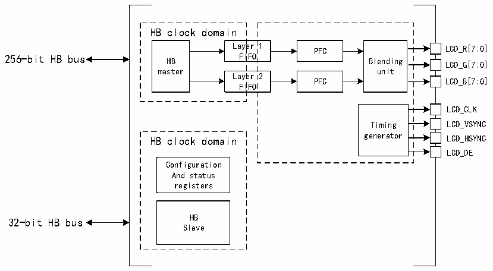

<!-- source-page: 979 -->

[← p.978](0978.md) · [index](../README.md) · [PDF p.979](https://ch32-riscv-ug.github.io/CH32H417/datasheet_en/CH32H417RM.PDF#page=979) · [p.980 →](0980.md)

<!-- header: CH32H417 Reference Manual https://wch-ic.com -->

# Chapter 43 LCD-TFT Display Controller (LTDC)

LCD-TFT (Thin Film Transistor-Liquid Crystal Display) Display Controller (LTDC) mainly provides parallel  
digital RGB, horizontal synchronization, vertical synchronization, pixel clock and data enable signals, which can  
be used as output signals to interface with different LCD and TFT panels.  

## 43.1 Main Features

● Provide 2 display layers, each containing a proprietary 8×256-bit FIFO  
● Support color lookup tables (CLUT) with up to 256 colors per layer  
● Support programmable timing for different display panels  
● Support programmable background color  
● Support programmable polarity for HSYNC, VSYNC, and data enable signals  
● Each display layer supports up to 8 input colors  
● Flexible blending between 2 layers using alpha values (per-pixel or constant)  
● Support chroma key (transparent color)  
● Support programmable window position and size  
● Support thin-film transistor (TFT) color displays  
● Support up to 3 programmable interrupt timers  

## 43.2 Overview

Figure 43-1 Structural block diagram of LTDC  
 <!-- rendered from the PDF; verify at https://ch32-riscv-ug.github.io/CH32H417/datasheet_en/CH32H417RM.PDF#page=979 -->

🖼 Text parsed from the figure above

HB clock domain  
Layer 1 PFC LCD_R[7:0]  
Laye FI  er IFO  1  Laye FI  er IFO  2  
256-bit HB bus HB FIFO Blending  
LCD_G[7:0]  
master unit  
PFC LCD_B[7:0]  
LCD_CLK  
Timing LCD_VSYNC  
HB clock domain generator LCD_HSYNC  
LCD_DE  
Configuration  
And status  
registers  
32-bit HB bus HB  
Slave  

（1）PFC:pixel format converter,performing the pixel format conversion from the selected input pixel format of a layer to words.  
（2）Itdc_ker_ck:pixel clock.  
<!-- image: p979-draw-image-00001 bbox=[511.44, 786.36, 530.88, 796.68] -->
<!-- footer: V1.7 977 -->
