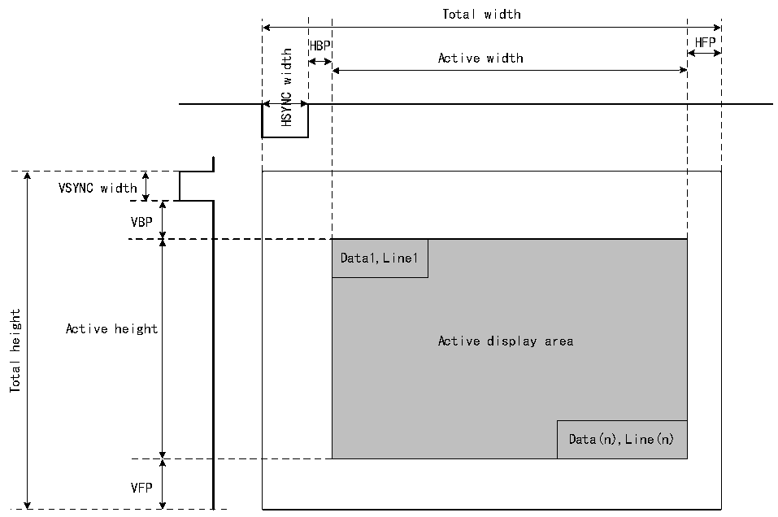

<!-- source-page: 980 -->

[← p.979](0979.md) · [index](../README.md) · [PDF p.980](https://ch32-riscv-ug.github.io/CH32H417/datasheet_en/CH32H417RM.PDF#page=980) · [p.981 →](0981.md)

<!-- header: CH32H417 Reference Manual https://wch-ic.com -->

## 43.3 Function Description

### 43.3.1 LTDC Synchronization Timing

The LTDC interface is a synchronous data interface comprising pixel clock, pixel data, and horizontal and vertical  
sync signals. Figure 43-2 illustrates the configurable timing parameters generated by the LTDC synchronous  
timing generator module.  

Figure 43-2 LTDC synchronization timing  
 <!-- rendered from the PDF; verify at https://ch32-riscv-ug.github.io/CH32H417/datasheet_en/CH32H417RM.PDF#page=980 -->

🖼 Text parsed from the figure above

Total width  
HBP  Active width  Data1,Line1  
VSYNC width  
VBP  
height  
Active height  
Total  
VFP  

<em>Note: (1) HSYNC and VSYNC denote horizontal and vertical sync widths, respectively; HBP and HFP denote</em>  
<em>horizontal back-edge period and horizontal front-edge period, respectively; VBP and VFP denote vertical</em>  
<em>back-edge period and vertical front-edge period, respectively.</em>  
- <em>(2) When LTDC is enabled, the generated timing uses the X/Y=0/0 position as the first horizontal sync pixel within</em>
<em>the vertical sync region, followed by the back edge, active data display region, and front edge.</em>  
- <em>(3) When LTDC is disabled, the timing generator module resets to X=total width-1 and Y=total height-1, holding</em>
<em>the previous pixel during the vertical sync phase and before FIFO refresh. Consequently, only blanking data is</em>  
<em>continuously output.</em>  
An example of synchronization timing configuration is as follows:  
1) LCD-TFT timing (to be extracted from the panel datasheet);  
2) Horizontal and vertical sync width: 0xA pixels, 0x2-1 lines;  
3) Horizontal and vertical trailing edge: 0x14 pixels, 0x2 lines;  
4) Effective width and effective height: 0x140 pixels, 0xF0 lines (320x240);  
5) Horizontal leading edge: 0xA pixels;  
6) Vertical leading edge: 0x4 lines;  
<!-- image: p980-draw-image-00001 bbox=[511.44, 786.36, 530.88, 796.68] -->
<!-- footer: V1.7 978 -->
