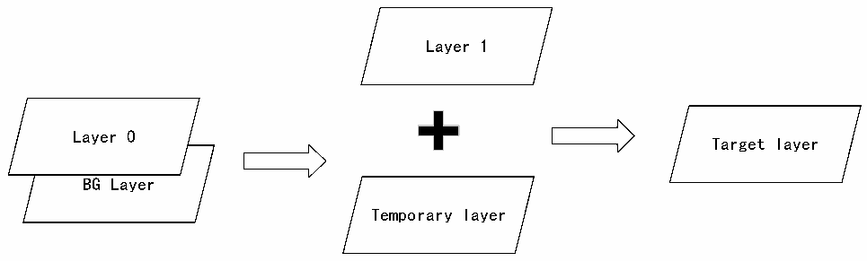

<!-- source-page: 982 -->

[← p.981](0981.md) · [index](../README.md) · [PDF p.982](https://ch32-riscv-ug.github.io/CH32H417/datasheet_en/CH32H417RM.PDF#page=982) · [p.983 →](0983.md)

<!-- header: CH32H417 Reference Manual https://wch-ic.com -->
The length and number of rows are set to prevent data beyond the end of the frame buffer from being prefetched  
into the FIFO corresponding to the layer.  
If it is set below the required bytes, a FIFO underflow interrupt will be generated (if previously enabled).  
If it is set to more bytes than actually needed, useless data read from FIFO will be discarded and will not be  
displayed.  

#### 44.3.4.3 Color Frame Buffer Spacing

The color frame buffer of each layer has a configurable spacing, which is the distance (in bytes) from the  
beginning of one line to the beginning of the next line. It is configured through the R32_LTDC_LxCFBLR  
register.  

### 43.3.5 Layer Window and Blending Function

Each layer supports windowing functionality as well as two-layer blending. LTDC first performs windowing  
operations on each layer, then blends the two layers into a single frame.  
Window functions define a display window, with each layer having independent window position configuration  
registers: R32_LTDC_LxWHPCR and R32_LTDC_LxWVPCR. Window configuration defines the display  
window within a layer. Pixels within the window retain their original values, while pixels outside the window are  
replaced with the pixel value defined by the R32_LTDC_LxDCCR register.  
The blending order is fixed, proceeding from bottom to top. The blending unit first blends layer 0 with the  
background layer to produce a temporary layer, then blends layer 1 with the temporary layer to generate the final  
layer. The ARGB values of the background layer are defined in the R32_LTDC_BCCR register. If a layer is  
disabled, the blending function uses that layer&#x27;s default color. To prevent the default color from appearing when a  
layer is disabled, set the blending coefficient for that layer in the R32_LTDC_LxBFCR register to its reset value.  
The blending process is illustrated in Figure 43-3.  

Figure 43-3 Block diagram of blending process  
 <!-- rendered from the PDF; verify at https://ch32-riscv-ug.github.io/CH32H417/datasheet_en/CH32H417RM.PDF#page=982 -->

🖼 Text parsed from the figure above

Layer 1  
Layer 0  
Target layer  
BG Layer  
Temporary layer  

General blending formula: BC = BF1 * C + BF2 * CS;  
BC represents the blended color; BF1 is blending factor 1; C is the current layer&#x27;s color; BF2 is blending factor 2;  
CS is the color of the next layer to be blended.  
The blending factors for the current pixel have two possible values, determined by register configuration. One is  
the pixel&#x27;s alpha multiplied by a constant Alpha, and the other is a constant Alpha.  
<em>Note: The constant Alpha value is programmed into the register and implemented by hardware as 255 equal</em>  
<em>divisions.</em>  
<em>Example: To enable only the first layer, configure BF1 to the constant Alpha and BF2 to 1 minus the constant</em>  
<em>Alpha.</em>  
<em>Constant Alpha: The constant Alpha programmed into the LxCACR register is 240 (0xF0).</em>  
<!-- image: p982-draw-image-00001 bbox=[511.44, 786.36, 530.88, 796.68] -->
<!-- footer: V1.7 980 -->
