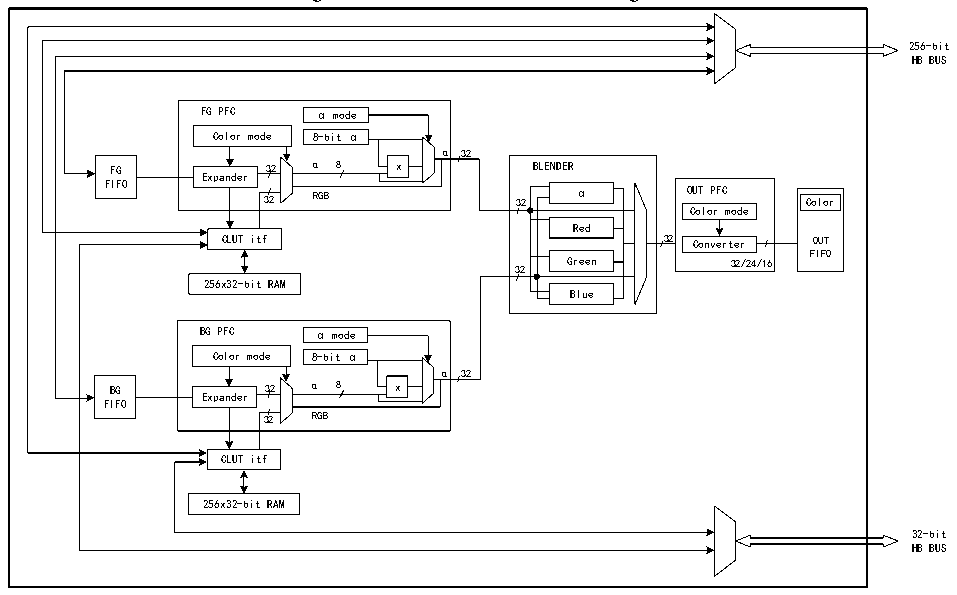

<!-- source-page: 998 -->

[← p.997](0997.md) · [index](../README.md) · [PDF p.998](https://ch32-riscv-ug.github.io/CH32H417/datasheet_en/CH32H417RM.PDF#page=998) · [p.999 →](0999.md)

<!-- header: CH32H417 Reference Manual https://wch-ic.com -->

Figure 44-1 GPHA structure block diagram  
 <!-- rendered from the PDF; verify at https://ch32-riscv-ug.github.io/CH32H417/datasheet_en/CH32H417RM.PDF#page=998 -->

🖼 Text parsed from the figure above

256-bit  
HB BUS  
FG PFC α mode Color mode 8-bit α α 32 α 8 x Expander 32 RGB  Expander  
mode  8-bit α  
α 32  
FIFO  
α  Red  Green Blue  
Color  OUTFIFO  
Color mode  
FIFO  
32 Green 32/24/16  
256x32-bit RAM  
BG PFC α mode Color mode 8-bit α α 32 α 8 x Expander 32 RGB  Expander  
α 32  
FIFO  
CLUT itf  
256x32-bit RAM  
32-bit  
HB BUS  

GPHA controller performs direct memory transfer. As a HB master, it can control HB bus matrix to start HB  
transactions. HB slave port is used to program GPHA controller.  
GPHA supports the following 3 modes of operation:  
- Register-to-memory;
- Memory-to-memory with pixel format conversion;
- Memory-to-memory with pixel format conversion and blending.
GPHA functions include the following operations:  
- Support filling specified portions or the entire area of the target image with a specific color;
- Support copying portions or the entire content of the source image to corresponding portions or the entire target
image;  
- Support copying portions or the entire content of the source image to portions or the entire target image with
pixel format conversion;  
- Support blending portions and/or the entire content of two source images with different pixel formats, then
copying the result to portions or the entire target image with different color formats.  

### 44.2.2 GPHA Control

The GPHA controller can be configured via the R32_GPHA_CTLR register to perform the following operations:  
1) Select the GPHA operating mode;  
2) Enable/disable GPHA interrupts;  
3) Start/suspend/abort an ongoing data transfer.  

### 44.2.3 GPHA Foreground Layer FIFO and Background Layer FIFO

The coordinated operation of the GPHA Foreground Layer (FG) FIFO and Background Layer (BG) FIFO is  
critical to the efficient image processing of the GPHA. These FIFOs acquire input data for replication and  
processing, fetching pixels according to the color format preset in the corresponding Pixel Format Converter  
<!-- image: p998-draw-image-00001 bbox=[511.44, 786.36, 530.88, 796.68] -->
<!-- footer: V1.7 996 -->
