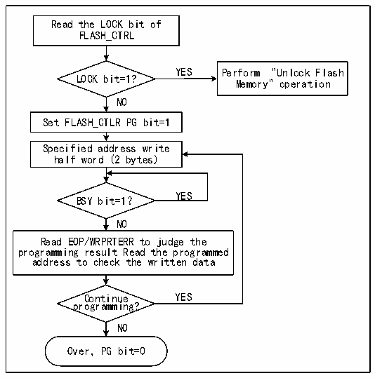

<!-- source-page: 1036 -->

[← p.1035](1035.md) · [index](../README.md) · [PDF p.1036](https://ch32-riscv-ug.github.io/CH32H417/datasheet_en/CH32H417RM.PDF#page=1036) · [p.1037 →](1037.md)

<!-- header: CH32H417 Reference Manual https://wch-ic.com -->

### 46.5.2 Flash Memory Unlock

After the system reset, the flash memory controller (FPEC) and FLASH_CTLR register will be locked and cannot  
be accessed. The flash memory controller module can be unlocked by writing the sequence to the  
R32_FLASH_KEYR register.  
Unlock sequence:  
1) Write KEY1 = 0x45670123 to the FLASH_KEYR register (must operate KEY1 first);  
2) Write KEY2 = 0xCDEF89AB to the FLASH_KEYR register (must operate KEY2 secondly).  
The above operations must be performed sequentially and continuously. Otherwise, it is an error operation, which  
will lock the FPEC module and FLASH_CTLR register and generate a bus error until the next system reset.  
The flash memory controller (FPEC) and the R32_FLASH_CTLR register can be locked again by setting the  
&quot;LOCK&quot; bit in the R32_FLASH_CTLR register to 1.  

### 46.5.3 Main Memory Standard Program

Standard programming writes 2 bytes per operation. When the PG bit in the R32_FLASH_CTLR register is set to  
‘1’, each write of a half-word (2 bytes) to a flash address initiates one programming cycle. Writing any  
non-half-word data causes FPEC to generate a bus error. During programming, the BSY bit is ‘1’; upon  
completion, BSY becomes ‘0’ and EOP becomes ‘1’.  
Note: When the BSY bit is ‘1’, write operations to any register are prohibited.  

Figure 46-1 FLASH program  
 <!-- rendered from the PDF; verify at https://ch32-riscv-ug.github.io/CH32H417/datasheet_en/CH32H417RM.PDF#page=1036 -->

🖼 Text parsed from the figure above

Read the LOCK bit of  
FLASH_CTRL  
YES Perform &quot;Unlock Flash  
LOCK bit=1?  
Memory&quot; operation  
NO  
Set FLASH_CTLR PG bit=1  
Specified address write  
half word (2 bytes)  
YES  
BSY bit=1？  
NO  
Read EOP/WRPRTERR to judge the  
programming result Read the programmed  
address to check the written data  
Continue YES  
programming?  
NO  
Over，PG bit=0  

1) Check the LOCK bit in the R32_FLASH_CTLR register. If it is 1, you need to perform the &quot;Release Flash  
Memory Lock&quot; operation.  
2) Set the PEG bit in the FLASH_CTLR register to ‘1’ to enable the standard page erasure mode.  
3) Write the half-word to be programmed to the specified flash memory address (even address).  
4) Wait for the BSY bit to become ‘0’ or for the EOP bit in the R32_FLASH_STATR register to become ‘1’,  
indicating programming completion. Then clear the EOP bit to ‘0’.  
5) Check the R32_FLASH_STATR register for errors, or read the programmed address data for verification.  
<!-- image: p1036-draw-image-00001 bbox=[515.88, 786.36, 535.32, 796.68] -->
<!-- footer: V1.7 1034 -->
