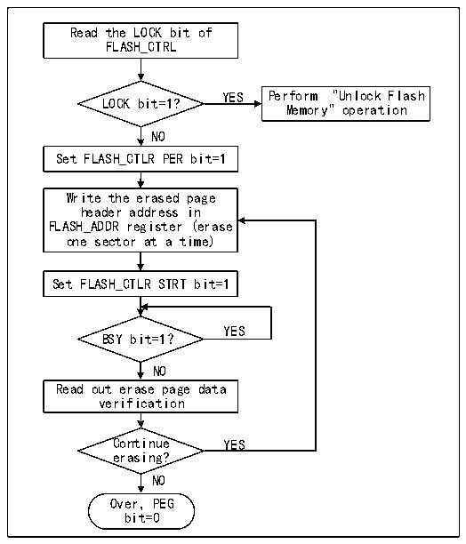

<!-- source-page: 1037 -->

[← p.1036](1036.md) · [index](../README.md) · [PDF p.1037](https://ch32-riscv-ug.github.io/CH32H417/datasheet_en/CH32H417RM.PDF#page=1037) · [p.1038 →](1038.md)

<!-- header: CH32H417 Reference Manual https://wch-ic.com -->
6) To continue programming, repeat steps 3-5. To end programming, clear the PG bit.  

### 46.5.4 Main Memory Standard Erase

Flash memory is erased by sector.  

Figure 46-2 FLASH page erasure  
 <!-- rendered from the PDF; verify at https://ch32-riscv-ug.github.io/CH32H417/datasheet_en/CH32H417RM.PDF#page=1037 -->

🖼 Text parsed from the figure above

Read the LOCK bit of  
FLASH_CTRL  
YES Perform &quot;Unlock Flash  
LOCK bit=1?  
Memory&quot; operation  
NO  
Set FLASH_CTLR PER bit=1  
Write the erased page  
header address in  
FLASH_ADDR register (erase  
one sector at a time)  
Set FLASH_CTLR STRT bit=1  
YES  
BSY bit=1？  
NO  
Read out erase page data  
verification  
Continue YES  
erasing?  
NO  
Over，PEG  
bit=0  

1) Check the LOCK bit in the R32_FLASH_CTLR register. If it is 1, you need to perform the &quot;Release Flash  
Memory Lock&quot; operation.  
2) Set the PEG bit in the FLASH_CTLR register to ‘1’ to enable the sector erasure mode.  
3) Write the page heading address of the page to be erased to the FLASH_ADDR register.  
4) Set the STAT bit in the FLASH_CTLR register to ‘1’ to start an erase action.  
5) When the BYS bit changes to &#x27;0&#x27; or the EOP bit in the FLASH_STATR register to be &#x27;1&#x27;, it indicates the end of  
erasure. Clear the EOP bit to 0.  
6) Read the page of erasure page for verification.  
7) To erase the sector continuously, you can repeat steps 3-5 to end erasing and clear the PEG bit to 0.  
<em>Note: After successful erasure, words read -0xe339e339, half words read -0xe339, even address bytes read -0x39,</em>  
<em>and odd addresses read 0xe3.</em>  

### 46.5.5 Fast Programming Mode Unlock

Fast programming mode operation can be unlocked by writing a sequence to the R32_FLASH_MODEKEYR  
register. After unlocking, the block bit of the R32_FLASH_CTLR register will be cleared to 0, indicating that  
quick erasure and programming operations can be performed. Lock again by setting the &quot;FLOCK&quot; bit of the  
R32_FLASH_CTLR register to 1.  
Unlock sequence:  
1) Write KEY1=0x45670123 to the FLASH_MODEKEYR register.  
2) Write KEY2=0xCDEF89AB to the FLASH_MODEKEYR register.  
<!-- image: p1037-draw-image-00001 bbox=[515.88, 786.36, 535.32, 796.68] -->
<!-- footer: V1.7 1035 -->
