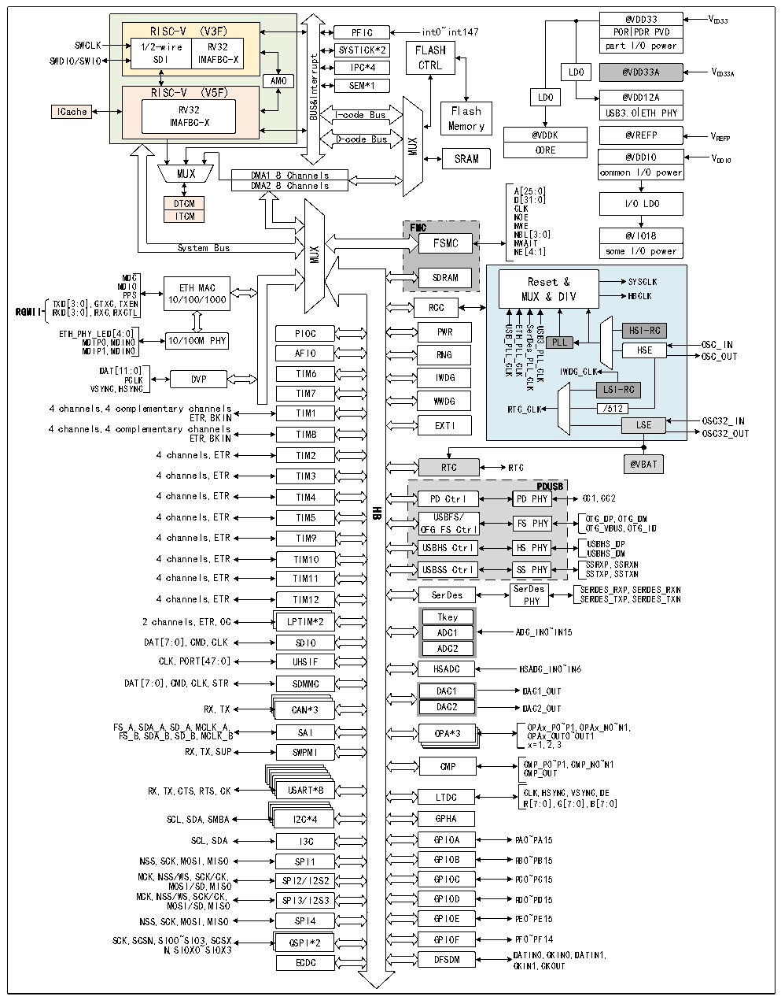

<!-- source-page: 3 -->

[← p.2](0002.md) · [index](../README.md) · [PDF p.3](https://ch32-riscv-ug.github.io/CH32H417/datasheet_zh/CH32H417RM.PDF#page=3) · [p.4 →](0004.md)

<!-- header: CH32H417系列应用手册 https://wch.cn -->

图1-1-1 CH32H417系统框图  
 <!-- rendered from the PDF; verify at https://ch32-riscv-ug.github.io/CH32H417/datasheet_zh/CH32H417RM.PDF#page=3 -->

🖼 Text parsed from the figure above

RISC-V (V3F) 1/2-wire RV32 SDI IMAFBC-X  AMO RISC-V (V5F) RV32IMAFBC-X  
@VDD33 VDD33  
int0~int147 POR PDR PVD  
PFIC  
SWCLK partI/O power  
FLASH  
SWDIO/SWIO LDO @VDD33A VDD33A  
CTRL  
AMOtpurretnI&amp;SUB SEM*1  
LDO @VDD12A  
RV32 I-code Bus Flash  
ICache  
USB3.0ETH PHY  
IMAFBC-X Memory  
@VDDK @VREFP VREFP  
D-code Bus  
MUX  
CORE  
SRAM @VDDIO VDDIO  
common I/O power  
MUX DMA1 8 Channels  
DMA2 8 Channels  
A[25:0]  
D[31:0] CLK  
DTCM  
I/O LDO  
ITCM  
NOE  
FMCFSMC  SDRAM  
NWE  
NBL[3:0]  
@VIO18  
FSMC NWAIT NE[4:1]  
MDC SDRAM  
Reset &amp; SYSCLK  
MDIO ETH MAC  
MUX &amp; DIV HBCLK RCC  
TXD[3:0],GTXC,T P X P E S N 10/100/1000 RGMII RXD[3:0],RXC,RXCTL  
USB_PLL_CLK ETH_PLL_CLK SerDes_PLL_CLK USB3_PLL_CLK  
HSI-RC  
ETH_PHY_LED[4:0] PIOC PWR  
MDIP0,MDIN0 10/100M PHY  
PLL OSC_IN  
HSE OSC_OUT  
MDIP1,MDIN0 AFIO RNG  
DAT[11 PC :0 L ] K DVP TIM6 IWDG  
IWDG_CLK  
VSYNC,HSYNC TIM7  
LSI-RC  
WWDG  
4 channels,4 complementary channels ETR,BKIN TIM1 4 channels,4 complementary channels EXTI ETR,BKIN TIM8  
/512  
RTC_CLK LSE OSC32_IN OSC32_OUT  
4 channels,ETR TIM2  
RTC @VBAT  
RTC  
4 channels,ETR TIM3  
PDUSB  
4 channels,ETR TIM4 PD Ctrl PD PHY CC1,CC2  
HB  
4 channels,ETR TIM5 USBFS/ FS PHY OTG_DP,OTG_DM  
OFG FS Ctrl OTG_VBUS,OTG_ID  
4 channels,ETR TIM9  
USBHS Ctrl HS PHY USBHS_DP  
USBHS_DM  
4 channels,ETR TIM10  
4 channels,ETR TIM11 USBSS Ctrl SS PHY S S S S R T X X P P , , S S S S R T X X N N  
SerDes SERDES_RXP,SERDES_RXN  
4 channels,ETR TIM12 SerDes PHY SERDES_TXP,SERDES_TXN  
Tkey  
2 channels,ETR,OC LPTIM*2  
ADC1 ADC_IN0~IN15  
DAT[7:0],CMD,CLK SDIO  
ADC2  
CLK,PORT[47:0] UHSIF  
HSADC HSADC_IN0~IN6  
DAT[7:0],CMD,CLK,STR SDMMC  
DAC1 DAC1_OUT  
RX,TX CAN*3 DAC2 DAC2_OUT  
FS F _ S A _ , B S , D S A D _ A A _ , B S , D S _ D A _ , B M , C M L C K L _ K A _ , B SAI OPA*3 O O P P A A x x _ _ P OU 0~ T P 0 1 ~ , OU OP T1 Ax_N0~N1,  
x=1,2,3  
RX,TX,SUP SWPMI  
CMP CMP_P0~P1,CMP_N0~N1  
CMP_OUT  
RX,TX,CTS,RTS,CK USART*8 LTDC CLK,HSYNC,VSYNC,DE  
R[7:0],G[7:0],B[7:0]  
SCL,SDA,SMBA I2C*4 GPHA  
SCL,SDA I3C GPIOA PA0~PA15  
NSS,SCK,MOSI,MISO SPI1 GPIOB PB0~PB15  
MCK,NSS/WS,SCK/CK, SPI2/I2S2 GPIOC PC0~PC15  
MOSI/SD,MISO  
MCK,NSS/WS,SCK/CK, SPI3/I2S3 GPIOD PD0~PD15  
MOSI/SD,MISO  
NSS,SCK,MOSI,MISO SPI4 GPIOE PE0~PE15  
SCK,SCSN,SIO0~SIO3,SCSX QSPI*2 GPIOF PF0~PF14  
N,SIOX0~SIOX3  
ECDC DFSDM D C A K T I I N N 1, 0 C , K CK OU I T N0,DATIN1,  

<!-- image: p3-draw-image-00001 bbox=[495.72, 779.4, 516.24, 789.84] -->
<!-- footer: V1.7 2 -->
