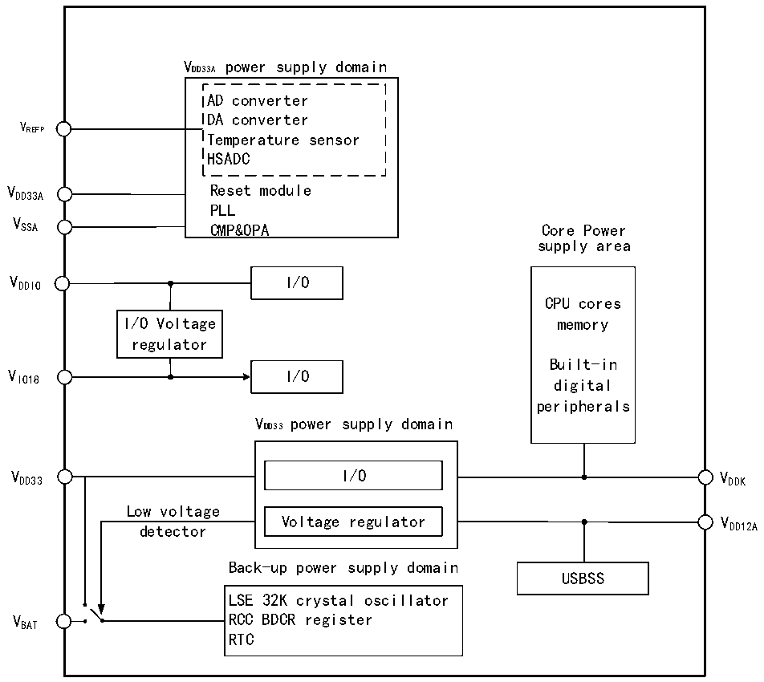

<!-- source-page: 8 -->

[← p.7](0007.md) · [index](../README.md) · [PDF p.8](https://ch32-riscv-ug.github.io/CH32H417/datasheet_zh/CH32H417RM.PDF#page=8) · [p.9 →](0009.md)

<!-- header: CH32H417系列应用手册 https://wch.cn -->

# 第 2 章 电源控制（PWR）

## 2.1 概述

CH32H417 芯片系统工作电压 VDD33 范围为 2.4～3.6V，内置电压调节器提供内核所需的工作电源。  
当主电源VDD33 掉电后，电池等后备电源可通过VBAT 引脚为实时时钟（RTC）提供电源，如果无需后备电  
源，建议将VDD33 直接连接到VBAT 引脚上。  
VDD33A 和 VSSA 引脚专门为系统中模拟相关电路供电，包括 ADC、DAC、温度传感器等。VREFP 作为一些  
模拟电路例如ADC电压上限的参考点，部分封装为独立引脚，未封装出来则在芯片内部等于VDD33A。  

图2-1 电源结构框图  
 <!-- rendered from the PDF; verify at https://ch32-riscv-ug.github.io/CH32H417/datasheet_zh/CH32H417RM.PDF#page=8 -->

🖼 Text parsed from the figure above

VDD33A power supply domain  
AD converter  
DA converter  
V  
REFP Temperature sensor  
HSADC  
VDD33A Reset module  
PLL  
V  
SSA CMP&amp;OPA Core Power  
supply area  
VDDIO I/O  
CPU cores  
I/O Voltage memory  
regulator  
Built-in  
V I/O  
IO18 digital  
peripherals  
VDD33 power supply domain  
VDD33 I/O VDDK  
Low voltage  
Voltage regulator V  
detector DD12A  
Back-up power supply domain  
USBSS  
LSE 32K crystal oscillator  
VBAT RCC BDCR register  
RTC  

## 2.2 电源管理

### 2.2.1 上电复位和掉电复位

系统内部集成了上电复位 POR 和掉电复位 PDR 电路，当芯片供电电压 VDD33 低于对应门限电压时，  
系统被相关电路复位，无需外置额外的复位电路。上电门限电压 VPOR 和掉电门限电压 VPDR 的参数请参  
考对应的数据手册。  
<!-- image: p8-draw-image-00001 bbox=[495.72, 786.24, 516.24, 796.68] -->
<!-- footer: V1.7 4 -->
