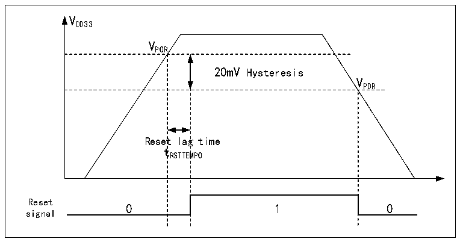
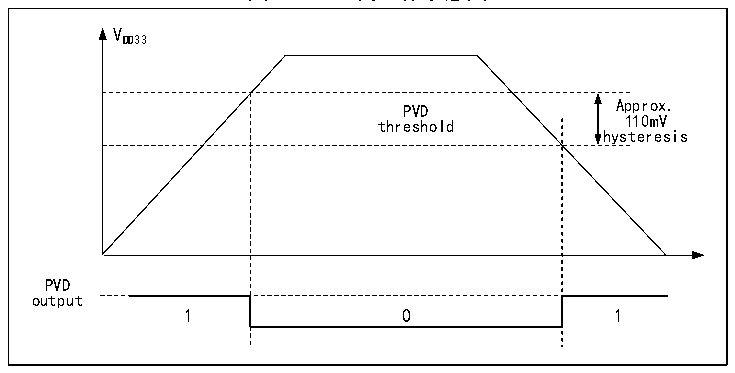

<!-- source-page: 9 -->

[← p.8](0008.md) · [index](../README.md) · [PDF p.9](https://ch32-riscv-ug.github.io/CH32H417/datasheet_zh/CH32H417RM.PDF#page=9) · [p.10 →](0010.md)

<!-- header: CH32H417系列应用手册 https://wch.cn -->

图2-2 POR和PDR的工作示意图  
 <!-- rendered from the PDF; verify at https://ch32-riscv-ug.github.io/CH32H417/datasheet_zh/CH32H417RM.PDF#page=9 -->

🖼 Text parsed from the figure above

VDD33  
VPOR  
20mV Hysteresis  Reset  lag t RSTTEM  g time MPO  
VPDR  
tRSTTEMPO  
Reset  
signal  

### 2.2.2 可编程电压监测器

可编程电压监测器 PVD，主要被用于监控系统主电源的变化，与电源控制寄存器 PWR_CTLR 的  
PLS[2:0]所设置的门槛电压相比较，可产生状态标志，以便及时通知系统进行数据保存等掉电前操作。  
具体配置如下：  
1） 设置PWR_CTLR寄存器的PLS[2:0]域，选择要监控电压阈值。  
2） 设置PWR_CTLR寄存器的PVDE位来开启PVD功能。  
3） 读取 PWR_CSR 状态寄存器的 PVDO 位可获取当前系统主电源与 PLS[2:0]设置阈值关系，执行相应  
软处理。当VDD33 电压高于PLS[2:0]设置阈值，PVDO位置0；当VDD33 电压低于PLS[2:0]设置阈值，  
PVDO位置1。  

图2-3 PVD的工作示意图  
 <!-- rendered from the PDF; verify at https://ch32-riscv-ug.github.io/CH32H417/datasheet_zh/CH32H417RM.PDF#page=9 -->

🖼 Text parsed from the figure above

VDD33  
PVD threshold  0  
hysteresis  
PVD  
output  

## 2.3 低功耗模式

在系统复位后，微控制器处于正常工作状态（运行模式），此时可以通过降低系统主频或者关闭  
不用外设时钟或者降低工作外设时钟来节省系统功耗。如果系统不需要工作，可设置系统进入低功耗  
模式，并通过特定事件让系统跳出此状态。  
微控制器目前提供了2种低功耗模式，从处理器、外设、电压调节器等的工作差异上分为：  
● 睡眠模式：内核停止运行，所有外设（包含内核私有外设）仍在运行。  
● 停止模式：V3F和V5F均进入停止模式时，停止模式才生效。停止所有时钟，唤醒后系统继续  
运行。  
<!-- image: p9-draw-image-00001 bbox=[495.72, 786.24, 516.24, 796.68] -->
<!-- footer: V1.7 5 -->
