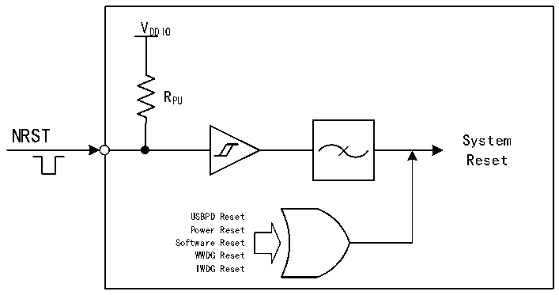

<!-- source-page: 15 -->

[← p.14](0014.md) · [index](../README.md) · [PDF p.15](https://ch32-riscv-ug.github.io/CH32H417/datasheet_zh/CH32H417RM.PDF#page=15) · [p.16 →](0016.md)

<!-- header: CH32H417系列应用手册 https://wch.cn -->

图3-1系统复位结构  
 <!-- rendered from the PDF; verify at https://ch32-riscv-ug.github.io/CH32H417/datasheet_zh/CH32H417RM.PDF#page=15 -->

🖼 Text parsed from the figure above

VDDIO  
RPU  
NRST  
System  
Reset  
USBPD Reset  
Power Reset  
Software Reset  
WWDG Reset  
IWDG Reset  

### 3.2.3 后备区域复位

后备区域复位发生时，只会复位后备区域寄存器，包括RCC_BDCTLR寄存器（RTC使能和LSE振荡  
器）。其产生条件包括：  
● 在VDD33 和VBAT 都掉电的前提下，由VDD33 或VBAT 上电引起  
● RCC_BDCTLR寄存器的BDRST位置1  
<!-- image: p15-draw-image-00001 bbox=[500.4, 786.24, 520.56, 796.68] -->
<!-- footer: V1.7 11 -->
